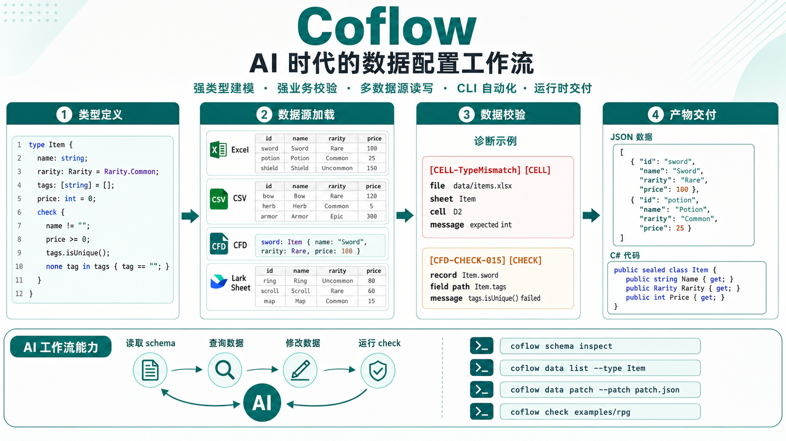

# Coflow

<p align="center">
  
</p>

**AI 时代的数据配置工作流 —— 灵活 · 可信 · 高效**

从类型建模、多源采集、业务校验，到数据交付，Coflow 把游戏配置整理成一套可验证、可定位、可写回、AI 可维护的流水线。

- 官网与文档：<https://puring103.github.io/coflow/>
- 最新 Release：<https://github.com/Puring103/coflow/releases/latest>

---

## 核心特性

- **强类型建模**：CFT schema 支持类型、默认值、枚举、引用、多态、数组、字典、注解和 check 规则。配置约束只有一份权威定义，改一处生效。
- **构建期挡错**：类型不对、引用悬空、check 不过都会在构建阶段挡下，错误数据不会进入产物。每条诊断带上文件、表、单元格和字段路径。
- **多数据源统合**：Excel、CSV 和 CFD 文本加载后进入同一个 runtime model，跨源引用天然成立；改动通过统一 writer/patch 机制写回原始数据源。
- **专用配置表达**：表格适合批量数值，CFD 文本适合嵌套结构、多态对象和覆盖模板 —— 每一份数据都放在最合适的地方。
- **AI 友好维护**：稳定的 CLI 让 AI agent 读 schema、查记录、提交结构化 patch、消费诊断继续修。改动经 schema 校验、可回滚、可复盘。
- **维度与变体**：一份 schema 支持任意维度的变体（语言、平台、服等）。每个变体在构建期独立展开、各自跑 check，覆盖漏了在构建期就发现。
- **运行时交付**：一次构建同时产出运行时数据（JSON / MessagePack）和加载代码（C#），消除 DTO 与 schema 的手写漂移。
- **可视化编辑器与 LSP**：文件视图、表格视图、记录视图、关系图和诊断面板；VS Code/LSP 集成提供 CFT/CFD 的诊断、补全、hover、跳转和语义高亮。

---

## 安装

### CLI

```powershell
cargo install --git https://github.com/Puring103/coflow.git coflow
coflow --help
```

也可以直接下载 [最新 Release](https://github.com/Puring103/coflow/releases/latest)。

Windows Release 提供包含 CLI 与可视化编辑器的完整版安装包，以及不含编辑器的
CLI-only 安装包。macOS Release 同时提供包含 CLI 与可视化编辑器的完整版 DMG
（arm64 / x64，已 codesign 和 notarize），以及仅含 CLI 的压缩包。

### AI Agent Skills

CLI 内置仓库全部 skills（覆盖工作流、schema 建模、数据维护），无需 Node.js：

```powershell
coflow skill install -g
```

省略 `-g` 时安装到当前 Coflow 项目的 `.agents/skills/`。

---

## 快速开始

跑一遍仓库自带的 RPG 示例：

```powershell
coflow check examples/rpg
coflow build examples/rpg
```

`examples/rpg/coflow.yaml` 声明 data/code 的实际输出目录：

```text
examples/rpg/generated/data
examples/rpg/generated/csharp
```

Coflow 每次构建都会先写入并验证 staging 和 `.coflow/artifacts/generations/` 中的不可变 generation，再完整替换配置指定的 data/code 输出目录，最后原子替换 `.coflow/artifacts/active.json`。命令成功信息会输出稳定输出目录；不要在这些目录中放置手写文件。使用 `coflow clean [CONFIG_OR_DIR]` 清理历史 generation 和中断遗留的 staging；当前活动 generation 会保留。

单独运行某个阶段：

```powershell
coflow cft check examples/rpg
coflow export json examples/rpg
coflow codegen csharp examples/rpg
```

使用 MessagePack 时把 `outputs.data.type` 改为 `messagepack` 后重新 build 即可。

---

## 项目形态

一个 Coflow 项目由 `coflow.yaml` 描述。最简形式：

```yaml
schema: schema/

sources:
  - path: data          # 目录源，自动发现 .xlsx / .csv / .cfd

outputs:
  data:
    type: json
    dir: generated/data
  code:
    type: csharp
    dir: generated/csharp
    namespace: Example.Rpg.Config
```

需要显式映射 sheet、类型和列头时：

```yaml
sources:
  - path: data/tables.xlsx
    sheets:
      - sheet: Item
        key: id                 # 省略时默认 id / Id / ID
        columns:
          Item ID: id
          Name: name
      - sheet: Skill
        columns:
          Skill ID: id
```

`sources` 支持 `path`（本地文件或目录）或 `url`（远端 source）；`type` 是可选的 provider id，省略时按后缀推断。目录源可同时包含 Excel、CSV 和 CFD 文件；`sheets` 只作用于 Excel。

`outputs.data.type` 支持 `json` / `messagepack`；`outputs.code.type` 目前支持 `csharp`。`outputs.*` 除 `type`、`dir` 外的字段会作为 provider options 传入（例如 C# codegen 的 `namespace`）。

启用维度和变体（例如本地化）：

```yaml
dimensions:
  language:
    variants: [zh, en, ja]
    out_dir: data/dimensions/language
```

---

## CFT 简览

CFT 描述配置数据的形状、默认值、引用和校验规则。

```cft
# 常量
const MAX_LEVEL: int = 100;

# 枚举
enum Rarity {
  Common = 0,
  Rare   = 10,
  Epic   = 20,
}

# 类型和字段
# @idAsEnum 让 record key 自动填充到空 enum，生成强类型 C# key
@idAsEnum(ItemId)
type Item {
  name:       string;
  rarity:     Rarity = Rarity.Common;   # 默认值
  tags:       [string] = [];            # 数组
  attributes: {string: int} = {};       # 字典
}

enum ItemId {}

# 继承和多态
abstract type Reward {
  source: string = "drop";
  check { source != ""; }
}

sealed type ItemReward : Reward {
  item:  &Item;   # &Type 表示对某条记录的引用
  count: int = 1;
}

# 业务校验
type Monster {
  level:        int;
  tags:         [string] = [];
  drop_weights: [int]    = [];

  check {
    level >= 1 && level <= MAX_LEVEL;
    tags.isUnique();
    all weight in drop_weights {
      weight > 0;
    }
  }
}
```

常用注解：

- `@idAsEnum(Name)`：把 record key 填充进空 enum，生成强类型 C# key。
- `@struct`：让 sealed value-like type 生成 C# struct。
- `@expand`：让 Excel 相邻列展开成嵌套 object 字段。
- `@localized`：声明字段值按语言维度变化。
- `@singleton`：声明该 type 有且仅有一条 record。

check 支持 `len` / `contains` / `isUnique` / `min` / `max` / `sum` / `keys` / `values` / `matches` 等内建函数；`isUnique` 支持可比较标量数组（`int`、`bool`、`string`、`enum` 及其 nullable 形式）。

---

## Excel 编写要点

- 每张导入 sheet 必须有 `id` / `Id` / `ID` 列，作为 record key（不是 CFT 字段）；record key 是 string identifier。
- 表头 `#` 是可选导入控制列，数据行该列写 `##` 时整行跳过。
- CFT 字段类型是 `&Item` / `[&Item]` / `{string: &Item}` 时，单元格写 `&sword_01` 这类 key-only 引用。
- CFT 字段是普通对象（`Stats`、`Reward`）时，单元格写 `Stats{hp: 100, attack: 50}`；多态对象用 `ConcreteType{...}`。
- 裸字符串保持字符串语义。JSON / MessagePack 中，引用字段导出为纯 key 字符串（`"sword_01"`，不是 `"Item.sword_01"`）。
- `coflow build` 会把 `@idAsEnum` lock state 与 data/code generation 一起激活，并在最终激活前于 `coflow.yaml` 同级原子更新非权威的 `coflow.enum.lock.json` 镜像；此文件应提交到版本库，让干净 clone 恢复稳定整数值。

---

## 常用命令

```powershell
# 项目与构建
coflow init my-config
coflow check examples/rpg
coflow build examples/rpg
coflow export json examples/rpg --out generated/data
coflow export messagepack examples/rpg --out generated/data
coflow codegen csharp examples/rpg --out generated/csharp --namespace Game.Config
coflow lsp examples/rpg

# AI / 自动化入口（默认输出 JSON）
coflow schema inspect examples/rpg
coflow schema files examples/rpg
coflow schema write-file examples/rpg --file schema/main.cft --stdin --check
coflow data sources examples/rpg
coflow data list examples/rpg --type Item
coflow data get examples/rpg Item.sword
coflow data create-file examples/rpg --file data/items.csv --type Item --provider csv
coflow data sync-header examples/rpg --file data/items.csv --type Item
coflow data write-file examples/rpg --file data/items.cfd --stdin --check
coflow data patch examples/rpg --patch-file patch.json
```

data 命令区分：

- **`data patch`**：走 provider writer 逐字段/记录写回，适合表格和 CFD；事务、重建和诊断语义以 [CLI 命令参考](https://puring103.github.io/coflow/docs/reference/08-cli.html) 为准。
- **`data write-file`**：整文件重写，只允许作用于配置里 CFD source 覆盖的 `.cfd` 文件，适合大范围 CFD 修改。
- **`data create-file` / `data sync-header`**：本地文件级命令，支持 `.cfd` / `.csv` / `.xlsx`；表格文件同步表头，CFD 同步记录顶层字段。

`schema write-file` 只允许写入项目配置已包含的精确小写 `.cft` schema 文件；`--dry-run` 预览，`--check` 在写入后（或 dry-run 内存内容上）编译并返回诊断。

---

## 运行时依赖

生成的 C# 加载器：

- **JSON**：依赖 `Newtonsoft.Json`。
- **MessagePack**：依赖 MessagePack-CSharp，走显式 `MessagePackReader` 路径，面向普通 .NET 和 Unity/IL2CPP 环境。

默认生成入口是 `CoflowTables`：

```csharp
var tables = CoflowTables.Load(dataDir);
var item = tables.TbItem.Get("potion");
var maybeItem = tables.TbItem.Find("potion");
```

每张表通过 `Tb{TypeName}` 访问器暴露 `Get`、`Find`、`TryGet` 和只读列表 API。生成的 loader 面向受信的 Coflow exporter 产物；不会生成自定义 `CftLoadException`。JSON 导出不会为无记录的表写空 `[]` 文件，C# JSON loader 会把缺失的空表文件视为空表。

---

## 文档导航

- [设计理念](https://puring103.github.io/coflow/docs/) —— 为什么需要 Coflow
- [安装与快速开始](https://puring103.github.io/coflow/docs/guide/install.html)
- [策划视角](https://puring103.github.io/coflow/docs/guide/for-designers.html) · [程序视角](https://puring103.github.io/coflow/docs/guide/for-programmers.html) · [AI Agent](https://puring103.github.io/coflow/docs/guide/ai-agent.html)
- [CFT Schema](https://puring103.github.io/coflow/docs/reference/03-language/01-cft.html) · [CFD 文本数据](https://puring103.github.io/coflow/docs/reference/03-language/02-cfd.html) · [表格单元格值](https://puring103.github.io/coflow/docs/reference/03-language/03-cell-value.html)
- [数据源与 Provider](https://puring103.github.io/coflow/docs/reference/04-sources/01-overview.html) · [诊断模型](https://puring103.github.io/coflow/docs/reference/09-diagnostics/01-diagnostics.html) · [本地化与维度](https://puring103.github.io/coflow/docs/reference/10-localization.html)
- [CLI 命令参考](https://puring103.github.io/coflow/docs/reference/08-cli.html)

---

## 许可证

Apache-2.0
