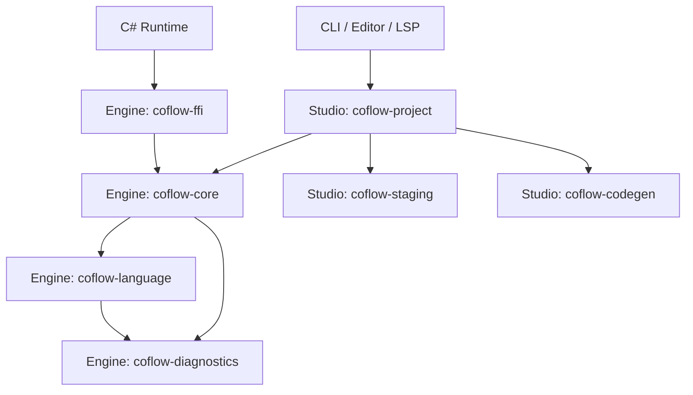
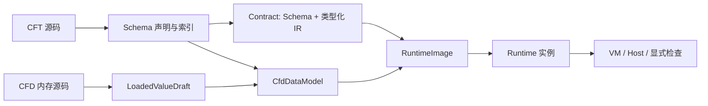

# Engine 分层与数据生命周期

Engine 提供可嵌入的语言和运行时能力，Studio 负责项目、编辑和文件系统。Engine 的本地依赖保持在 `engine/` 内。

## 模块依赖

| 模块 | 职责 |
| --- | --- |
| coflow-language | 源码坐标、共享词法扫描、CFT/CFD 语法、结构预算 |
| coflow-diagnostics | 诊断代码、阶段与 Engine 共享严重级别 |
| coflow-core::schema | 声明语义、静态值、查询索引、默认值依赖计划；CFT 声明编译由 cft-compiler 特性控制 |
| coflow-core::contract | 不可变 Schema 与类型化 IR 的二进制契约、版本与完整性校验 |
| coflow-core::loading / build | 内存 CFD 输入、类型引导转换、默认值构造、引用解析与模型诊断 |
| coflow-core::runtime | 运行时构建、不可变映像、实例状态、值访问、Host 绑定、执行和显式检查 |
| coflow-core::vm | 函数编译、IR、字节码优化、预算、寄存器执行和闭包 |
| coflow-ffi | C ABI、线程所属句柄、Host 回调适配和 Unity/IL2CPP 边界 |
| coflow-project | 项目发现与编排、编辑单元格语法、索引、变更和文件发布 |

## 数据生命周期

- `CftStaticValue` 表达常量和字段默认值的静态载荷；用途由声明位置决定。
- `LoadedValueDraft` 保留加载阶段尚未解析的引用和编辑输入。
- `CfdDataModel` 可携带诊断和不完整编辑状态。模型构造继续检查直接构造的草稿，不能假定所有输入都经过 CFD lowering。
- `CallableSource` 统一函数与模板的源码、导入和来源信息，类别由外层枚举表达。
- `RuntimeBuilder` 负责构建，`RuntimeImage` 保存已链接的固定数据和程序，`Runtime` 持有实例资源及动态状态。
- 固定值、动态值、VM Slot 和 HostValue 各自服务于存储、执行与宿主边界，不互相替代。

## 契约格式

当前格式版本为 6。Schema 序列化保存别名、常量、类型自身字段、枚举变体、检查声明及源码元数据；不保存继承关系缓存、展开字段、枚举查询表、维度索引或默认值依赖计划。

声明编译和反序列化共用索引构造入口。继承遍历检查父类型存在性、环与结构预算；索引恢复完成后执行默认值计划分析。契约加载随后验证类型化 IR。SHA-256 用于完整性和标识，不代替结构校验。

源码坐标和展示元数据仍参与契约标识。旧格式在头部版本检查阶段明确拒绝；生成的契约文件与 C# 绑定标识必须一起更新。

## 校验与对外边界

对象可实例化和类型可赋值规则由 Core 语义层提供，CFD 加载、模型构造和 Studio 单元格解析各自转换为对应诊断。枚举掩码从声明集中构造，加载、模型和运行时读取同一掩码。

VM 执行器、预算实现、构造和契约程序收集模块仅在 crate 内可见。编译器、IR、字节码保留为语言工具和分析接口；业务执行通过 Runtime 进入。

Rust FFI 的操作码枚举与数字解码由同一声明表生成。Rust 测试核对完整 C 头文件操作码和 C# 实际使用的操作码子集；数字空位保持未分配。

共享 Rust 类型保留可选的 TS 类型描述。导出入口和目标目录由编辑器的 `export_bindings` 负责，类型定义不自动写入编辑器目录。

## 验证

普通开发使用仓库根目录的 `cargo check --workspace` 和 `cargo test --workspace`。契约回归覆盖格式拒绝、字节往返、继承/枚举/维度索引、默认值依赖以及损坏结构。项目层继续运行迁移后的单元格解析测试，FFI 测试覆盖跨语言操作码一致性。
