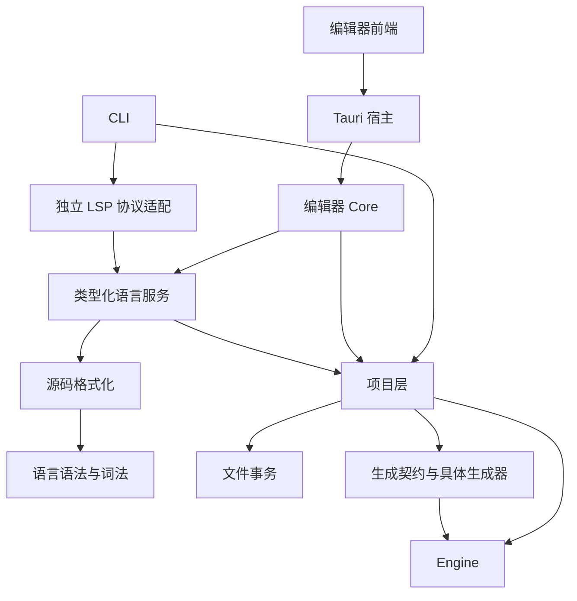

# Studio 与编辑器实现

## 依赖方向

Engine 负责语言语义与内存运行，不发现项目、不写项目文件。Studio 负责配置、源文件、会话和宿主编排。Tauri 负责命令、事件、窗口和系统集成，编辑器 Core 保持宿主无关。

## 项目层

| 模块 | 职责 |
| --- | --- |
| `schema_cache` | 按输入指纹缓存 CFT 编译尝试与成功代际；错误尝试保留诊断 |
| `session_api/factory` | 创建 schema、只读、构建和写会话 |
| `session_api/read` | 只读与构建能力边界 |
| `session_api/write` | 写会话、不可变代际句柄、mutation 提交 |
| `session_api/source` | 草稿校验上下文、源码候选准备、源码事务提交 |
| `session_api/mutations` | 字段和记录操作的类型化便利入口 |
| `query` | 不触发 Git 命令的内存查询 |
| `commit` | 提交影响：代际、schema、落盘路径、受影响文件 |
| `project/config_write` | 项目输入、文件创建与删除的文件事务 |

`WriteProjectSession` 通过 `Arc` 持有当前代际。宿主短暂取锁获得 `ProjectSnapshot` 或 `SourceUpdateContext` 后，在锁外执行 Git 比较或源码编译。写入采用写时复制，旧快照继续读取原代际。

源码保存接口携带编辑开始时读取的原始文本，候选准备后先核对该基线，提交时再次检查磁盘。配置写入使用 `Project.config_source` 中最初解析的原文作为预期内容。

源码候选记录会话身份、版本、预期磁盘内容。提交同时检查会话版本与磁盘内容；任一冲突都不覆盖现有文件。相同内容保存返回无影响提交，不推进版本。

`SourceValidationContext` 用于隔离草稿校验：CFD 复用源数据缓存；CFT 复用独立 schema 尝试缓存。该接口不打开或改变语言服务中的文档。

## 语言服务

`coflow-lsp::service::LanguageService` 提供类型化的文档同步、诊断、补全、着色、格式化、跳转、符号、悬浮和函数文档结果。独立 LSP 与编辑器共用语义查询实现。

打开文档、版本和诊断快照由语言验证核心统一持有。诊断发布从快照读取，不消费快照中的诊断。较旧文档版本以及相同版本的不同内容被拒绝；相同版本和内容可重复查询。

独立 LSP 在协议边界进行 JSON 编解码和字段转换。异步验证以输入版本检查候选有效性。编辑器直接调用类型化 API。

CFD 能力分为函数文档、语义着色、补全、未完成语法恢复和定义跳转。`coflow-format` 仅依赖语法与词法，Core 依赖只用于格式化回归测试。

## 编辑器会话与并发

项目状态与语言服务分别使用项目读写锁和语言互斥锁。语言计算不持有项目锁；提交只将变更路径或新项目基线加入待失效队列。下一次语言请求消费这些输入。

计算期间发生项目提交时，该请求返回冲突，不发布旧基线结果。应用待失效输入失败时保留输入供后续请求处理。关闭会话会使进行中的语言请求和已经准备的重载候选失效。

重载在锁外构建项目候选，提交时检查版本票据。前台重载最多尝试三次；持续冲突返回明确错误。重载复用原语言服务句柄并替换项目基线，未保存覆盖和文档版本继续有效。

前端以 generation controller 接受项目代际，以 mutation history controller 串行处理撤销与重做；图布局纯计算与浏览器 worker 适配独立。

## 提交与错误语义

mutation 和源码写入成功后，编辑器依据 `ProjectCommit` 更新诊断、导航缓存、版本和语言失效队列。该发布入口不执行语言计算，不返回语言失败。

项目输入和文件结构操作在文件事务成功后返回 `ProjectCommit`。编辑器记录内部写入并重载目录与项目状态；已提交而刷新失败时返回 `committed` 错误，提示重新加载项目，避免重复执行已完成的写入。

## 源码自动保存与恢复

源码视图只持有当前文档，不缓存跨页面草稿。输入停止 500 毫秒、编辑区失焦或 Ctrl+S 时触发串行保存，不自动格式化。保存期间的新输入继续保留，并在前一次提交后使用更新后的磁盘基线保存。

文件切换、视图切换与桌面窗口关闭在当前文档保存成功后继续。失败时保留输入；外部内容变化时暂停自动保存，提供使用磁盘内容或明确覆盖的选择。明确覆盖仍验证用户确认时的磁盘版本。

未完成的 CFT 可以保存并重新打开。无法形成 schema 的代际保留诊断，以空 schema 提供源码编辑入口，不显示旧模型中的记录；源码修复后重新构建数据视图。

`EditorHost` 在结构操作后显式更新监听范围。监听调整先添加新路径再移除旧路径，并逐步记录成功的操作，使失败后可继续恢复。已提交操作的刷新失败标记会话需要重载，后端拒绝后续写入；前端关闭已完成的操作对话框，显示重新加载入口。成功重载并恢复监听后解除写入限制。

## 编辑器设置持久化

`editor-setting/editor.json` 保存项目共享的视图定义、记录分组、类型缩略名字段和图节点坐标；`editor-setting/plugins.json` 保存项目插件清单、默认项和启用状态。这些文件进入 Git。

工作区标签及当前视图、视图标签顺序、图缩略模式、默认及自定义表格列宽按项目分别保存在用户数据目录，不写入项目目录。项目路径规范化后计算摘要作为本机设置键。读取时合并共享和本机设置；旧版共享文件中的个人字段首次读取时迁入本机文件，后续共享设置写入只保留共享字段。读取 JSON 时忽略未知字段，版本号仍需匹配。

## C# 代码生成

生成器以 `names` 管理命名与转义，以 `value_codecs` 管理类型映射与静态 codec，以 `declarations` 渲染 enum 和数据投影，以 `hosts` 渲染 Host 绑定。`generate` 负责名称冲突检查、契约和文件产物组装。生成契约保持独立于项目发现和文件发布。

## 回归边界

Rust 工作区测试覆盖协议与类型化服务结果一致性、重复诊断读取、过期版本、重载保留草稿、关闭期间请求、离锁计算、源码冲突、无变化保存和已提交错误语义。普通开发验证执行 `cargo check --workspace` 与 `cargo test --workspace`。
