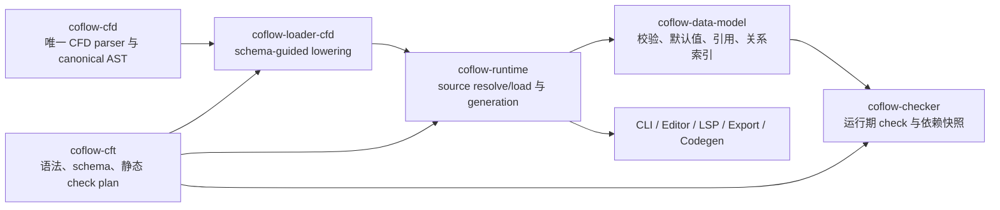

# CFT、CFD、Checker 与 DataModel 核心库加固计划

- 日期：2026-07-18
- 基线分支：`v0.8`
- 实施分支：`codex/core-architecture-hardening`
- 状态：本轮计划已实施并通过完整门禁，等待合并
- 范围：CFT/CFD 解析边界、CFD lowering、DataModel 构建与关系索引、Checker、Runtime source resolution

## 1. 背景与结论

前序重构已经完成 CFT schema 单一语义模型、record-owned dimension overlay、DataModel/Checker
边界收敛和 runtime generation/session 化。本轮复查的重点不是再次拆分 crate，而是验证这些新边界
在异常输入、维度引用、增量检查和 source directory 场景下是否完整，并清理迁移后遗留的重复表示、
重复算法和过宽 API。

审计结论如下：

1. 当前 crate 分层方向正确，不需要合并或删除 `coflow-cft`、`coflow-cfd`、
   `coflow-loader-cfd`、`coflow-data-model`、`coflow-checker` 或 `coflow-runtime`。
2. 发现 3 类需要修复的问题：语义正确性、异常输入安全性、内部表示与职责冗余。
3. 本轮修改保持行为兼容，不改变 CFT/CFD 语法、`coflow.yaml`、诊断 JSON 结构、导出格式、
   C# codegen 或编辑器 wire DTO。
4. DataModel 全量重建目前仍足够快；在基准没有证明必要前，不引入增量 DataModel、可变
   generation、永久数字 ID 或额外缓存层。
5. 本轮列出的实现与回归测试已经完成，完整 workspace gate 已通过。

## 2. 当前架构

核心数据流保持单向：



各模块的权威边界：

| 模块 | 当前唯一职责 | 明确不负责 |
| --- | --- | --- |
| `coflow-cft` | CFT AST、schema compilation、类型与 check 静态计划 | 数据加载、运行期值、source discovery |
| `coflow-cfd` | CFD token、parser、canonical AST、source span | schema-guided 类型转换、项目 source 解析 |
| `coflow-loader-cfd` | canonical AST 到 source-neutral draft 的 lowering、CFD writer | 第二套 CFD parser、目录发现 |
| `coflow-data-model` | 成功值模型、build validation、默认值、ref/spread、关系索引 | provider 选择、项目路径、check 执行 |
| `coflow-checker` | typed check plan 执行、read dependency、增量快照 | schema 编译、模型构建、物理来源选择 |
| `coflow-runtime` | source resolution、typed options、load/build/check、generation 和 mutation 编排 | CFD 语法、provider 内部解析、CLI 输出 |

现有设计中需要保留的关键点：

- `CftSchema` 是唯一成功 schema 语义模型；CFT AST spans 仍服务诊断与 LSP。
- `coflow-cfd` 与 `coflow-loader-cfd` 分别拥有语法和 schema adapter，边界合理。
- direct ref、spread provenance 和 checker read dependency 是不同语义的图，不能合并。
- `CfdRecordId` 只在一个 generation 内作为 dense index；跨 generation 使用
  `RecordCoordinate`。
- Checker snapshot 是增量执行的必要状态，但应保持 opaque。
- `spread_by_host` 是必要的私有反向索引，可避免按 host 查询时扫描全部 spread edges。

## 3. 问题清单

### 3.1 P0：语义正确性

| 问题 | 影响 | 处理目标 | 状态 |
| --- | --- | --- | --- |
| Checker record equality 混入 diagnostic provenance | 同一 record 通过不同访问路径得到的值可能比较不等 | 只比较稳定的 storage identity | 已完成 |
| DataModel ref resolve 路径分散，dimension overlay spread 未覆盖 | variant 值中的 spread/ref 可能无法解引用 | 提供唯一、spread-aware 的 `resolve_ref` | 已完成 |
| 浮点比较只对部分操作拒绝 NaN | `==`、`!=`、顺序比较语义不一致 | 六种比较统一返回 `CheckEvalTypeError` | 已完成 |
| dimension overlay build 丢失物理 origin | 诊断可能错误指向 default source | 全链路保留 overlay `RecordOrigin` | 已完成 |

### 3.2 P1：安全性与失败质量

| 问题 | 影响 | 处理目标 | 状态 |
| --- | --- | --- | --- |
| CFD parser 没有统一结构预算 | 深层或超大输入可能导致栈溢出或不可控工作量 | 接入共享 `StructuralLimits` | 已完成 |
| CFD lowering 遇到首个错误即停止 | 用户需要多轮修复，诊断质量差 | 聚合互相独立的 record/field/container 错误 | 已完成 |
| 显式 provider 目录由 loader 各自展开 | cycle、root escape、扩展名和 options 语义可能不一致 | 目录展开全部收口到 runtime | 已完成 |
| 空目录跳过 typed option decoding | 错误配置因目录暂时为空而被隐藏 | source resolve 阶段只解码一次并立即校验 | 已完成 |

### 3.3 P2：架构与代码质量

| 问题 | 影响 | 处理目标 | 状态 |
| --- | --- | --- | --- |
| `CfdRecord` 同时保存 `entries` 和派生 `fields` | 双份数据可能分叉，增加 clone 与维护成本 | 只保留有序 `entries`，按需投影 fields | 已完成 |
| Snapshot、raw IDs 和 edge 元数据公开面过宽 | 外部调用方可能依赖 generation-local 实现细节 | snapshot opaque；raw ID 构造/serde 内部化；删除未读取的 edge 元数据 | 已完成 |
| loader-cfd/csv/excel 重复目录 walker | 同一职责有多份实现 | 删除 provider 侧 walker，复用 runtime resolver | 已完成 |
| dependency graph 有未使用 traversal | 增加错误理解与维护面 | 删除 `affected_by` | 已完成 |
| DataModel 有无行为的 placeholder | 形成伪 API | 删除占位函数 | 已完成 |
| spread index builder 参数与状态分散 | 递归不变量难以审查 | 收敛为 `SpreadIndexContext`/`SpreadEdgeBuilder` | 已完成 |
| dimension rewrite 与普通 rewrite 混在长流程中 | 分支责任和失败边界不清晰 | 分离 dimension spread rewrite planning | 已完成 |
| 公开诊断文档与实际 enum 不一致 | 用户按错误的 code 排查 | 修正文档 | 已完成 |

## 4. 修改目标

### 4.1 正确性目标

- 同一 record 的语义身份不受访问路径、source span 或 diagnostic provenance 影响。
- default 与所有 dimension variants 走同一套引用解析、值校验和 checker 比较规则。
- 非法输入始终产生结构化诊断，不 panic、不栈溢出、不静默忽略配置错误。
- 诊断的文件、record、field 和 span 始终指向真正的物理来源。

### 4.2 架构目标

- Parser 只负责 syntax；loader 只负责 lowering；runtime 是 source discovery 唯一所有者；
  DataModel 是成功值和关系唯一所有者；checker 只执行 typed plan。
- 每类信息只有一个权威表示。派生 view 使用借用或迭代器，不长期保存第二份集合。
- generation-local 类型和执行状态不成为公共兼容契约。
- 仅保留有明确查询复杂度收益的索引，并通过私有 API 隐藏实现细节。

### 4.3 兼容性目标

本轮不改变：

- CFT/CFD 语言与 project config；
- diagnostic code JSON shape 和 CLI human/JSON 输出协议；
- JSON、MessagePack、C# 输出；
- editor/LSP DTO；
- mutation transaction、rollback 和 publication 语义。

## 5. 分阶段实施计划

### 阶段 0：行为基线与边界确认（已完成）

1. 复核 CFT -> CFD lowering -> DataModel -> Checker -> Runtime 主流程。
2. 对 public types、raw IDs、snapshot、索引和 provider helper 做 consumer 扫描。
3. 明确本轮兼容面和不应删除的类型/模块。
4. 使用既有 full/incremental differential tests 作为行为基线。

退出条件：每个候选删除项都有 consumer 证据，每个正确性问题都有可复现用例。

### 阶段 1：修复语义正确性（已完成）

1. Checker 引用值 equality 改为 storage identity。
2. DataModel 增加统一 `CfdDataModel::resolve_ref`，覆盖 direct/default/nested/dimension spread。
3. 六个浮点比较操作统一 NaN 失败行为。
4. overlay origin 贯穿 owner/value/ref/spread validation diagnostics。

退出条件：新增的四组回归测试通过，增量 checker 与 fresh full checker 结果一致。

### 阶段 2：加固解析与 source resolution（已完成）

1. CFD parser 增加 `CfdParseOptions`，复用 `coflow-structure::StructuralLimits`。
2. 在递归下降前结算 depth/node/work budget。
3. CFD lowering 在不会造成级联误报的边界聚合独立错误。
4. 把所有显式/隐式 provider directory expansion 移到 runtime。
5. 统一 canonicalization、root containment、cycle/dedup、extension filter、managed dimension 排除。
6. 即使目录为空，也完成 provider identity 和 typed option decoding。

退出条件：深度边界、目录 cycle/root escape/empty options 等测试全部通过。

### 阶段 3：精简模型与 API（已完成）

1. 删除 `CfdRecord.fields` 存储，消费者从 `entries` 投影。
2. 将 checker snapshot 内部字段设为 crate-private/private。
3. 内部化 edge IDs，删除 public `CfdRecordId::from_index` 和 ID serde。
4. 删除无 consumer 的 `DependencyGraph::affected_by` 和 placeholder。
5. 删除 CFD/CSV/Excel loader 中重复的目录 walker。
6. 以 context/builder 重构 spread index 递归状态。
7. 将 dimension spread rewrite planning 从普通 source rewrite collection 中分离。

退出条件：repo scan 无旧 API consumer，workspace 编译和测试全部通过。

### 阶段 4：文档与关闭审计（已完成）

1. 对照实际 diagnostic enum 修正公开 code 表。
2. 复审曾计划删除的 `spread_by_host`，确认其复杂度收益后保留并私有化。
3. 确认没有理由继续做 crate 合并、语法迁移、wire format 迁移或增量 DataModel。
4. 运行完整 repository gate。

退出条件：文档与实现一致，完整 gate 通过，无本轮范围内未关闭的高/中优先级问题。

## 6. 删除、精简与保留清单

### 6.1 已删除或收敛

- `CfdRecord.fields` 重复存储。
- provider-specific directory expansion helpers。
- `DependencyGraph::affected_by` 未使用的一跳 traversal。
- DataModel 无行为 placeholder。
- public raw edge ID 构造与序列化能力。
- `SpreadSite` 重复坐标、edge 自身 ID、未读取的 type/key 构建期元数据。
- checker snapshot 内部 state 的公开访问面。
- 分散的 direct/spread/dimension ref resolve 入口。

### 6.2 必须保留

- CFT AST 与 spans：LSP、诊断和 source navigation 需要。
- `coflow-cfd` / `coflow-loader-cfd` 分层：syntax 与 schema lowering 生命周期不同。
- DataModel relation edges：ref rewrite、provenance、反向查询需要。
- `spread_by_host`：避免 host 查询退化为全 edge 扫描。
- Checker snapshot：增量 diagnostics 和 read dependency 合并需要。
- direct ref、spread、check read 三张独立关系图：失效规则不同。
- immutable full DataModel rebuild：当前代表性基准约 9.7 ms/build，复杂增量模型暂无收益证据。

### 6.3 暂不实施的优化

以下项目只有在 profiling/benchmark 证明收益后才能启动：

- incremental DataModel delta、record arena 或跨 generation numeric ID；
- 合并 ref/spread/check dependency graph；
- 删除 `spread_by_host` 等查询索引；
- 合并 `coflow-cfd` 与 `coflow-loader-cfd`；
- 为内部便利新增 public DTO 或 snapshot getters；
- 大范围目录搬迁或纯命名重构。

## 7. 测试方案

### 7.1 单元与回归测试

| 模块 | 必测行为 |
| --- | --- |
| CFD parser | depth/node/work 恰好到限、越限、默认上限、恢复后 diagnostic span |
| CFD lowering | 多 record、多 field、array、dict 的独立错误聚合；不产生级联错误 |
| DataModel | direct/nested/default/dimension spread ref；overlay origin；invalid target/type |
| Checker | 同 target 多路径引用 equality；六种 NaN 比较；infinity 顺序 |
| Source resolution | 显式/隐式目录、cycle、alias dedup、root escape、扩展名过滤、空目录 options |
| Rewrite planning | default/dimension ref/spread rename、delete、rollback 和 provenance |

### 7.2 集成与差分测试

- 每个增量 checker 场景都与 fresh full checker 比较 diagnostics 和 dependency snapshot。
- dimension default/variant、nested object、ref/spread 的读写结果做差分。
- runtime mutation 覆盖 preflight、staging、candidate rebuild、rollback 和 publication。
- CLI、editor backend、LSP、exporter、codegen 继续运行既有兼容性 suites。
- directory source 从配置到 resolved source、loader 和 file index 做端到端验证。

### 7.3 非功能测试

- 超深/超大 CFD 输入必须受结构预算限制，不能 stack overflow。
- 目录 cycle 与 symlink/junction alias 不得无限遍历或重复加载。
- DataModel representative benchmark 若长期显著超过当前约 9.7 ms/build，再评估增量构建；
  不能只根据代码体量启动复杂缓存设计。
- 查询热点必须用 benchmark 证明，不能通过删除私有索引换取表面上的类型减少。

### 7.4 Repository gate

普通开发提交执行：

```powershell
cargo check --workspace
cargo test --workspace
```

本轮关闭审计使用完整 gate：

```powershell
pwsh scripts/sync-skill-references.ps1
pwsh scripts/sync-skill-references.ps1 -Check
cargo check --workspace
cargo fmt --all -- --check
cargo clippy --workspace --all-targets -- -D warnings
cargo test --workspace
```

2026-07-18 当前工作区上述完整 gate 已全部通过。CFD editor 未启动、停止或重启。

## 8. 风险与回滚

| 风险 | 缓解措施 | 回滚边界 |
| --- | --- | --- |
| equality 改动影响历史 checker 结果 | 同 target/不同 path 与不同 target 都有测试 | 可独立回滚 checker equality commit |
| 统一 ref resolve 遗漏特殊 provenance | default、nested、dimension spread 全覆盖 | 保留旧结果 fixture 做差分 |
| parser budget 改变极端输入接受范围 | 默认阈值测试并支持显式 options | API 保留默认入口，按配置调整阈值 |
| directory resolver 收口改变 provider 行为 | 三种 loader 与 runtime 做端到端测试 | provider adapter 不再自行发现目录，回滚必须整体进行 |
| 删除重复 fields 改变顺序 | `entries` 是唯一有序权威，投影测试字段顺序 | 不恢复双存储，以 projection 修复 consumer |
| snapshot/ID 内部化影响外部 consumer | workspace consumer scan 和编译门禁 | 若确有跨 crate 用例，新增窄语义 API而不是恢复 raw API |

所有生产改动都不迁移用户数据格式，回滚只涉及代码；不得回滚已经写出的用户 source 文件，
mutation transaction 失败继续依赖既有 compensation 与旧 generation publication 语义。

## 9. 验收标准

1. P0/P1/P2 问题表中项目全部完成，并有对应回归测试。
2. CFD parser 对异常结构输入有确定诊断，不 panic 或无界执行。
3. default 与 dimension overlay 使用同一套 ref resolve 和 value semantics。
4. Checker equality 与 NaN 行为一致且有明确类型错误。
5. source directory discovery 只有 runtime 一处实现，空目录也校验 typed options。
6. 成功模型没有 `entries`/`fields` 双权威，generation-local API 不再公开。
7. CFT/CFD syntax、project config、diagnostic protocol、export/codegen/editor wire format 不变。
8. 增量与全量 checker、mutation rebuild 结果等价。
9. `cargo check --workspace`、`cargo test --workspace` 以及本轮完整 gate 全部通过。
10. 最终 review 未发现本轮范围内可复现且未记录的高/中优先级缺陷。

## 10. 后续触发条件

本轮关闭后不继续进行无指标重构。只有出现以下证据时再开新计划：

- representative DataModel build 或 checker 延迟超过明确预算；
- 新 provider 无法通过现有 source resolution contract 接入；
- public API consumer 证明需要新的稳定语义能力；
- 真实 profile 显示 relation/index 查询为热点；
- 新语法或 wire-format 需求由产品层明确提出。

后续计划必须提供基线、目标指标、兼容范围、差分测试与回滚策略，不能以“减少类型数量”或
“合并 crate”本身作为完成目标。
