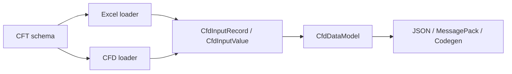

# CFD 文本配置语法

**依赖文档**：[01-cft.md](01-cft.md)、[02-data-model.md](02-data-model.md)、[03-cell-value.md](03-cell-value.md)

CFD（Coflow Data File）是面向复杂结构数据的文本配置文件。它加载 CFT 作为类型定义，解析结果不是独立运行时模型，而是和 Excel / cell-value 一样转换为 `CfdInputRecord` / `CfdInputValue`，再交给 DataModel 做类型检查、默认值、引用解析和索引构建。

CFD 的定位是 Excel 的补充：Excel 适合大量同构表格数据，CFD 适合嵌套对象、字典、数组、继承对象、覆盖模板等复杂结构。两者最终进入同一个 data-model 阶段，因此可以相互引用，只要引用写成可解析的 typed reference。

---

## 1. 记录

单条记录格式：

```cfd
sword_01: Item {
  name: "Iron Sword",
  price: 100,
}
```

规则：

- `sword_01` 是记录 key。
- `Item` 是 CFT 类型名。
- 记录名必须是合法 record key identifier。
- `id` 是 CFD 顶层记录字段中的保留字段名，不能在记录块里声明；记录 key 已承担 id 语义。
- 记录块结束由 `}` 决定，不需要 `;`。
- 字段使用 `:`，字段、数组、字典条目使用 `,` 分隔，允许尾逗号。

同类型记录可以分组：

```cfd
Item {
  sword_01 { name: "Sword" }
  shield_01 { name: "Shield" }
}
```

多态分组可以在分组内指定具体类型：

```cfd
Reward {
  coin_01: CurrencyReward { amount: 100 }
  item_01: ItemReward { item: &sword_01, count: 1 }
}
```

如果分组类型是抽象类型，子记录必须写 `key: ConcreteType { ... }`；`key { ... }` 只能实例化非抽象具体类型。

---

## 2. 值

CFD 是 schema-guided 解析：字段类型来自 CFT，因此同一段文本会按目标类型解释。

```cfd
monster_01: Monster {
  name: "Slime",
  level: 3,
  boss: false,
  stats: { hp: 100, attack: 20 },
  tags: ["early", "forest"],
  weights: { Fire: 10, Ice: 5 },
}
```

标量规则与 cell-value 一致：

- `int`、`float`、`bool` 按目标类型解析。
- `string` 可写双引号字符串，也保留简单裸字符串能力。
- 枚举可写 `Variant` 或 `Enum.Variant`。
- `null` 只允许用于 `T?`。
- `#` 是注释。

数组在 CFD 中使用逗号：

```cfd
tags: ["weapon", "melee"]
```

这和 Excel cell-value 的数组分隔符 `|` 不同；CFD 更接近普通配置文件，Excel cell-value 更关注单元格内歧义控制。

---

## 3. 引用

CFD 支持两种引用标记：

```cfd
item: &sword_01
item: @Item.sword_01
label: @TextTable.main.labels["start"]
weight: @DropTable.default.weights[Fire]
```

规则：

- `&key` 是直接记录引用简写，只能用于对象字段，目标类型来自字段的 CFT 类型。
- `&key` 不支持路径；需要字段、数组或字典访问时使用 `@Type.key.path[index]`。
- `@Type.key` 是显式 typed record reference。
- `@Type.key.path[index]` 是显式 typed path reference，可引用对象字段、数组元素、字典条目，也可以引用标量字段。
- `Type` 必须是 CFT 类型名，`key` 必须是合法 record key identifier。
- 裸 `sword_01` 不会被当作记录引用；对象字段中裸记录名会报错并提示使用 `@Type.key` 或 `&key`。
- 旧的 `@key` 语法无效。

引用最终在 DataModel 阶段检查合法性。类型不要求文本上完全一致，但必须满足 CFT 继承关系下的可赋值规则。例如 `@ItemReward.r1` 可以赋给 `Reward` 字段，但 `@Reward.r1` 不能赋给更窄的 `ItemReward` 字段。

CFT 对象字段默认同时接受引用和内联对象；字段上无参注解 `@ref` 会强制 CFD 值使用 `&key`、`@Type.key` 或路径引用，拒绝内联对象；`@inline` 会强制 CFD 值使用 `{...}` 或 `ConcreteType{...}` 内联对象，拒绝记录引用和路径引用。`@ref` / `@inline` 标在 `[Item]` 或 `{string: Item}` 字段上时，会递归约束数组元素或字典 value。

---

## 4. 覆盖

对象和字典支持 `...` 覆盖语法：

```cfd
base: Monster {
  name: "Base",
  stats: { hp: 100, attack: 20 },
  weights: { Fire: 10, Ice: 5 },
}

elite: Monster {
  ...@Monster.base,
  name: "Elite",
  stats: { ...@Monster.base.stats, hp: 180 },
  weights: { ...@Monster.base.weights, Fire: 20 },
}
```

语义：

- spread 按出现顺序合并。
- 后面的 spread 覆盖前面的 spread。
- 本地字段或本地字典条目覆盖所有 spread 来源。
- 对象 spread 的来源必须是可赋值的对象。
- 字典 spread 的来源必须是相同目标字典类型。
- spread 来源可以是 inline object/dict、`&key`、`@Type.key` 或 `@Type.key.path[index]`。

DataModel 负责展开和校验 spread，因此 CFD 和未来其他加载器可以共享相同覆盖语义。

---

## 5. 与 Excel 的关系

Excel loader、cell-value parser 和 CFD loader 都应只产生 source-neutral input data：



Excel 的每一行等价于 CFD 的一条记录，Excel 的强制 `id` 列等价于 CFD 的记录名。对 CFD 顶层记录来说，`id` 不应作为业务字段写在记录块内。

因为引用检查发生在 DataModel 阶段，Excel 和 CFD 可以互相引用：

```cfd
shop_01: Shop {
  featured_item: @Item.sword_01,
}
```

只要 `Item.sword_01` 最终由 Excel 或 CFD 任一来源加载到同一个 DataModel 中，引用即可解析。

---

## 6. 代码提示与 LSP

当前实现重点是解析和 DataModel 语义。后续 LSP 应打通 CFT、Excel 和 CFD 的共同信息：

- CFT 提供类型、字段、枚举、继承关系。
- Excel 和 CFD 共同提供记录 key 索引。
- CFD completion 可在字段名、类型名、枚举值、`@Type.` 后的 key、路径字段、字典 key 位置复用同一 schema/index 服务。

这部分不要求 CFD parser 自己实现完整语言服务；更合理的方向是抽出 Coflow 级 schema/index/completion 核心，让 CFT LSP 和 CFD LSP 共享。
