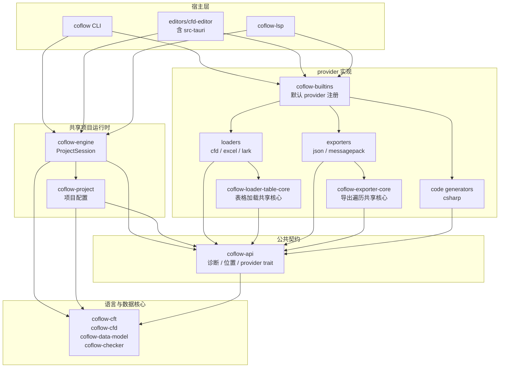
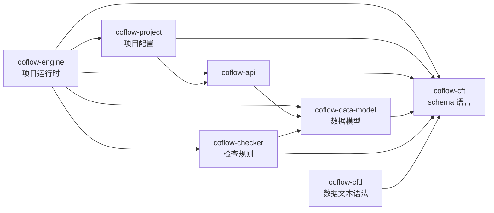

# Coflow 最终架构改造计划

本文汇总此前关于 editor 引入后架构、诊断、资源定位、`Project` / `workspace` 命名、`commands` / `language` 拆分、`coflow-pipeline` 去留等讨论，给出最终改造计划。

## 结论

当前问题不是缺少 `Adapters`，也不是 editor/app、language/commands 拆得不够细，而是缺少一个可复用的项目运行时。

现状中 CLI、`coflow-pipeline`、editor、LSP 都在不同程度上重复做这些事情：

- 打开项目配置。
- 解析 schema。
- 解析 source。
- 调 provider 加载数据。
- 构建 data model。
- 运行检查。
- 收集诊断。
- 把 record/source 映射回文件或表格位置。
- 把内部状态转换成各宿主层需要的通信结构。

最终目标是把真实复用的项目生命周期收敛到 `coflow-engine`，把 CLI、editor、LSP 降级为宿主层。

`coflow-pipeline` 不再保留为独立 crate。它当前承载了两类职责：

- 项目运行时流程：迁入 `coflow-engine`。
- CLI 命令产物流程：迁入根 CLI crate `coflow`。

## 不做的事

这些拆分目前不带来实际复用，暂不推进：

- 不引入泛化的 `Adapters` 层。
- 不把 editor 拆成 `editor-app` / `editor-adapter`。
- 不单独抽 `coflow-language`，LSP 内部可以继续模块化，但先不变成公共 crate。
- 不单独抽 `coflow-commands`，CLI 命令组织进入根 CLI crate。
- 不保留 `coflow-pipeline` 这个中间层，避免它继续一半像 engine、一半像 CLI。
- 不保留 `crates/coflow-editor-core` 这个独立 crate，editor 后端核心迁入 `editors/cfd-editor/src-tauri` 内部模块。
- 不让 `workspace` 成为核心领域概念。核心只认 `Project`；`workspace` 只允许作为 editor/LSP 宿主层的外部概念。

## 目标架构

```text
coflow-api
  诊断模型、来源位置、provider trait、数据/产物/写入接口

coflow-project
  coflow.yaml 解析、项目根目录、配置校验、schema 文件发现、
  项目相对路径解析、项目初始化

coflow-engine
  ProjectSession、项目生命周期、schema/model/check 状态、
  DiagnosticsStore、SourceIndex、RecordIndex、FileIndex、写入后重检

coflow CLI
  参数解析、命令编排、人类可读输出、JSON 输出、
  export/codegen/build 产物落盘、暂存和提交

editors/cfd-editor
  editor 应用、Tauri 后端、前端通信 DTO、graph/field 视图、编辑请求

coflow-lsp
  LSP 协议、文档同步、completion/hover/semantic tokens、
  DiagnosticSet 到 publishDiagnostics 的转换

providers
  loaders、exporters、code generators、loader/exporter 共享核心、默认 provider 注册
```

核心依赖方向：

```text
providers  -> coflow-api

coflow-project -> coflow-api

coflow-engine
  -> coflow-api
  -> coflow-project
  -> coflow-cft
  -> coflow-data-model
  -> coflow-checker

coflow CLI         -> coflow-engine
editors/cfd-editor -> coflow-engine
coflow-lsp         -> coflow-engine
```

依赖关系图分两张看。第一张只画跨层主依赖，避免把底层细节和 provider 注册揉在一起。



第二张只展开语言与数据核心内部依赖。



图中 CLI、editor 应用、LSP 都是宿主层。`editors/cfd-editor/src-tauri` 不单独作为一层，它属于 `editors/cfd-editor` 这个 editor 应用，原 `coflow-editor-core` 的后端能力迁入这里。图中也没有 `coflow-pipeline`，因为最终方案会删除这个 crate。运行时依赖进入 `coflow-engine`，CLI 命令产物流程进入根 crate `coflow`。

依赖规则不是“只能依赖相邻层”。本项目更应该要求依赖方向严格，而不是强行做成一层套一层：

- 依赖必须单向，不能形成环。
- `coflow-engine` 不依赖具体 provider，只通过 `ProviderRegistry` 和 trait 使用 provider。
- provider 不依赖 engine、CLI、editor、LSP。
- 宿主层不承载共享项目生命周期；项目打开、加载、检查、索引、写回重检都归 `coflow-engine`。
- LSP 可以直接依赖 `coflow-cft` / `coflow-cfd`，因为 completion、hover、semantic tokens 需要语法 AST。
- 跨层依赖只允许用于稳定核心类型和协议边界，不能拿来绕过 engine 重新实现项目运行时。

默认 provider 注册由 `coflow-builtins` 提供，只做一件事：

```rust
pub fn default_provider_registry() -> ProviderRegistry
```

除此之外不扩大它的职责。

## 各 crate 职责

### 语言与模型

- `coflow-cft`：CFT schema 语言核心，负责解析、编译、模块、类型定义、schema 诊断。
- `coflow-cfd`：CFD 数据文本语法核心，负责 `.cfd` parser、AST、语法定位，供 loader、editor、LSP 使用。
- `coflow-data-model`：来源无关的数据模型，负责把不同来源的数据记录编译成统一 `CfdDataModel`，维护 `RecordOrigin`、值模型、路径、来源位置映射。
- `coflow-checker`：基于 schema 和 model 执行检查规则，并生成依赖图。

### 公共接口

- `coflow-api`：provider 和宿主层的公共契约。放 `DiagnosticSet`、`SourceLocation`、`ProviderRegistry`、loader/exporter/codegen/writer trait、数据、产物、写入接口。它应该稳定、薄、不包含宿主层逻辑，也不承载 provider 实现共享算法。

### provider

- `coflow-loader-cfd`：本地 `.cfd` loader/writer，负责文本数据加载和写回。
- `coflow-loader-excel`：Excel `.xlsx` loader/writer，负责表格数据加载和单元格写回。
- `coflow-loader-lark`：飞书/Lark Sheets loader/writer，负责远程表格加载、写回、认证和 API 边界。
- `coflow-loader-table-core`：表格 loader 共享核心。承载 `TableSource`、`TableSheet`、`TableSheetConfig`、表格诊断、cell parsing、schema-guided row/column/cell parsing，以及 table 到 `CfdInputRecord + RecordOrigin::Table` 的转换。
- `coflow-exporter-json`：把验证后的 model 导出 JSON。
- `coflow-exporter-messagepack`：把验证后的 model 导出 MessagePack。
- `coflow-exporter-core`：exporter 共享核心。承载 `ExportEncoder`、`export_model_with_encoder`、schema-guided `CfdDataModel` traversal 和 `ExportError`。
- `coflow-codegen-csharp`：生成 C# 代码和相关运行时代码。

### 项目与运行时

- `coflow-project`：项目配置层。负责 `coflow.yaml` 解析、项目根目录、相对路径解析、配置校验、schema 文件发现、项目初始化。它不应长期承担 CLI JSON DTO 这类输出职责。
- `coflow-engine`：共享项目运行时。负责 `ProjectSession`、load/build/check/write 生命周期、`DiagnosticsStore`、`SourceIndex`、`RecordIndex`、`FileIndex`。

### 宿主层

- 根 crate `coflow`：CLI。负责命令参数、默认 provider 注册、调用 `coflow-engine`、触发 exporter/codegen provider、产物落盘、输出渲染。
- `coflow-lsp`：LSP server。负责协议、文档同步、completion/hover/semantic tokens、诊断发布。重构后诊断来源应来自 canonical `DiagnosticSet`，自己只做 LSP JSON 转换。
- `editors/cfd-editor`：editor 应用。`src-tauri` 是其中的 Tauri 后端 crate，负责桌面应用入口、命令桥接、窗口、前端通信 DTO、graph/table/detail 视图、编辑请求转换。

## 当前错误格式

当前项目里“错误”和“诊断”格式分成几类，复用性不完全一致。

### 底层语言诊断

`coflow-cft` 使用自己的 schema 语言诊断：

```rust
pub struct CftDiagnostics {
    pub diagnostics: Vec<CftDiagnostic>,
}

pub struct CftDiagnostic {
    pub code: CftErrorCode,
    pub stage: CftStage,
    pub severity: CftSeverity,
    pub message: String,
    pub primary: Option<CftLabel>,
    pub related: Vec<CftLabel>,
}

pub struct CftLabel {
    pub module: ModuleId,
    pub span: Span,
    pub message: Option<String>,
}
```

它适合 CFT lexer/parser/schema/type checker 内部使用。它的定位是 `module + span`，不是最终 host 展示格式。

`coflow-data-model` 使用自己的数据模型诊断：

```rust
pub struct CfdDiagnostics {
    pub diagnostics: Vec<CfdDiagnostic>,
}

pub struct CfdDiagnostic {
    pub code: CfdErrorCode,
    pub stage: CfdStage,
    pub severity: CfdSeverity,
    pub message: String,
    pub primary: Option<CfdLabel>,
    pub related: Vec<CfdLabel>,
}

pub struct CfdLabel {
    pub record: Option<CfdRecordId>,
    pub path: CfdPath,
    pub message: Option<String>,
}
```

它适合 data model、reference、check 内部使用。它的定位是 `record + field path`，需要通过 `RecordOrigin` 映射成文件、表格或远程单元格。

`coflow-checker` 不需要自己的独立诊断格式。checker 的错误天然落在 record/path 上，复用 `CfdDiagnostics` 比新增 `CheckerDiagnostic` 更清楚。后续如果觉得 `CfdDiagnostics` 命名过窄，可以统一重命名为更中性的 record/path 诊断模型，但不要为 checker 再建一套平行格式。

### 当前 canonical 诊断

`coflow-api` 已经有内部最接近统一格式的诊断：

```rust
pub struct DiagnosticSet {
    pub diagnostics: Vec<Diagnostic>,
}

pub struct Diagnostic {
    pub code: String,
    pub stage: String,
    pub severity: Severity,
    pub message: String,
    pub primary: Option<Label>,
    pub related: Vec<Label>,
}

pub struct Label {
    pub location: SourceLocation,
    pub message: Option<String>,
}
```

`SourceLocation` 是当前最完整的位置表达：

```rust
pub enum SourceLocation {
    FileSpan { path, start_line, start_character, end_line, end_character },
    TableCell { path, sheet, row, column },
    RemoteCell { document, sheet, row, column },
    ProjectConfig { path, key_path },
    Artifact { path },
}
```

后续 engine 内部只应保存这套 canonical diagnostics。

### CLI JSON DTO

`coflow-project` 当前还定义了 `DiagnosticJson` / `RelatedJson`：

```rust
pub struct DiagnosticJson {
    pub code: String,
    pub stage: String,
    pub severity: String,
    pub message: String,
    pub path: String,
    pub sheet: Option<String>,
    pub cell: Option<String>,
    pub start_line: usize,
    pub start_character: usize,
    pub end_line: usize,
    pub end_character: usize,
    pub related: Vec<RelatedJson>,
}
```

这本质是 CLI JSON 输出 DTO，不应该长期放在 `coflow-project`。重构后应移动到根 CLI crate，作为 `DiagnosticSet -> JSON` 的输出格式。

### pipeline 结果包装

`coflow-pipeline` 当前用：

```rust
pub enum PipelineOutcome<T> {
    Success(T),
    Diagnostics(DiagnosticSet),
}
```

这说明 pipeline 已经把 schema/data/check/artifact/codegen 可定位错误收敛到了 `DiagnosticSet`，方向是对的。但 `PipelineOutcome` 本身是命令流程包装。拆除 `coflow-pipeline` 后，运行时诊断进入 `coflow-engine`，CLI 命令成功/失败和报告结构留在根 CLI crate。

### editor 错误和诊断

editor 当前有两类格式。

命令错误：

```rust
pub struct EditorError {
    pub kind: EditorErrorKind,
    pub message: String,
    pub diagnostics: Vec<DiagnosticItem>,
}

pub enum EditorErrorKind {
    Session,
    Project,
    Load,
    Write,
    NotFound,
    Other,
}
```

前端诊断项：

```rust
pub struct DiagnosticItem {
    pub severity: String,
    pub code: String,
    pub stage: String,
    pub message: String,
    pub file_path: Option<String>,
    pub record_key: Option<String>,
    pub field_path: Option<String>,
}
```

`EditorError` 可以继续作为 editor 命令边界错误；`DiagnosticItem` 只能作为前端通信 DTO。editor 内部不应再维护独立诊断管线。

### LSP 诊断

LSP 当前直接构造 `serde_json::Value`，发送 `textDocument/publishDiagnostics`：

```text
DiagnosticSet
  -> LSP Diagnostic[]
  -> textDocument/publishDiagnostics
```

`publishDiagnostics` 是 LSP 协议要求，必须存在。但它只是 LSP 宿主层边界转换，不应成为 Coflow 内部诊断格式。

### 字符串错误

当前仍有不少 `Result<_, String>`：

- project 打开、配置路径解析、YAML 读取和解析。
- schema 文件发现和读取。
- artifact 写盘、暂存、提交。
- LSP 协议读写。
- provider HTTP/API 底层错误。

这些错误分两类处理：

- 用户可修复、可定位的问题：逐步转成 `DiagnosticSet`。
- 进程级、环境级、协议级失败：保留命令错误或宿主层错误。

## 错误格式收敛规则

- 允许存在多套格式，但只有 `DiagnosticSet` 是跨模块、跨宿主层流转的内部事实来源。
- engine 内部只保存 `DiagnosticSet`，不保存 `DiagnosticJson`、`DiagnosticItem`、LSP Diagnostic JSON。
- CFT / CFD 底层诊断可以保留，但进入 engine 边界时必须映射到 `DiagnosticSet`。
- checker 不新增独立诊断格式，继续复用 record/path 诊断模型。
- `DiagnosticJson` 迁入 CLI，只作为 JSON 输出 DTO。
- `DiagnosticItem` 只作为 editor 前端通信 DTO。
- LSP Diagnostic JSON 只作为 `publishDiagnostics` 的协议输出。
- `EditorError` 保留为 editor 命令失败格式，但其中的 diagnostics 应由 `DiagnosticSet` 转换而来。
- `Result<_, String>` 只用于不可定位的命令级、I/O、协议或环境失败；能定位到 project/source/artifact 的错误应优先进入 `DiagnosticSet`。
- 禁止在 host 层绕过 `DiagnosticSet` 重新收集、分类、改写项目诊断。

错误格式目标流向：

```text
CftDiagnostics
  -> DiagnosticSet

CfdDiagnostics + RecordOrigin
  -> DiagnosticSet

provider / project / artifact diagnostics
  -> DiagnosticSet

DiagnosticSet
  -> CLI DiagnosticJson
  -> editor DiagnosticItem
  -> LSP Diagnostic + publishDiagnostics
```

## 核心模型

### ProjectSession

`ProjectSession` 是新的共享运行时状态。它不是 UI session，也不是 LSP session。

```rust
pub struct ProjectSession {
    pub project: Project,
    pub schema: CftContainer,
    pub model: Option<CfdDataModel>,
    pub diagnostics: DiagnosticsStore,
    pub sources: SourceIndex,
    pub records: RecordIndex,
    pub files: FileIndex,
    pub dependencies: DependencyGraph,
}
```

职责：

- 打开项目。
- 编译 schema。
- resolve/load sources。
- build model。
- run checks。
- 保存可复用索引。
- 提供 write 后重检能力。

不负责：

- CLI JSON 输出。
- editor 通信 DTO。
- LSP JSON。
- 前端状态。
- 产物落盘。

### DiagnosticsStore

内部唯一诊断格式是：

```rust
coflow_api::DiagnosticSet
coflow_api::Diagnostic
coflow_api::SourceLocation
```

`DiagnosticsStore` 只是在 canonical diagnostics 上建索引：

```rust
pub struct DiagnosticsStore {
    diagnostics: DiagnosticSet,
    by_stage: BTreeMap<String, Vec<DiagnosticId>>,
    by_file: BTreeMap<PathBuf, Vec<DiagnosticId>>,
    by_record: BTreeMap<String, Vec<DiagnosticId>>,
}
```

`DiagnosticJson`、editor `DiagnosticItem`、LSP diagnostic JSON 都只能是宿主层转换结果，不能进入 engine 内部状态。

### SourceIndex / RecordIndex / FileIndex

这些索引替代 editor 当前重复维护的：

- `source_files`
- `key_to_file`
- `file_to_keys`
- `source_for_file`

目标接口：

```rust
pub struct SourceIndex {
    pub resolved_sources: Vec<ResolvedSourceEntry>,
}

pub struct ResolvedSourceEntry {
    pub id: SourceId,
    pub provider_id: String,
    pub source: ResolvedSource,
    pub display_path: String,
}

pub struct RecordIndex {
    pub by_key: BTreeMap<String, RecordRef>,
    pub by_file: BTreeMap<String, Vec<String>>,
}

pub struct RecordRef {
    pub key: String,
    pub origin: RecordOrigin,
    pub source_id: SourceId,
    pub provider_id: String,
}

pub struct FileIndex {
    pub source_files: BTreeSet<String>,
    pub display_to_source: BTreeMap<String, SourceId>,
}
```

路径规则由 `coflow-engine` / `coflow-project` 统一：

- 项目根目录相对路径。
- slash 展示路径。
- 本地文件绝对路径。
- source 展示名。
- record origin 到文件、表格或远程位置的映射。

LSP 的 `file://` URI 仍属于 LSP 宿主层，但应复用统一 path normalization，不再自己决定资源语义。

## 数据流

### 检查和加载

```text
Project::open_schema_only
  -> compile schema
  -> resolve configured sources
  -> provider.preflight
  -> provider.load
  -> collect input records + origins + source index
  -> CfdDataModel::builder
  -> coflow-checker
  -> ProjectSession
```

输出不再只是 `model`，而是完整 session：

```rust
pub struct ProjectBuildOutput {
    pub session: ProjectSession,
}
```

### 编辑写回

```text
editor edit request
  -> RecordIndex finds RecordOrigin + provider_id
  -> ProviderRegistry selects writer
  -> writer.write_cell
  -> touched origins
  -> reload affected source or full reload
  -> rebuild model/checks
  -> update ProjectSession diagnostics/indexes
  -> editor renders communication DTO
```

首版可以先 full reload，保留 dependency graph 给后续增量检查。不要为了增量能力提前引入复杂分层。

### 导出和代码生成

```text
CLI command
  -> coflow-engine builds ProjectSession
  -> exporter/codegen produces ArtifactSet
  -> CLI runs artifact safety checks
  -> CLI stages files
  -> CLI commits files
  -> CLI renders human/json report
```

这部分不再经过 `coflow-pipeline`。产物安全检查、暂存、提交、报告输出都是 CLI 命令语义，放在根 CLI crate 更直接。

## 分阶段计划

### 阶段 1：诊断收敛

目标：所有内部模块都以 `DiagnosticSet` 作为唯一诊断格式。

改动：

- 将 `DiagnosticJson` 从 `coflow-project` 的核心职责中移出。
- `coflow-project` 只返回 `DiagnosticSet`。
- CLI 新增诊断输出转换：`DiagnosticSet -> human/json`。
- editor session 内部不再保存 `Diagnostics { schema, load, check }`，改存 `DiagnosticsStore` 或 `DiagnosticSet`。
- LSP 所有 project/schema/data/check diagnostics 先转 canonical diagnostics，再转换成 publishDiagnostics。

验收：

- 同一错误在 CLI、editor、LSP 的 code、stage、severity、message 一致。
- 宿主层只差显示格式，不差诊断来源。

### 阶段 2：资源定位索引收敛

目标：资源定位成为 engine 能力，而不是 editor/LSP 各自拼 map。

改动：

- 新增 `SourceIndex`、`RecordIndex`、`FileIndex`。
- load records 时同步保存 `RecordOrigin -> SourceId -> provider_id`。
- 统一 `file_label_for`、`path_to_slash`、project relative path 的使用边界。
- editor 删除自有 `key_to_file`、`file_to_keys`、`source_for_file` 构建逻辑，改读 engine index。

验收：

- editor record 列表、字段定位、graph target file、写入来源都来自同一套 index。
- 表格、本地 CFD、远程 Lark 来源在索引模型中同等表达。

### 阶段 3：引入 coflow-engine

目标：让项目生命周期有唯一实现。

改动：

- 新增 `crates/coflow-engine`。
- 将 `coflow-pipeline/src/data.rs` 中的 `load_project_data`、`resolve_sources`、`configured_source` 等运行时逻辑迁入 engine。
- engine 接受 `Project`、`ProviderRegistry`，不直接依赖具体 provider。
- engine 输出 `ProjectSession`。
- engine 负责 load/build/check/write 生命周期，不负责产物落盘和 CLI 报告。

验收：

- CLI check 和 editor build 使用同一条 load/build/check 路径。
- `ProjectLoadOutput { model }` 被替换或升级为包含 session/index/diagnostics 的结构。

### 阶段 4：拆除 coflow-pipeline

目标：删除 `coflow-pipeline` crate，不保留剩余中间层。

改动：

- 将 `run_check` 命令编排迁入根 CLI crate。
- 将 `build/export/codegen` 命令编排迁入根 CLI crate。
- 将 `BuildReport`、`ExportReport`、`CodegenReport` 等 CLI 输出结构迁入根 CLI crate 或 CLI 内部模块。
- 将 artifact safety、stage、commit 逻辑迁入根 CLI crate。
- 从 workspace members 中移除 `crates/coflow-pipeline`。

验收：

- workspace 不再包含 `coflow-pipeline`。
- engine 中没有 CLI 输出、产物落盘、暂存、提交职责。
- CLI 仍能执行 check/export/codegen/build。

### 阶段 5：合并并迁移 editor

目标：删除 `crates/coflow-editor-core`，把 editor 后端核心迁入 `editors/cfd-editor/src-tauri`，并让 editor 不再维护第二套 project runtime。

改动：

- 将 `crates/coflow-editor-core/src` 下的 session/store/DTO/graph/edit 能力迁入 `editors/cfd-editor/src-tauri/src` 内部模块。
- `editors/cfd-editor/src-tauri` 调用 `coflow-engine` 构建 `ProjectSession`。
- editor 通信 DTO 从 `ProjectSession` 派生。
- 写入逻辑使用 `RecordIndex` 找 `RecordOrigin` 和 writer provider。
- editor diagnostics 转换只做 `DiagnosticSet -> DiagnosticItem`。
- 从 workspace members 中移除 `crates/coflow-editor-core`。

验收：

- 删除 editor 中重复的 source resolve/load/model build/check 代码。
- editor 与 CLI 对同一项目给出一致诊断。
- workspace 不再包含 `coflow-editor-core`。

### 阶段 6：迁移 LSP

目标：LSP 只做语言协议，不再独立决定 project diagnostics 语义。

改动：

- LSP 项目诊断来自 engine。
- `lsp_diagnostic` 只做转换。
- `preferred_diagnostic_uri` 保留为 LSP 打开文档优先策略，但不负责资源定位语义。
- CFD syntax diagnostics 也逐步转成 `DiagnosticSet` 后发布。

验收：

- CFT、CFD、project、data diagnostics 走统一转换路径。
- LSP 中表格/远程来源有明确展示策略；不能定位到打开文件时，显示在 project config 或虚拟诊断源，而不是静默降级为空路径。

### 阶段 7：provider registry 统一

目标：新增最小 `coflow-builtins`，统一 CLI、editor、LSP 的默认 provider 注册。

改动：

- 新增 `coflow-builtins::default_provider_registry()`。
- CLI、editor、LSP 共用它。
- 不把业务命令、宿主层逻辑、engine 逻辑放入 `coflow-builtins`。

验收：

- 新 provider 只需要在一个地方注册。
- `coflow-builtins` 没有变成新的杂物层。

### 阶段 8：API 瘦身与共享核心迁出

目标：让 `coflow-api` 回到稳定契约层，把 provider 实现共享算法迁出。

改动：

- 新增 `coflow-loader-table-core`。
- 将 `coflow-api::table` 迁入 `coflow-loader-table-core`。
- 将 `coflow-api::cell_value` 迁入 `coflow-loader-table-core`，作为表格/cell 解析共享能力。
- `coflow-loader-excel` 和 `coflow-loader-lark` 改为依赖 `coflow-loader-table-core`。
- 新增 `coflow-exporter-core`。
- 将 `coflow-api::export` 中的 `ExportEncoder`、`ExportError`、`export_model_with_encoder` 迁入 `coflow-exporter-core`。
- `coflow-exporter-json` 和 `coflow-exporter-messagepack` 改为依赖 `coflow-exporter-core`。
- `coflow-api` 保留 provider trait、diagnostics、source location、artifact、resolved source、write request/outcome 和 provider registry。

验收：

- `coflow-api` 不再包含表格加载算法。
- `coflow-api` 不再包含导出遍历算法。
- Excel/Lark 表格加载仍复用同一套 schema-guided table parsing。
- JSON/MessagePack 导出仍复用同一套 schema-guided model traversal。

### 阶段 9：清理命名和边界

目标：删除重构后的旧路径和混乱概念。

改动：

- 核心文档只使用 `Project` 表示 coflow.yaml 根。
- `workspace` 只出现在 editor/LSP 宿主层语境。
- 移除旧的 editor diagnostics bucket。
- 移除 project 中 CLI DTO。
- 删除不再需要的重复 path/diagnostic helper。
- 删除 `coflow-pipeline` 相关文档、依赖和导出。
- 删除 `coflow-api` 中迁出后的旧 module re-export。

验收：

- 新人看依赖图能明确：核心项目运行时是 engine，CLI/editor/LSP 是宿主层。

## 测试策略

每个阶段都要增加针对迁移边界的测试，而不是只依赖手工跑示例。

重点测试：

- config validation diagnostics 输出 `DiagnosticSet`。
- `DiagnosticSet -> CLI JSON` 稳定。
- `DiagnosticSet -> editor DiagnosticItem` 稳定。
- `DiagnosticSet -> LSP diagnostic` 稳定。
- `RecordOrigin::File` 到文件 span。
- `RecordOrigin::Table` 到本地 table cell。
- `RecordOrigin::Table` 到远程 document cell。
- `SourceIndex` 对本地目录、多 loader、显式 loader、远程 source 的记录。
- editor 写入通过 `RecordIndex` 找到正确 writer。
- CLI 在没有 `coflow-pipeline` 后仍能完成 check/export/codegen/build。
- `coflow-loader-excel` 和 `coflow-loader-lark` 通过 `coflow-loader-table-core` 共享表格解析。
- `coflow-exporter-json` 和 `coflow-exporter-messagepack` 通过 `coflow-exporter-core` 共享导出遍历。

提交前按仓库要求运行：

```powershell
cargo check --workspace
cargo fmt --all -- --check
cargo clippy --workspace --all-targets -- -D warnings
cargo test --workspace
```

## 推荐执行顺序

最稳妥的顺序是：

1. 先做 diagnostics canonical 化。
2. 再做 source/record/file index。
3. 引入 `coflow-engine`，迁入运行时逻辑。
4. 拆除 `coflow-pipeline`，把命令产物逻辑迁入 CLI。
5. 迁移 editor。
6. 迁移 LSP。
7. 新增 `coflow-builtins`，统一默认 provider 注册。
8. 瘦身 `coflow-api`，迁出 `coflow-loader-table-core` 和 `coflow-exporter-core`。
9. 清理命名、文档和旧依赖。

不要先拆 editor/app 或 language/commands。那些拆分不解决当前主要重复，反而会把重复代码搬到更多 crate 里。

## 最终判断

Coflow 当前的底层模型并不差：provider API、`DiagnosticSet`、`RecordOrigin`、产物模型分离都已经有正确方向。真正需要激进处理的是项目生命周期复用。把 `ProjectSession + DiagnosticsStore + SourceIndex + RecordIndex` 做扎实，并删除职责混杂的 `coflow-pipeline`，架构会比增加 adapter/language/commands 这些抽象更清晰，也更容易长期维护。
