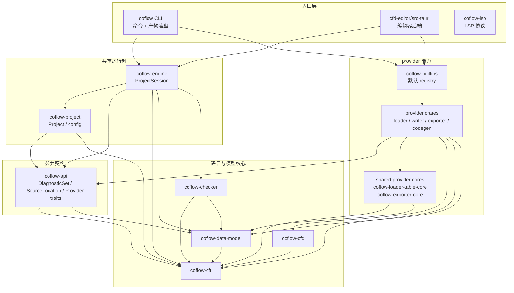

# Coflow 最终架构迁移记录

本文是 editor 引入后架构讨论的最终版。当前迁移目标不是增加 `Adapters`、`editor/app`、`language/commands` 等抽象，而是把真正复用的项目生命周期收敛到 `coflow-engine`，并删除职责混杂的中间层。

## 最终结论

- 不保留独立 `coflow-pipeline` crate。运行时逻辑进入 `coflow-engine`，CLI 命令产物流程进入根 crate `coflow`。
- 不保留独立 `crates/coflow-editor-core`。editor 后端核心进入 `editors/cfd-editor/src-tauri` 内部模块。
- 不新增泛化 `Adapters` 层。
- 不拆 `editor-app` / `editor-adapter`。
- 不单独抽 `coflow-language` 或 `coflow-commands`。
- 核心领域概念只使用 `Project`；`workspace` 只作为 Cargo 或宿主层概念出现。
- `coflow-api` 只保留 contracts，不承载 provider 实现算法。
- 表格共享算法属于 `coflow-loader-table-core`。
- 导出遍历共享算法属于 `coflow-exporter-core`。
- 默认 provider 注册属于 `coflow-builtins`。

## 当前目标架构

```text
coflow-api
  诊断模型、来源位置、provider trait、数据/产物/写入接口

coflow-project
  coflow.yaml 解析、项目根目录、配置校验、schema 文件发现、
  项目相对路径解析、项目初始化

coflow-engine
  ProjectSession、项目生命周期、schema/model/check 状态、
  DiagnosticsStore、SourceIndex、RecordIndex、FileIndex

coflow CLI
  参数解析、命令编排、人类可读输出、JSON 输出、
  export/codegen/build 产物落盘、暂存和提交

editors/cfd-editor/src-tauri
  editor 后端、前端通信 DTO、graph/field 视图、编辑请求

coflow-lsp
  LSP 协议、文档同步、completion/hover/semantic tokens、
  DiagnosticSet 到 publishDiagnostics 的转换

providers
  默认 provider 注册、provider crates、表格/导出共享核心
```

## 核心依赖图



依赖规则不是“只能依赖相邻层”，而是方向必须严格：

- 依赖必须单向，不能形成环。
- `coflow-engine` 不依赖具体 provider，只通过 `ProviderRegistry` 和 trait 使用 provider。
- provider 不依赖 engine、CLI、editor、LSP。
- 宿主层不承载共享项目生命周期；项目打开、加载、检查、索引和写回重检归 `coflow-engine`。
- `coflow-lsp` 当前是 schema-only/text language server，不加载数据源，不装配默认 provider registry；它可以直接依赖 `coflow-cft` / `coflow-cfd`，因为 completion、hover、semantic tokens 需要语法 AST。
- 跨层依赖只允许用于稳定核心类型和协议边界，不能拿来绕过 engine 重新实现项目运行时。

## 各 crate 职责

### 语言与模型

- `coflow-cft`：CFT schema 语言核心，负责解析、编译、模块、类型定义和 schema 诊断。
- `coflow-cfd`：CFD 数据文本语法核心，负责 `.cfd` parser、AST 和语法定位。
- `coflow-data-model`：来源无关的数据模型，负责把不同来源的数据记录编译成统一 `CfdDataModel`，维护值模型、路径和来源位置映射。
- `coflow-checker`：基于 schema 和 model 执行检查规则，并生成依赖图。checker 复用 data-model 的 record/path 诊断模型，不定义独立诊断格式。

### 公共接口

- `coflow-api`：provider 和宿主层的公共契约。放 `DiagnosticSet`、`SourceLocation`、`ProviderRegistry`、loader/exporter/codegen/writer trait、数据、产物、写入接口。它稳定、薄，不包含宿主层逻辑，也不承载 provider 实现共享算法。

### provider

- `coflow-loader-cfd`：本地 `.cfd` loader/writer，负责文本数据加载和写回。
- `coflow-loader-excel`：Excel `.xlsx` loader/writer，负责表格文件读取和单元格写回。
- `coflow-loader-lark`：飞书/Lark Sheets loader/writer，负责远程表格加载、写回、认证和 API 边界。
- `coflow-loader-table-core`：表格 loader 共享核心。承载 `TableSource`、`TableSheet`、`TableSheetConfig`、表格诊断、cell parsing、schema-guided row/column/cell parsing，以及 table 到 `CfdInputRecord + RecordOrigin::Table` 的转换。
- `coflow-exporter-json`：把验证后的 model 导出 JSON。
- `coflow-exporter-messagepack`：把验证后的 model 导出 MessagePack。
- `coflow-exporter-core`：exporter 共享核心。承载 `ExportEncoder`、`export_model_with_encoder`、schema-guided `CfdDataModel` traversal 和 `ExportError`。
- `coflow-codegen-csharp`：生成 C# 代码和相关运行时代码。
- `coflow-builtins`：默认 provider 注册聚合。它不是 provider 算法实现层，只负责把内置 loader/writer/exporter/codegen 注册进 `ProviderRegistry`。

### 项目与运行时

- `coflow-project`：项目配置层。负责 `coflow.yaml` 解析、项目根目录、相对路径解析、配置校验、schema 文件发现和项目初始化。
- `coflow-engine`：共享项目运行时。负责 `ProjectSession`、load/build/check 生命周期、`DiagnosticsStore`、`SourceIndex`、`RecordIndex`、`FileIndex`。

### 宿主层

- 根 crate `coflow`：CLI。负责命令参数、调用 `coflow-builtins::default_provider_registry()`、调用 `coflow-engine`、触发 exporter/codegen provider、产物落盘、输出渲染。
- `coflow-lsp`：LSP server。负责协议、文档同步、completion/hover/semantic tokens、诊断发布。
- `editors/cfd-editor`：editor 应用。`src-tauri` 是其中的 Tauri 后端 crate，负责桌面应用入口、命令桥接、前端通信 DTO、graph/table/detail 视图和编辑请求转换。

## 诊断收束

当前允许多套底层诊断结构，但跨模块事实来源只有 `DiagnosticSet`。

```text
CftDiagnostics
  -> DiagnosticSet

CfdDiagnostics + RecordOrigin
  -> DiagnosticSet + DiagnosticLogicalLocation

provider / project / artifact diagnostics
  -> DiagnosticSet

DiagnosticSet
  -> CLI DiagnosticJson
  -> editor DiagnosticItem
  -> LSP Diagnostic + publishDiagnostics
```

规则：

- engine 内部只保存 `DiagnosticSet` 和索引，不保存 `DiagnosticJson`、`DiagnosticItem`、LSP Diagnostic JSON。
- CFT / CFD 底层诊断可以保留，但进入 engine 边界时必须映射到 `DiagnosticSet`。
- checker 不新增独立诊断格式。
- `DiagnosticJson` 只在根 CLI crate。
- `DiagnosticItem` 只在 editor 前端通信边界。
- `publishDiagnostics` 是 LSP 协议输出，不是 Coflow 内部格式。
- `Result<_, String>` 只用于不可定位的命令级、I/O、协议或环境失败；能定位到 project/source/artifact 的错误优先进入 `DiagnosticSet`。

## 核心数据流

### 检查和加载

```text
Project::open_schema_only
  -> coflow-engine::build_project_session
  -> compile schema
  -> resolve configured sources
  -> provider.preflight
  -> provider.load
  -> collect input records + origins + source index
  -> CfdDataModel::builder
  -> coflow-checker
  -> ProjectSession
```

### 编辑写回

```text
editor edit request
  -> RecordIndex finds RecordOrigin + provider_id
  -> ProviderRegistry selects writer
  -> writer.write_field
  -> rebuild ProjectSession
  -> editor renders communication DTO
```

首版写回后做 full rebuild，保持跨文件引用、索引和 check 诊断一致。dependency graph 保留给后续增量检查使用。

### 导出和代码生成

```text
CLI command
  -> coflow-engine builds ProjectSession
  -> exporter/codegen produces ArtifactSet
  -> CLI runs artifact safety checks
  -> CLI stages files
  -> CLI commits files
  -> CLI renders human/json report
```

产物安全检查、暂存、提交、报告输出都是 CLI 命令语义，不属于 engine。

## 已完成迁移项

- `coflow-builtins` 已成为默认 provider registry 入口。
- `coflow-engine` 已提供 `ProjectSession`、`DiagnosticsStore`、`SourceIndex`、`RecordIndex`、`FileIndex` 和 `build_project_session`。
- 根 crate `coflow` 已承接 check/build/export/codegen 命令编排、artifact staging/commit、CLI report 和 JSON diagnostic DTO。
- 独立 `coflow-pipeline` crate 已从 Cargo workspace 移除。
- 独立 `coflow-editor-core` crate 已从 Cargo workspace 移除；editor 后端位于 `editors/cfd-editor/src-tauri/src/editor`。
- `coflow-api` 已移除表格加载算法和导出遍历算法。
- `coflow-loader-table-core` 已承接表格解析和 cell value 解析。
- `coflow-exporter-core` 已承接 JSON/MessagePack 共用的 schema-aware traversal。
- `coflow-project` 不再承载 CLI `DiagnosticJson`。

## 维护验收

架构边界变更时必须保持以下约束：

- Cargo workspace 不包含 `crates/coflow-pipeline`。
- Cargo workspace 不包含 `crates/coflow-editor-core`。
- `coflow-engine` 不依赖 `coflow-builtins` 或具体 provider crate。
- `coflow-api` 不出现 `pub mod table`、`pub mod cell_value`、`pub mod export`。
- Excel/Lark writer 使用 `coflow-loader-table-core` 的共享 cell renderer。
- JSON/MessagePack exporter 使用 `coflow-exporter-core`。
- CLI JSON DTO 不回流到 `coflow-project`。
- editor 不重新实现 source resolve/load/model build/check。

提交前按仓库要求运行：

```powershell
cargo check --workspace
cargo fmt --all -- --check
cargo clippy --workspace --all-targets -- -D warnings
cargo test --workspace
```

## 最终判断

Coflow 的核心应保持为：`coflow-api` 提供契约，`coflow-project` 提供项目配置，`coflow-engine` 提供可复用运行时，provider crates 提供具体输入输出能力，CLI/editor/LSP 作为宿主层做各自协议和 UI 转换。删除 `coflow-pipeline` 和 `coflow-editor-core` 后，架构不再依赖临时中间层，后续扩展应优先沿这些边界演进。
