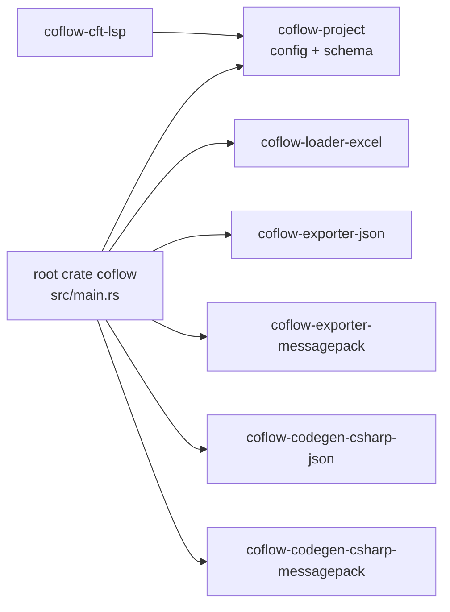
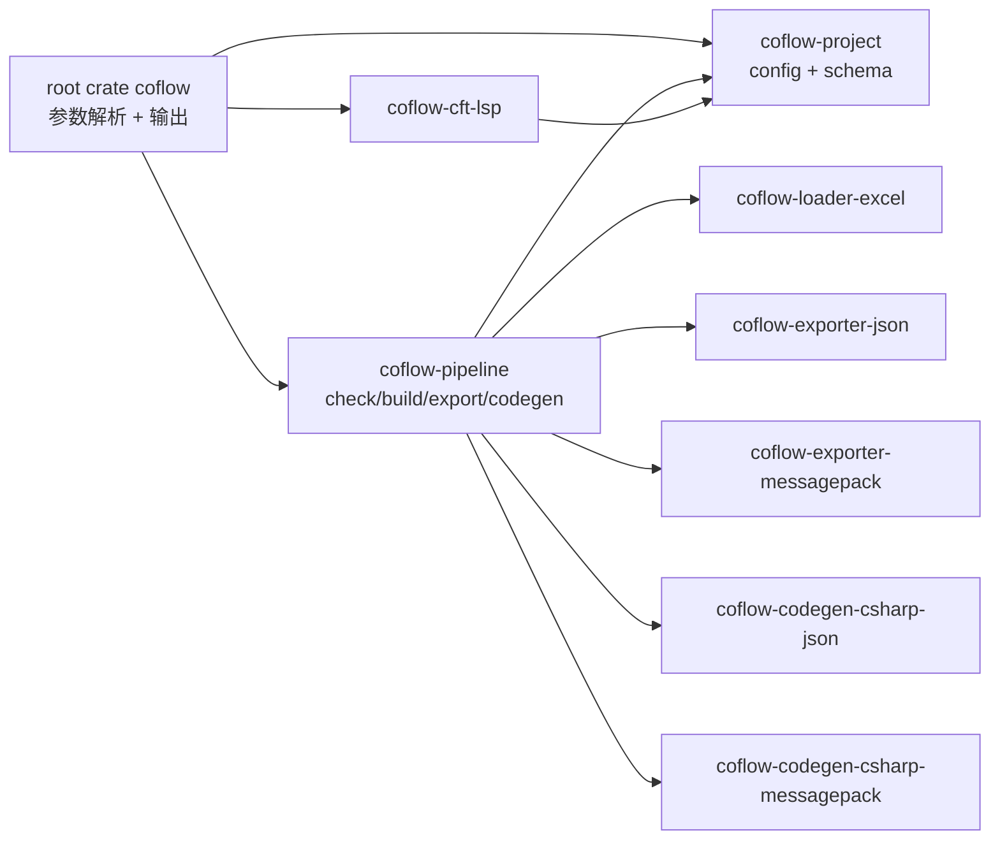
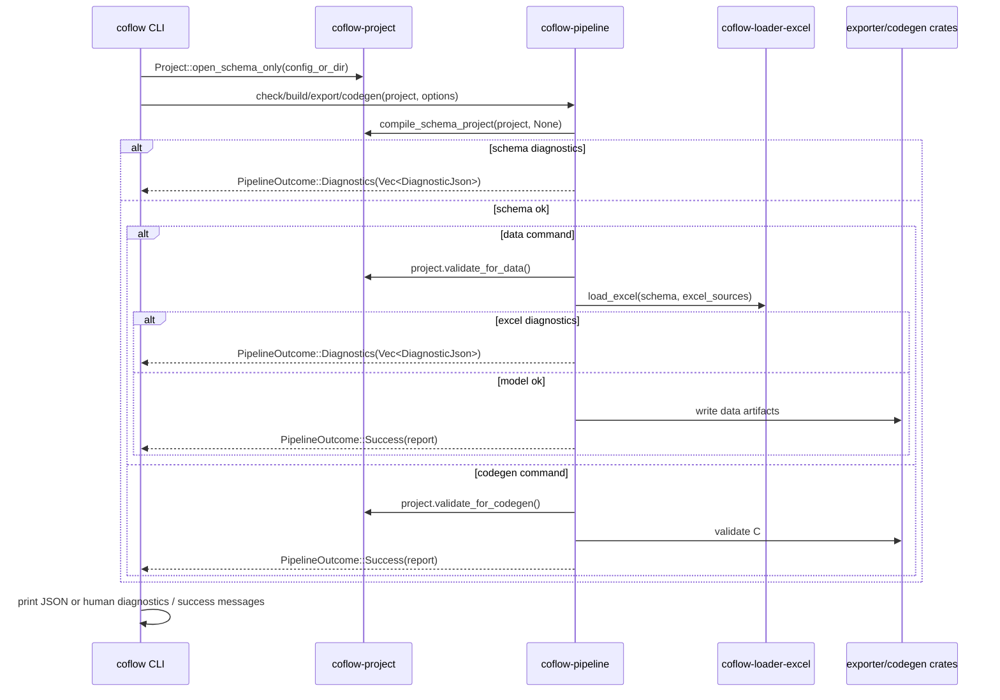
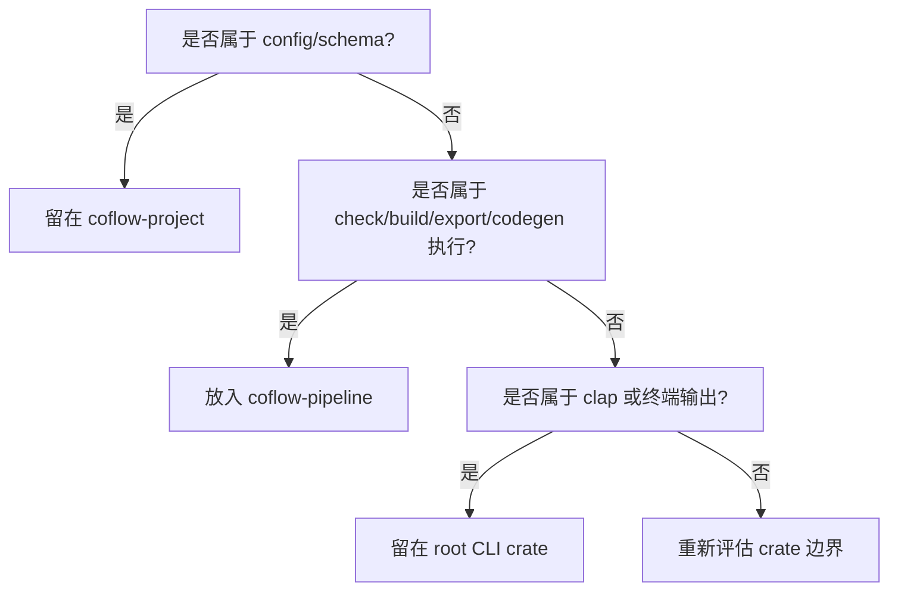

# Coflow Pipeline Crate 完整迁移 Implementation Plan

> **For agentic workers:** REQUIRED SUB-SKILL: Use superpowers:subagent-driven-development (recommended) or superpowers:executing-plans to implement this plan task-by-task. Steps use checkbox (`- [ ]`) syntax for tracking.

**Goal:** 一次性把项目级执行编排从 CLI 根包迁移到新的 `coflow-pipeline` crate，并把项目配置校验拆成 schema-only、data、codegen 这些明确阶段。

**Architecture:** `coflow-project` 继续提供 `Project`、配置解析、路径解析和 CFT schema 编译，但不再在 `Project::open_schema_only` 阶段校验 Excel source 是否存在。新增 `coflow-pipeline` 负责 check/build/export/codegen 的业务流水线、data-stage source 校验、Excel 诊断聚合和 artifact 写入。C# target-specific 约束仍落在 `coflow-codegen-csharp`，pipeline 只负责在 codegen 阶段调用这些校验并传播错误。

**Tech Stack:** Rust 2021 workspace、clap、serde/serde_json、serde_yaml、Coflow 内部 crates、Cargo integration tests、Mermaid 文档图。

---

## 迁移原则

- `coflow-project` 不新增 Excel、exporter、codegen 依赖，避免污染 `coflow-cft-lsp` 的依赖树。
- `coflow-project` 的项目打开必须支持 schema-only 模式；`coflow cft check`、`coflow cft lsp`、`coflow codegen csharp` 不能因为 Excel 文件缺失而失败。
- 数据命令仍必须校验 Excel source：`coflow check`、`coflow build`、`coflow export json`、`coflow export messagepack` 遇到缺失 workbook 或非法 sheet 配置要失败。
- `coflow-pipeline` 不解析 clap 参数，不直接写 stdout/stderr，只返回结构化结果、诊断和输出路径。
- CLI 根包不再直接调用 `coflow-loader-excel`、`coflow-exporter-json`、`coflow-exporter-messagepack`、`coflow-codegen-csharp-json`、`coflow-codegen-csharp-messagepack`。
- 现有命令行为保持不变：`check`、`build`、`export json`、`export messagepack`、`codegen csharp` 的成功消息、失败退出码和主要错误文本继续被现有 CLI tests 覆盖。
- API 先保持固定流水线函数，不引入通用 DAG、trait object 或插件系统。
- 所有新增公开类型派生 `Debug`，避免触发 workspace lint；生产代码不使用 `unwrap`、`expect`、`panic`。

## 必须覆盖的需求

- `Project::open` 保持现有 full/data 校验语义以兼容旧调用点；新增 `Project::open_schema_only` 或等价 API 给 schema-only 命令使用。
- `coflow codegen csharp` 只需要 schema、outputs.code 和 outputs.data.type，不需要 Excel source 存在。
- `coflow cft check` 和 `coflow cft lsp` 只需要 schema，不需要 Excel source 存在。
- C# target validation 必须拒绝生成成员名碰撞，例如 `foo_bar` 与 `fooBar` 同时映射为 `FooBar`。
- C# target validation 必须拒绝生成文件名碰撞和保留名，至少包含默认数据库类 `GameConfig`、运行时异常 `CftLoadException`，以及用户配置的 database class。
- CFT/C# 校验必须确保 `@ref(Target)` 字段的非 nullable id 类型与 Target 继承范围的 `@id` 字段类型一致。
- C# `float` 映射坚持全 64 位：CFT `float` 对应 C# `double`，JSON/MessagePack readers 不得降成 Single。
- `@struct` 内含或嵌套 `@ref` 必须支持，resolver 对 struct 使用“返回更新后的值并写回父字段/集合元素”的模型，不能用按值传参丢弃修改。
- Excel 文件级 JSON diagnostic 必须填真实 workbook path，不能继续输出空 `path`。

## 当前结构



问题点：`src/main.rs` 同时承担 CLI 参数解析、项目流水线编排、Excel 诊断转换、文件写入和成功消息生成，文件职责过宽。

## 目标结构



关键变化：`coflow-cft-lsp` 仍然只依赖 `coflow-project`，不会因为项目流水线迁移而加载 Excel/export/codegen 依赖。

## 目标数据流



## 文件结构

| 文件 | 动作 | 职责 |
| --- | --- | --- |
| `Cargo.toml` | 修改 | workspace members 增加 `crates/coflow-pipeline`；根包依赖切换到 `coflow-pipeline`，移除直接流水线依赖。 |
| `crates/coflow-project/src/lib.rs` | 修改 | 增加 schema-only 项目打开和阶段化配置校验；保留 full 校验入口兼容数据命令。 |
| `crates/coflow-pipeline/Cargo.toml` | 新增 | 声明 pipeline crate 依赖。 |
| `crates/coflow-pipeline/src/lib.rs` | 新增 | 公开 API：outcome、options、reports、check/build/export/codegen 函数。 |
| `crates/coflow-pipeline/src/schema.rs` | 新增 | schema 编译与 CFT diagnostics 转换。 |
| `crates/coflow-pipeline/src/excel.rs` | 新增 | `ProjectConfig.sources` 到 `ExcelSource` 的转换、Excel 加载、Excel diagnostics 转换。 |
| `crates/coflow-pipeline/src/artifacts.rs` | 新增 | JSON/MessagePack 数据写入、C# 文件写入、输出目录解析。 |
| `crates/coflow-codegen-csharp/src/ir.rs` | 修改 | 增加 C# target validation：成员碰撞、文件名碰撞、保留名、ref id 类型一致性。 |
| `crates/coflow-codegen-csharp/src/emit.rs` | 修改 | CFT `float` 改为 C# `double`，struct ref resolver 改为返回更新值。 |
| `crates/coflow-codegen-csharp-json/templates/database_json_readers.cs.tera` | 修改 | JSON float reader 返回 `double`。 |
| `crates/coflow-codegen-csharp-messagepack/templates/database_messagepack_readers.cs.tera` | 修改 | MessagePack float reader 返回 `double`，不转 Single。 |
| `crates/coflow-pipeline/tests/pipeline.rs` | 新增 | pipeline crate 级测试，覆盖成功 check/export/build/codegen 和诊断返回。 |
| `src/main.rs` | 修改 | 删除流水线实现细节，改为调用 `coflow_pipeline`，保留 clap、`init`、`cft check`、`cft lsp`、输出函数。 |
| `tests/cli.rs` | 修改 | 保留现有行为测试；只在需要时补充断言，验证 CLI 行为未变。 |
| `crates/coflow-codegen-csharp/src/lib.rs` | 修改 | 增加 codegen target validation 单元测试。 |
| `docs/spec/07-project-pipeline.md` | 修改 | 写明项目管线由 `coflow-pipeline` crate 承担，`coflow-project` 是配置/schema 层。 |
| `README.md` | 修改 | 如命令说明不变，只补一句内部 crate 职责；不新增用户可见命令。 |

## 目标公开 API

`crates/coflow-pipeline/src/lib.rs` 最终公开这些类型和函数：

```rust
use coflow_project::DiagnosticJson;
use std::path::{Path, PathBuf};

#[derive(Debug, Clone, Copy, PartialEq, Eq)]
pub enum DataFormat {
    Json,
    Messagepack,
}

#[derive(Debug, Clone, Copy, PartialEq, Eq)]
pub enum CodegenTarget {
    Csharp,
}

#[derive(Debug)]
pub enum PipelineOutcome<T> {
    Success(T),
    Diagnostics(Vec<DiagnosticJson>),
}

#[derive(Debug, Default)]
pub struct BuildOptions<'a> {
    pub data_out_dir: Option<&'a Path>,
    pub code_out_dir: Option<&'a Path>,
    pub namespace: Option<&'a str>,
}

#[derive(Debug, Default)]
pub struct ExportOptions<'a> {
    pub out_dir: Option<&'a Path>,
}

#[derive(Debug, Default)]
pub struct CodegenOptions<'a> {
    pub out_dir: Option<&'a Path>,
    pub namespace: Option<&'a str>,
}

#[derive(Debug)]
pub struct CheckReport;

#[derive(Debug)]
pub struct ExportReport {
    pub format: DataFormat,
    pub dir: PathBuf,
}

#[derive(Debug)]
pub struct CodegenReport {
    pub target: CodegenTarget,
    pub dir: PathBuf,
}

#[derive(Debug)]
pub struct BuildReport {
    pub data: ExportReport,
    pub code: Option<CodegenReport>,
}

pub fn check_project(project: &coflow_project::Project) -> Result<PipelineOutcome<CheckReport>, String>;
pub fn build_project(
    project: &coflow_project::Project,
    options: BuildOptions<'_>,
) -> Result<PipelineOutcome<BuildReport>, String>;
pub fn export_project_data(
    project: &coflow_project::Project,
    format: DataFormat,
    options: ExportOptions<'_>,
) -> Result<PipelineOutcome<ExportReport>, String>;
pub fn generate_project_code(
    project: &coflow_project::Project,
    target: CodegenTarget,
    options: CodegenOptions<'_>,
) -> Result<PipelineOutcome<CodegenReport>, String>;
```

`PipelineOutcome::Diagnostics` 表示业务校验失败，CLI 应返回失败退出码但不把它当成 Rust error。`Err(String)` 只用于配置错误、I/O 错误、unsupported output type、生成失败等命令错误。

`coflow-project` 最终额外公开这些阶段化入口：

```rust
impl Project {
    pub fn open(config_or_dir: Option<&Path>) -> Result<Self, String>;
    pub fn open_schema_only(config_or_dir: Option<&Path>) -> Result<Self, String>;
    pub fn validate_for_data(&self) -> Result<(), String>;
    pub fn validate_for_codegen(&self) -> Result<(), String>;
}
```

语义：

- `open_schema_only` 只校验 config 可解析、schema path 存在、outputs 字段格式可解析，不校验 `sources[*].file` 是否存在，也不要求 `sources[*].sheets` 非空。
- `open` 保持兼容，等价于 `open_schema_only` 后调用 `validate_for_data` 和 outputs 校验。
- `validate_for_data` 校验 Excel source 文件存在、sheet 名非空、source 有 sheet。
- `validate_for_codegen` 校验 `outputs.code.type == "csharp"`，并校验 `outputs.data.type` 是 `json` 或 `messagepack`，但不校验 Excel source。

## Task 1: 拆分 `coflow-project` 项目打开和阶段校验

**Files:**
- Modify: `crates/coflow-project/src/lib.rs`
- Modify: `tests/cli.rs`

- [ ] **Step 1: 写 schema-only 命令不校验 Excel source 的失败测试**

在 `tests/cli.rs` 追加测试：

```rust
#[test]
fn schema_only_commands_do_not_require_excel_sources() {
    let root = temp_project_dir("schema-only-missing-source");
    std::fs::create_dir_all(root.join("schema")).expect("create schema dir");
    std::fs::write(
        root.join("schema").join("main.cft"),
        "type Item { @id id: string; value: int; }\n",
    )
    .expect("write schema");
    std::fs::write(
        root.join("coflow.yaml"),
        "schema: schema/\n\
         sources:\n\
           - file: data/missing.xlsx\n\
             sheets:\n\
               - sheet: Items\n\
                 type: Item\n\
                 columns:\n\
                   A: id\n\
         outputs:\n\
           data:\n\
             type: json\n\
             dir: generated/data\n\
           code:\n\
             type: csharp\n\
             dir: generated/csharp\n\
             namespace: Game.Config\n",
    )
    .expect("write config");

    let cft_check = run_coflow(["cft", "check", root.to_str().expect("utf8 path")]);
    assert!(
        cft_check.status.success(),
        "cft check should not require xlsx\nstdout: {}\nstderr: {}",
        String::from_utf8_lossy(&cft_check.stdout),
        String::from_utf8_lossy(&cft_check.stderr)
    );

    let codegen_dir = root.join("generated").join("csharp");
    let codegen = run_coflow([
        "codegen",
        "csharp",
        root.to_str().expect("utf8 path"),
        "--out",
        codegen_dir.to_str().expect("utf8 path"),
    ]);
    assert!(
        codegen.status.success(),
        "codegen should not require xlsx\nstdout: {}\nstderr: {}",
        String::from_utf8_lossy(&codegen.stdout),
        String::from_utf8_lossy(&codegen.stderr)
    );
    assert!(codegen_dir.join("GameConfig.cs").exists());

    let _ = std::fs::remove_dir_all(root);
}
```

Run:

```powershell
cargo test --test cli schema_only_commands_do_not_require_excel_sources -- --nocapture
```

Expected: FAIL，错误文本包含 `sources[0].file ... does not exist`。

- [ ] **Step 2: 增加阶段化 `Project` API**

修改 `crates/coflow-project/src/lib.rs` 中 `impl Project` 的打开逻辑：

```rust
impl Project {
    pub fn open(config_or_dir: Option<&Path>) -> Result<Self, String> {
        let project = Self::open_schema_only(config_or_dir)?;
        project.validate_for_data()?;
        Ok(project)
    }

    pub fn open_schema_only(config_or_dir: Option<&Path>) -> Result<Self, String> {
        let config_path = resolve_config_path(config_or_dir)?;
        let config_path = fs::canonicalize(&config_path).map_err(|err| {
            format!(
                "failed to resolve config `{}`: {err}",
                config_path.display()
            )
        })?;
        let root_dir = config_path
            .parent()
            .ok_or_else(|| format!("config `{}` has no parent directory", config_path.display()))?
            .to_path_buf();
        let source = fs::read_to_string(&config_path)
            .map_err(|err| format!("failed to read `{}`: {err}", config_path.display()))?;
        let config = serde_yaml::from_str(&source)
            .map_err(|err| format!("failed to parse `{}`: {err}", config_path.display()))?;
        validate_project_config_schema_only(&root_dir, &config)?;
        Ok(Self {
            config_path,
            root_dir,
            config,
        })
    }

    pub fn validate_for_data(&self) -> Result<(), String> {
        validate_sources(&self.root_dir, &self.config.sources)
    }

    pub fn validate_for_codegen(&self) -> Result<(), String> {
        let code = self
            .config
            .outputs
            .code
            .as_ref()
            .ok_or_else(|| {
                "coflow.yaml missing outputs.code; required `type: csharp` for `coflow codegen csharp`"
                    .to_string()
            })?;
        if code.output_type != "csharp" {
            return Err(format!(
                "coflow.yaml outputs.code.type is `{}`; expected `csharp`",
                code.output_type
            ));
        }
        let data = self.config.outputs.data.as_ref().ok_or_else(|| {
            "coflow.yaml missing outputs.data; required `type: json` or `type: messagepack` for `coflow codegen csharp`"
                .to_string()
        })?;
        if !matches!(data.output_type.as_str(), "json" | "messagepack") {
            return Err(format!(
                "coflow.yaml outputs.data.type is `{}`; expected `json` or `messagepack`",
                data.output_type
            ));
        }
        Ok(())
    }
}
```

替换原 `validate_project_config`：

```rust
fn validate_project_config_schema_only(
    root_dir: &Path,
    config: &ProjectConfig,
) -> Result<(), String> {
    validate_schema_config(root_dir, &config.schema)?;
    validate_outputs(&config.outputs)?;
    validate_source_shapes(&config.sources)?;
    Ok(())
}

fn validate_source_shapes(sources: &[SourceConfig]) -> Result<(), String> {
    for (source_index, source) in sources.iter().enumerate() {
        let source_label = format!("sources[{source_index}]");
        if source.file.as_os_str().is_empty() {
            return Err(format!("{source_label}.file is empty"));
        }
        for (sheet_index, sheet) in source.sheets.iter().enumerate() {
            let sheet_label = format!("{source_label}.sheets[{sheet_index}]");
            if sheet.sheet.trim().is_empty() {
                return Err(format!("{sheet_label}.sheet is empty"));
            }
            if let Some(type_name) = &sheet.type_name {
                if type_name.trim().is_empty() {
                    return Err(format!("{sheet_label}.type is empty"));
                }
            }
        }
    }
    Ok(())
}
```

保留 `validate_sources`，但删除其中重复的 file empty/sheet type 形状校验或让它先调用 `validate_source_shapes(sources)?`，然后只负责数据阶段规则：

```rust
fn validate_sources(root_dir: &Path, sources: &[SourceConfig]) -> Result<(), String> {
    validate_source_shapes(sources)?;
    for (source_index, source) in sources.iter().enumerate() {
        let source_label = format!("sources[{source_index}]");
        if !resolve_project_relative(root_dir, &source.file).is_file() {
            return Err(format!(
                "{source_label}.file `{}` does not exist",
                source.file.display()
            ));
        }
        if source.sheets.is_empty() {
            return Err(format!("{source_label}.sheets is empty"));
        }
    }
    Ok(())
}
```

- [ ] **Step 3: 更新 schema-only 调用点**

在 `src/main.rs` 中把 schema-only 命令改成使用 `open_schema_only`：

```rust
fn cft_check(args: &CftCheckArgs) -> Result<bool, String> {
    let project = Project::open_schema_only(args.config_or_dir.as_deref())?;
    // keep the existing compile_schema_project/reporting body
}

fn cft_lsp(args: &CftLspArgs) -> Result<bool, String> {
    let project = Project::open_schema_only(args.config_or_dir.as_deref())?;
    coflow_cft_lsp::run(project)
}
```

后续 Task 7 切换 CLI 到 pipeline 时，`codegen_csharp` 也必须用 `open_schema_only`。

- [ ] **Step 4: 运行阶段化校验测试**

Run:

```powershell
cargo fmt --all -- --check
cargo test --test cli schema_only_commands_do_not_require_excel_sources -- --nocapture
cargo test --test cli config_validation_rejects_invalid_sources_and_sheets -- --nocapture
```

Expected: 两个测试都 PASS；第一个证明 schema-only 不要求 workbook，第二个证明数据阶段配置校验仍保留。

- [ ] **Step 5: Commit**

```powershell
git add crates/coflow-project/src/lib.rs src/main.rs tests/cli.rs
git commit -m "refactor: split project config validation by stage"
```

## Task 2: 新增 `coflow-pipeline` crate 骨架

**Files:**
- Create: `crates/coflow-pipeline/Cargo.toml`
- Create: `crates/coflow-pipeline/src/lib.rs`
- Modify: `Cargo.toml`

- [ ] **Step 1: 写最小 API 骨架**

创建 `crates/coflow-pipeline/Cargo.toml`：

```toml
[package]
name = "coflow-pipeline"
version = "0.1.0"
edition = "2021"
description = "Project execution pipeline for Coflow."
license = "Apache-2.0"
repository = "https://github.com/wtlll/ScriptForGame"
publish = false

[lints]
workspace = true

[dependencies]
coflow-cft = { path = "../coflow-cft" }
coflow-project = { path = "../coflow-project" }
coflow-loader-excel = { path = "../coflow-loader-excel" }
coflow-exporter-json = { path = "../coflow-exporter-json" }
coflow-exporter-messagepack = { path = "../coflow-exporter-messagepack" }
coflow-codegen-csharp-json = { path = "../coflow-codegen-csharp-json" }
coflow-codegen-csharp-messagepack = { path = "../coflow-codegen-csharp-messagepack" }
serde_json = { version = "1", features = ["preserve_order"] }
```

创建 `crates/coflow-pipeline/src/lib.rs`：

```rust
#![cfg_attr(
    not(test),
    deny(
        clippy::dbg_macro,
        clippy::expect_used,
        clippy::panic,
        clippy::panic_in_result_fn,
        clippy::todo,
        clippy::unimplemented,
        clippy::unreachable,
        clippy::unwrap_used
    )
)]

use coflow_project::{DiagnosticJson, Project};
use std::path::{Path, PathBuf};

#[derive(Debug, Clone, Copy, PartialEq, Eq)]
pub enum DataFormat {
    Json,
    Messagepack,
}

#[derive(Debug, Clone, Copy, PartialEq, Eq)]
pub enum CodegenTarget {
    Csharp,
}

#[derive(Debug)]
pub enum PipelineOutcome<T> {
    Success(T),
    Diagnostics(Vec<DiagnosticJson>),
}

#[derive(Debug, Default)]
pub struct BuildOptions<'a> {
    pub data_out_dir: Option<&'a Path>,
    pub code_out_dir: Option<&'a Path>,
    pub namespace: Option<&'a str>,
}

#[derive(Debug, Default)]
pub struct ExportOptions<'a> {
    pub out_dir: Option<&'a Path>,
}

#[derive(Debug, Default)]
pub struct CodegenOptions<'a> {
    pub out_dir: Option<&'a Path>,
    pub namespace: Option<&'a str>,
}

#[derive(Debug)]
pub struct CheckReport;

#[derive(Debug)]
pub struct ExportReport {
    pub format: DataFormat,
    pub dir: PathBuf,
}

#[derive(Debug)]
pub struct CodegenReport {
    pub target: CodegenTarget,
    pub dir: PathBuf,
}

#[derive(Debug)]
pub struct BuildReport {
    pub data: ExportReport,
    pub code: Option<CodegenReport>,
}

pub fn check_project(_project: &Project) -> Result<PipelineOutcome<CheckReport>, String> {
    Err("coflow-pipeline check_project is not wired yet".to_string())
}

pub fn build_project(
    _project: &Project,
    _options: BuildOptions<'_>,
) -> Result<PipelineOutcome<BuildReport>, String> {
    Err("coflow-pipeline build_project is not wired yet".to_string())
}

pub fn export_project_data(
    _project: &Project,
    _format: DataFormat,
    _options: ExportOptions<'_>,
) -> Result<PipelineOutcome<ExportReport>, String> {
    Err("coflow-pipeline export_project_data is not wired yet".to_string())
}

pub fn generate_project_code(
    _project: &Project,
    _target: CodegenTarget,
    _options: CodegenOptions<'_>,
) -> Result<PipelineOutcome<CodegenReport>, String> {
    Err("coflow-pipeline generate_project_code is not wired yet".to_string())
}
```

- [ ] **Step 2: 加入 workspace**

修改根 `Cargo.toml` 的 workspace members：

```toml
    "crates/coflow-codegen-csharp-messagepack",
    "crates/coflow-project",
    "crates/coflow-pipeline",
    "crates/coflow-cft-lsp",
```

- [ ] **Step 3: 运行格式和编译检查**

Run:

```powershell
cargo fmt --all -- --check
cargo check -p coflow-pipeline
```

Expected:

```text
Finished `dev` profile
```

- [ ] **Step 4: Commit**

```powershell
git add Cargo.toml crates/coflow-pipeline
git commit -m "feat: add coflow pipeline crate skeleton"
```

## Task 3: 迁移 schema 和 Excel 诊断到 pipeline

**Files:**
- Create: `crates/coflow-pipeline/src/schema.rs`
- Create: `crates/coflow-pipeline/src/excel.rs`
- Modify: `crates/coflow-pipeline/src/lib.rs`
- Create: `crates/coflow-pipeline/tests/pipeline.rs`

- [ ] **Step 1: 写失败测试**

创建 `crates/coflow-pipeline/tests/pipeline.rs`：

```rust
#![allow(
    clippy::expect_used,
    clippy::panic,
    clippy::panic_in_result_fn,
    clippy::unwrap_used
)]

use coflow_pipeline::{check_project, PipelineOutcome};
use coflow_project::Project;

#[test]
fn check_project_passes_for_rpg_example() {
    let project =
        Project::open_schema_only(Some(std::path::Path::new("examples/rpg"))).expect("open project");

    let outcome = check_project(&project).expect("check project");

    assert!(matches!(outcome, PipelineOutcome::Success(_)));
}

#[test]
fn check_project_returns_schema_diagnostics() {
    let root = temp_project_dir("coflow-pipeline-schema-diagnostics");
    std::fs::create_dir_all(root.join("schema")).expect("create schema dir");
    std::fs::write(root.join("schema").join("bad.cft"), "type Broken { value: Missing; }\n")
        .expect("write schema");
    std::fs::write(root.join("coflow.yaml"), "schema: schema/\nsources: []\n")
        .expect("write config");
    let project = Project::open_schema_only(Some(root.as_path())).expect("open project");

    let outcome = check_project(&project).expect("check project");

    let PipelineOutcome::Diagnostics(diagnostics) = outcome else {
        panic!("expected diagnostics");
    };
    assert!(
        diagnostics
            .iter()
            .any(|diagnostic| diagnostic.message.contains("Missing")),
        "diagnostics: {diagnostics:?}"
    );

    let _ = std::fs::remove_dir_all(root);
}

fn temp_project_dir(name: &str) -> std::path::PathBuf {
    let suffix = format!(
        "{}-{}",
        std::process::id(),
        std::time::SystemTime::now()
            .duration_since(std::time::UNIX_EPOCH)
            .expect("system time")
            .as_nanos()
    );
    let root = std::env::temp_dir().join(format!("{name}-{suffix}"));
    if root.exists() {
        std::fs::remove_dir_all(&root).expect("clean temp dir");
    }
    root
}
```

Run:

```powershell
cargo test -p coflow-pipeline check_project -- --nocapture
```

Expected: FAIL，错误文本包含 `coflow-pipeline check_project is not wired yet`。

- [ ] **Step 2: 实现 schema 编译 helper**

创建 `crates/coflow-pipeline/src/schema.rs`：

```rust
use coflow_cft::CftContainer;
use coflow_project::{
    compile_schema_project, dedupe_cft_diagnostics, DiagnosticJson, Project, SchemaBuild,
};

pub(crate) fn compile_project_schema(
    project: &Project,
) -> Result<Result<CftContainer, Vec<DiagnosticJson>>, String> {
    let build = compile_schema_project(project, None)?;
    let diagnostics = diagnostics_from_schema_build(&build);
    if !diagnostics.is_empty() {
        return Ok(Err(diagnostics));
    }
    build
        .container
        .ok_or_else(|| "schema compilation did not produce a container".to_string())
        .map(Ok)
}

fn diagnostics_from_schema_build(build: &SchemaBuild) -> Vec<DiagnosticJson> {
    dedupe_cft_diagnostics(build.diagnostics.clone())
        .iter()
        .map(|diagnostic| DiagnosticJson::from_cft(diagnostic, &build.sources, &build.paths))
        .collect()
}
```

- [ ] **Step 3: 实现 Excel helper 和 diagnostics 转换**

创建 `crates/coflow-pipeline/src/excel.rs`，内容从 `src/main.rs` 迁移并改成返回 diagnostics，不打印：

```rust
use coflow_cft::CftContainer;
use coflow_loader_excel::{
    load_excel, ExcelDiagnostic, ExcelDiagnostics, ExcelLoadError, ExcelLoadOutput, ExcelLocation,
    ExcelSheet, ExcelSource,
};
use coflow_project::{DiagnosticJson, Project, RelatedJson};

pub(crate) fn load_project_excel(
    project: &Project,
    schema: &CftContainer,
) -> Result<Result<ExcelLoadOutput, Vec<DiagnosticJson>>, String> {
    let sources = excel_sources(project);
    match load_excel(schema, &sources) {
        Ok(output) => {
            if let Some(checks) = &output.check_diagnostics {
                Ok(Err(diagnostics_from_excel_checks(checks)))
            } else {
                Ok(Ok(output))
            }
        }
        Err(err) => Ok(Err(diagnostics_from_excel_error(&err))),
    }
}

fn excel_sources(project: &Project) -> Vec<ExcelSource> {
    project
        .config
        .sources
        .iter()
        .map(|source| {
            let sheets = source
                .sheets
                .iter()
                .map(|sheet| {
                    let mut out = ExcelSheet::new(sheet.sheet.clone());
                    if let Some(type_name) = &sheet.type_name {
                        out = out.with_type(type_name.clone());
                    }
                    if !sheet.columns.is_empty() {
                        out = out.with_columns(sheet.columns.clone());
                    }
                    out
                })
                .collect();
            ExcelSource::new(project.resolve_path(&source.file), sheets)
        })
        .collect()
}

fn excel_diagnostic_json(diagnostic: &ExcelDiagnostic) -> DiagnosticJson {
    let fallback = ExcelLocation::new("");
    let location = diagnostic
        .primary
        .as_ref()
        .map_or(&fallback, |label| &label.location);
    let (line, character) = excel_position(location);
    DiagnosticJson {
        code: diagnostic.source.code.as_str().to_string(),
        stage: diagnostic.source.stage.to_string(),
        severity: "error".to_string(),
        message: diagnostic.source.message.clone(),
        path: location.file.display().to_string(),
        start_line: line,
        start_character: character,
        end_line: line,
        end_character: character.saturating_add(1),
        related: diagnostic
            .related
            .iter()
            .map(|label| excel_related_json(&label.location, label.message.clone()))
            .collect(),
    }
}

fn excel_error_json(
    code: impl Into<String>,
    stage: impl Into<String>,
    message: String,
    file: &std::path::Path,
) -> DiagnosticJson {
    DiagnosticJson {
        code: code.into(),
        stage: stage.into(),
        severity: "error".to_string(),
        message,
        path: file.display().to_string(),
        start_line: 0,
        start_character: 0,
        end_line: 0,
        end_character: 1,
        related: Vec::new(),
    }
}

fn excel_location_json(
    code: impl Into<String>,
    stage: impl Into<String>,
    message: String,
    location: &ExcelLocation,
) -> DiagnosticJson {
    let (line, character) = excel_position(location);
    DiagnosticJson {
        code: code.into(),
        stage: stage.into(),
        severity: "error".to_string(),
        message,
        path: location.file.display().to_string(),
        start_line: line,
        start_character: character,
        end_line: line,
        end_character: character.saturating_add(1),
        related: Vec::new(),
    }
}

fn excel_related_json(location: &ExcelLocation, label: Option<String>) -> RelatedJson {
    let (line, character) = excel_position(location);
    RelatedJson {
        path: location.file.display().to_string(),
        start_line: line,
        start_character: character,
        end_line: line,
        end_character: character.saturating_add(1),
        label,
    }
}

fn excel_position(location: &ExcelLocation) -> (usize, usize) {
    (
        location.row.unwrap_or(1).saturating_sub(1),
        location.column.unwrap_or(1).saturating_sub(1),
    )
}

fn diagnostics_from_excel_checks(checks: &ExcelDiagnostics) -> Vec<DiagnosticJson> {
    checks
        .diagnostics
        .iter()
        .map(excel_diagnostic_json)
        .collect()
}

fn diagnostics_from_excel_error(err: &ExcelLoadError) -> Vec<DiagnosticJson> {
    match err {
        ExcelLoadError::OpenWorkbook { file, message } => vec![excel_error_json(
            "EXCEL-OPEN",
            "EXCEL",
            format!("failed to open workbook `{}`: {message}", file.display()),
            file,
        )],
        ExcelLoadError::ReadSheet { location, message } => vec![excel_location_json(
            "EXCEL-SHEET",
            "EXCEL",
            message.clone(),
            location,
        )],
        ExcelLoadError::MissingSheet { file, sheet } => vec![excel_error_json(
            "EXCEL-SHEET",
            "EXCEL",
            format!("workbook `{}` is missing sheet `{sheet}`", file.display()),
            file,
        )],
        ExcelLoadError::EmptySheet { location } => vec![excel_location_json(
            "EXCEL-SHEET",
            "EXCEL",
            "sheet is empty".to_string(),
            location,
        )],
        ExcelLoadError::UnknownType {
            location,
            type_name,
        } => vec![excel_location_json(
            "EXCEL-TYPE",
            "EXCEL",
            format!("unknown CFT type `{type_name}`"),
            location,
        )],
        ExcelLoadError::UnknownColumn {
            location,
            type_name,
            column,
            field,
        } => vec![excel_location_json(
            "EXCEL-COLUMN",
            "EXCEL",
            format!("column `{column}` maps to unknown field `{field}` on type `{type_name}`"),
            location,
        )],
        ExcelLoadError::DuplicateFieldColumn {
            location,
            field,
            first_column,
            duplicate_column,
        } => vec![excel_location_json(
            "EXCEL-COLUMN",
            "EXCEL",
            format!("field `{field}` is mapped by both `{first_column}` and `{duplicate_column}`"),
            location,
        )],
        ExcelLoadError::CellParse {
            location,
            type_name,
            field,
            diagnostics,
        } => diagnostics
            .diagnostics
            .iter()
            .map(|diag| {
                excel_location_json(
                    format!("CELL-{:?}", diag.code),
                    "CELL",
                    format!(
                        "failed to parse `{type_name}.{field}` cell: {}",
                        diag.message
                    ),
                    location,
                )
            })
            .collect(),
        ExcelLoadError::UnsupportedCellValue { location, kind } => vec![excel_location_json(
            "EXCEL-CELL",
            "EXCEL",
            format!("unsupported Excel cell value `{kind}`"),
            location,
        )],
        ExcelLoadError::DataModel(diagnostics) => diagnostics_from_excel_checks(diagnostics),
    }
}
```

- [ ] **Step 4: 接入 `check_project`**

修改 `crates/coflow-pipeline/src/lib.rs` 顶部模块和 `check_project`：

```rust
mod excel;
mod schema;

use excel::load_project_excel;
use schema::compile_project_schema;
```

替换 `check_project`：

```rust
pub fn check_project(project: &Project) -> Result<PipelineOutcome<CheckReport>, String> {
    let schema = match compile_project_schema(project)? {
        Ok(schema) => schema,
        Err(diagnostics) => return Ok(PipelineOutcome::Diagnostics(diagnostics)),
    };
    project.validate_for_data()?;
    match load_project_excel(project, &schema)? {
        Ok(_) => Ok(PipelineOutcome::Success(CheckReport)),
        Err(diagnostics) => Ok(PipelineOutcome::Diagnostics(diagnostics)),
    }
}
```

- [ ] **Step 5: 验证测试通过**

Run:

```powershell
cargo fmt --all -- --check
cargo test -p coflow-pipeline check_project -- --nocapture
```

Expected:

```text
test check_project_passes_for_rpg_example ... ok
test check_project_returns_schema_diagnostics ... ok
```

- [ ] **Step 6: Commit**

```powershell
git add crates/coflow-pipeline/src/lib.rs crates/coflow-pipeline/src/schema.rs crates/coflow-pipeline/src/excel.rs crates/coflow-pipeline/tests/pipeline.rs
git commit -m "feat: move project check pipeline into coflow-pipeline"
```

## Task 4: 补齐 C# target validation 和 64 位 float 语义

**Files:**
- Modify: `crates/coflow-codegen-csharp/src/ir.rs`
- Modify: `crates/coflow-codegen-csharp/src/emit.rs`
- Modify: `crates/coflow-codegen-csharp/src/lib.rs`
- Modify: `crates/coflow-codegen-csharp-json/templates/database_json_readers.cs.tera`
- Modify: `crates/coflow-codegen-csharp-messagepack/templates/database_messagepack_readers.cs.tera`

- [ ] **Step 1: 写 C# 成员名碰撞、保留文件名、ref id 类型、double 映射失败测试**

在 `crates/coflow-codegen-csharp/src/lib.rs` 的 test module 追加：

```rust
#[test]
fn codegen_rejects_generated_member_name_collisions() -> Result<(), String> {
    let schema = compile_schema(
        r"
            type Item {
                @id id: string;
                foo_bar: int;
                fooBar: int;
            }
        ",
    )?;

    let Err(err) = generate_json(&schema, &CsharpCodegenOptions::new("Game.Config")) else {
        return Err("member name collision should fail".to_string());
    };
    require_contains(&err.to_string(), "generated C# member name `FooBar` conflicts")?;
    Ok(())
}

#[test]
fn codegen_rejects_reserved_generated_file_names() -> Result<(), String> {
    let game_config = compile_schema("type GameConfig { @id id: string; }\n")?;
    let Err(err) = generate_json(&game_config, &CsharpCodegenOptions::new("Game.Config")) else {
        return Err("GameConfig type should fail".to_string());
    };
    require_contains(&err.to_string(), "reserved C# generated file name `GameConfig.cs`")?;

    let exception = compile_schema("type CftLoadException { @id id: string; }\n")?;
    let Err(err) = generate_json(&exception, &CsharpCodegenOptions::new("Game.Config")) else {
        return Err("CftLoadException type should fail".to_string());
    };
    require_contains(
        &err.to_string(),
        "reserved C# generated file name `CftLoadException.cs`",
    )?;
    Ok(())
}

#[test]
fn codegen_rejects_ref_id_type_mismatches() -> Result<(), String> {
    let schema = compile_schema(
        r"
            type Target { @id id: int; }
            type Drop {
                @id id: string;
                @ref(Target)
                target_id: string;
            }
        ",
    )?;

    let Err(err) = generate_json(&schema, &CsharpCodegenOptions::new("Game.Config")) else {
        return Err("@ref id type mismatch should fail".to_string());
    };
    require_contains(
        &err.to_string(),
        "@ref field `Drop.target_id` has C# id type `string` but target `Target` uses `long`",
    )?;
    Ok(())
}

#[test]
fn codegen_maps_cft_float_to_csharp_double() -> Result<(), String> {
    let schema = compile_schema(
        r"
            type Item {
                @id id: string;
                speed: float = 1.5;
            }
        ",
    )?;

    let files = generate_messagepack(&schema, &CsharpCodegenOptions::new("Game.Config"))
        .map_err(|err| err.to_string())?;
    let item = generated_file(&files, "Item.cs")?;
    let database = generated_file(&files, "GameConfig.cs")?;
    require_contains(item, "public double Speed { get; init; } = 1.5;")?;
    require_contains(database, "private static double ReadFloat(")?;
    require_not_contains(database, "private static float ReadFloat(")?;
    Ok(())
}
```

Run:

```powershell
cargo test -p coflow-codegen-csharp codegen_rejects_generated_member_name_collisions -- --nocapture
cargo test -p coflow-codegen-csharp codegen_rejects_reserved_generated_file_names -- --nocapture
cargo test -p coflow-codegen-csharp codegen_rejects_ref_id_type_mismatches -- --nocapture
cargo test -p coflow-codegen-csharp codegen_maps_cft_float_to_csharp_double -- --nocapture
```

Expected: all FAIL for the reason named by each test.

- [ ] **Step 2: 校验生成文件名和成员名碰撞**

在 `crates/coflow-codegen-csharp/src/ir.rs` 增加 helper：

```rust
use std::collections::BTreeSet;

fn normalized_csharp_file_key(name: &str) -> String {
    name.to_ascii_lowercase()
}

fn validate_generated_file_names(
    schema: &CftContainer,
    options: &CsharpCodegenOptions,
) -> Result<(), CsharpCodegenError> {
    let mut seen = BTreeSet::new();
    let reserved = [
        format!("{}.cs", options.database_class),
        "CftLoadException.cs".to_string(),
    ];
    for file in reserved {
        let key = normalized_csharp_file_key(&file);
        if !seen.insert(key) {
            return Err(CsharpCodegenError::new(format!(
                "reserved C# generated file name `{file}` conflicts with another generated file"
            )));
        }
    }
    for schema_enum in schema.all_enums() {
        validate_generated_file_name(&mut seen, &format!("{}.cs", schema_enum.name))?;
    }
    for schema_type in schema.all_types() {
        validate_generated_file_name(&mut seen, &format!("{}.cs", schema_type.name))?;
    }
    Ok(())
}

fn validate_generated_file_name(
    seen: &mut BTreeSet<String>,
    file: &str,
) -> Result<(), CsharpCodegenError> {
    let key = normalized_csharp_file_key(file);
    if !seen.insert(key) {
        return Err(CsharpCodegenError::new(format!(
            "reserved C# generated file name `{file}` conflicts with another generated file"
        )));
    }
    Ok(())
}
```

在 `build_project` 中 `validate_generated_names(&view)?;` 之前调用：

```rust
validate_generated_file_names(schema, options)?;
```

在 `validate_schema_names` 的每个 type 内增加 per-type member set：

```rust
let mut members = BTreeSet::new();
for field in &schema_type.all_fields {
    let property_name = pascal_case(&field.name);
    validate_ident("field property", &property_name)?;
    if !members.insert(property_name.clone()) {
        return Err(CsharpCodegenError::new(format!(
            "generated C# member name `{property_name}` conflicts on type `{}`",
            schema_type.name
        )));
    }

    if let Some(target) = annotation_name_arg(&field.annotations, "ref") {
        let ref_name = ref_property_name(&field.name, &target);
        validate_ident("ref property", &ref_name)?;
        if !members.insert(ref_name.clone()) {
            return Err(CsharpCodegenError::new(format!(
                "generated C# member name `{ref_name}` conflicts on type `{}`",
                schema_type.name
            )));
        }
    }
}
```

Use `schema_type.all_fields` rather than only local `fields` so inherited generated members are covered.

- [ ] **Step 3: 校验 `@ref` 字段类型与目标 `@id` 类型一致**

在 `crates/coflow-codegen-csharp/src/ir.rs` 增加：

```rust
fn validate_ref_id_types(view: &SchemaView) -> Result<(), CsharpCodegenError> {
    for ty in view.types.values() {
        for field in &ty.all_fields {
            let Some(target) = annotation_name_arg(&field.annotations, "ref") else {
                continue;
            };
            let target_meta = view.type_meta(&target)?;
            let target_id = target_meta.id_field()?;
            let field_id_type = csharp_ref_id_type_name(&field.ty);
            let target_id_type = csharp_ref_id_type_name(&target_id.ty);
            if field_id_type != target_id_type {
                return Err(CsharpCodegenError::new(format!(
                    "@ref field `{}.{}` has C# id type `{field_id_type}` but target `{target}` uses `{target_id_type}`",
                    ty.name, field.name
                )));
            }
        }
    }
    Ok(())
}

fn csharp_ref_id_type_name(ty: &FieldType) -> String {
    match ty.non_nullable() {
        FieldType::String => "string".to_string(),
        FieldType::Int => "long".to_string(),
        other => csharp_type_name_for_error(other),
    }
}

fn csharp_type_name_for_error(ty: &FieldType) -> String {
    match ty {
        FieldType::Int => "long".to_string(),
        FieldType::Float => "double".to_string(),
        FieldType::Bool => "bool".to_string(),
        FieldType::String => "string".to_string(),
        FieldType::Type(name) | FieldType::Enum(name) => name.clone(),
        FieldType::Array(inner) => format!("List<{}>", csharp_type_name_for_error(inner)),
        FieldType::Dict(key, value) => format!(
            "Dictionary<{}, {}>",
            csharp_type_name_for_error(key),
            csharp_type_name_for_error(value)
        ),
        FieldType::Nullable(inner) => format!("{}?", csharp_type_name_for_error(inner)),
    }
}
```

调用位置：

```rust
let view = SchemaView::new(schema);
validate_ref_id_types(&view)?;
validate_generated_names(&view)?;
```

If `FieldType` or `SchemaView::type_meta` is private to another module, move the helper to the module where those symbols are visible rather than making broad public API changes.

- [ ] **Step 4: 把 CFT `float` 映射为 C# `double`**

在 `crates/coflow-codegen-csharp/src/emit.rs`：

```rust
fn csharp_type(ty: &FieldType) -> String {
    match ty {
        FieldType::Int => "long".to_string(),
        FieldType::Float => "double".to_string(),
        // keep the rest unchanged
    }
}
```

在 JSON reader template 中把 `ReadFloat` 改成：

```csharp
private static double ReadFloat(JToken token, string path)
{
    if (token.Type == JTokenType.Float || token.Type == JTokenType.Integer)
    {
        return token.Value<double>();
    }

    throw TypeError(path, "number", token);
}
```

在 MessagePack reader template 中把 `ReadFloat` 改成：

```csharp
private static double ReadFloat(ref MessagePackReader reader, string path)
{
    try
    {
        return reader.NextMessagePackType switch
        {
            MessagePackType.Integer => ReadInt(ref reader, path),
            MessagePackType.Float => reader.ReadDouble(),
            _ => throw TypeError(path, "number", reader.NextMessagePackType.ToString()),
        };
    }
    catch (MessagePackSerializationException ex)
    {
        throw TypeError(path, "number", ex.Message);
    }
    catch (EndOfStreamException ex)
    {
        throw TypeError(path, "number", ex.Message);
    }
}
```

- [ ] **Step 5: 支持 `@struct` ref resolver 写回**

Add tests before implementation:

```rust
#[test]
fn codegen_resolves_refs_inside_structs_by_writing_back_values() -> Result<(), String> {
    let schema = compile_schema(
        r"
            type Target { @id id: string; }
            @struct
            sealed type Payload {
                @ref(Target)
                target_id: string;
            }
            type Row {
                @id id: string;
                payload: Payload;
                payloads: [Payload];
            }
        ",
    )?;

    let files = generate_json(&schema, &CsharpCodegenOptions::new("Game.Config"))
        .map_err(|err| err.to_string())?;
    let database = generated_file(&files, "GameConfig.cs")?;
    require_contains(
        database,
        "value.Payload = ResolvePayloadRefs(value.Payload, targetRefIndex, $\"{path}.payload\");",
    )?;
    require_contains(
        database,
        "value.Payloads[index] = ResolvePayloadRefs(value.Payloads[index], targetRefIndex, $\"{path}.payloads[{index}]\");",
    )?;
    require_contains(
        database,
        "private static Payload ResolvePayloadRefs(Payload value, Dictionary<string, Target> targetRefIndex, string path)",
    )?;
    require_contains(database, "return value;")?;
    Ok(())
}
```

Implementation direction:

- Extend `CsharpResolveMethod` with `returns_value: bool` or `return_type: Option<String>`.
- For struct methods, render `private static Payload ResolvePayloadRefs(Payload value, ..., string path)` and append `return value;`.
- For class methods, keep `private static void ResolveRowRefs(Row value, ..., string path)`.
- In `push_resolve_nested_value`, when nested type is struct and has refs, emit assignment:

```rust
out.push(format!(
    "value.{property} = Resolve{type_name}Refs(value.{property}, {index_args}, $\"{{path}}.{field_name}\");"
));
```

- For `List<StructType>`, emit indexed writeback:

```csharp
for (var index = 0; index < value.Payloads.Count; index++)
{
    value.Payloads[index] = ResolvePayloadRefs(value.Payloads[index], targetRefIndex, $"{path}.payloads[{index}]");
}
```

- For dictionary values where `TValue` is a struct with refs, collect keys first or assign by key:

```csharp
foreach (var key in value.PayloadById.Keys.ToList())
{
    value.PayloadById[key] = ResolvePayloadRefs(value.PayloadById[key], targetRefIndex, $"{path}.payloadById[{key}]");
}
```

If `System.Linq` is needed for `.ToList()`, add the using in database templates only when such a resolver is emitted. Prefer avoiding Linq by iterating over `new List<TKey>(value.Dict.Keys)` if that fits existing template style.

- [ ] **Step 6: 验证 C# target tests**

Run:

```powershell
cargo fmt --all -- --check
cargo test -p coflow-codegen-csharp -- --nocapture
```

Expected: all tests PASS.

- [ ] **Step 7: Commit**

```powershell
git add crates/coflow-codegen-csharp/src/ir.rs crates/coflow-codegen-csharp/src/emit.rs crates/coflow-codegen-csharp/src/lib.rs crates/coflow-codegen-csharp-json/templates/database_json_readers.cs.tera crates/coflow-codegen-csharp-messagepack/templates/database_messagepack_readers.cs.tera
git commit -m "fix: validate csharp target constraints"
```

## Task 5: 迁移数据导出和 C# codegen artifact 写入

**Files:**
- Create: `crates/coflow-pipeline/src/artifacts.rs`
- Modify: `crates/coflow-pipeline/src/lib.rs`
- Modify: `crates/coflow-pipeline/tests/pipeline.rs`

- [ ] **Step 1: 写失败测试**

追加到 `crates/coflow-pipeline/tests/pipeline.rs`：

```rust
use coflow_pipeline::{
    export_project_data, generate_project_code, CodegenOptions, CodegenTarget, DataFormat,
    ExportOptions,
};

#[test]
fn export_project_data_writes_json_tables() {
    let project =
        Project::open_schema_only(Some(std::path::Path::new("examples/rpg"))).expect("open project");
    let out_dir = temp_project_dir("coflow-pipeline-json-export");

    let outcome = export_project_data(
        &project,
        DataFormat::Json,
        ExportOptions {
            out_dir: Some(out_dir.as_path()),
        },
    )
    .expect("export data");

    let PipelineOutcome::Success(report) = outcome else {
        panic!("expected export success");
    };
    assert_eq!(report.format, DataFormat::Json);
    assert_eq!(report.dir, out_dir);
    assert!(out_dir.join("Item.json").exists());
    assert!(out_dir.join("DropTable.json").exists());

    let _ = std::fs::remove_dir_all(out_dir);
}

#[test]
fn generate_project_code_writes_csharp_files() {
    let project =
        Project::open_schema_only(Some(std::path::Path::new("examples/rpg"))).expect("open project");
    let out_dir = temp_project_dir("coflow-pipeline-csharp-codegen");

    let outcome = generate_project_code(
        &project,
        CodegenTarget::Csharp,
        CodegenOptions {
            out_dir: Some(out_dir.as_path()),
            namespace: Some("Game.Config"),
        },
    )
    .expect("generate csharp");

    let PipelineOutcome::Success(report) = outcome else {
        panic!("expected codegen success");
    };
    assert_eq!(report.target, CodegenTarget::Csharp);
    assert_eq!(report.dir, out_dir);
    let game_config = std::fs::read_to_string(out_dir.join("GameConfig.cs")).expect("GameConfig");
    assert!(game_config.contains("namespace Game.Config;"));

    let _ = std::fs::remove_dir_all(out_dir);
}

#[test]
fn generate_project_code_does_not_require_excel_sources() {
    let root = temp_project_dir("coflow-pipeline-codegen-missing-source");
    std::fs::create_dir_all(root.join("schema")).expect("create schema dir");
    std::fs::write(
        root.join("schema").join("main.cft"),
        "type Item { @id id: string; value: int; }\n",
    )
    .expect("write schema");
    std::fs::write(
        root.join("coflow.yaml"),
        "schema: schema/\n\
         sources:\n\
           - file: data/missing.xlsx\n\
             sheets:\n\
               - sheet: Items\n\
                 type: Item\n\
                 columns:\n\
                   A: id\n\
         outputs:\n\
           data:\n\
             type: json\n\
             dir: generated/data\n\
           code:\n\
             type: csharp\n\
             dir: generated/csharp\n\
             namespace: Game.Config\n",
    )
    .expect("write config");
    let project = Project::open_schema_only(Some(root.as_path())).expect("open project");
    let out_dir = root.join("generated").join("csharp");

    let outcome = generate_project_code(
        &project,
        CodegenTarget::Csharp,
        CodegenOptions {
            out_dir: Some(out_dir.as_path()),
            namespace: Some("Game.Config"),
        },
    )
    .expect("generate csharp");

    assert!(matches!(outcome, PipelineOutcome::Success(_)));
    assert!(out_dir.join("GameConfig.cs").exists());
    let _ = std::fs::remove_dir_all(root);
}

#[test]
fn check_project_excel_open_diagnostic_contains_file_path() {
    let root = temp_project_dir("coflow-pipeline-excel-open-path");
    std::fs::create_dir_all(root.join("schema")).expect("create schema dir");
    std::fs::create_dir_all(root.join("data")).expect("create data dir");
    std::fs::write(
        root.join("schema").join("main.cft"),
        "type Item { @id id: string; value: int; }\n",
    )
    .expect("write schema");
    std::fs::write(root.join("data").join("bad.xlsx"), "not an xlsx").expect("write bad xlsx");
    std::fs::write(
        root.join("coflow.yaml"),
        "schema: schema/\n\
         sources:\n\
           - file: data/bad.xlsx\n\
             sheets:\n\
               - sheet: Items\n\
                 type: Item\n\
                 columns:\n\
                   A: id\n",
    )
    .expect("write config");
    let project = Project::open_schema_only(Some(root.as_path())).expect("open project");

    let outcome = check_project(&project).expect("check project");

    let PipelineOutcome::Diagnostics(diagnostics) = outcome else {
        panic!("expected diagnostics");
    };
    assert!(
        diagnostics
            .iter()
            .any(|diagnostic| diagnostic.code == "EXCEL-OPEN"
                && diagnostic.path.ends_with("bad.xlsx")),
        "diagnostics: {diagnostics:?}"
    );

    let _ = std::fs::remove_dir_all(root);
}

#[test]
fn export_project_data_requires_excel_sources() {
    let root = temp_project_dir("coflow-pipeline-export-missing-source");
    std::fs::create_dir_all(root.join("schema")).expect("create schema dir");
    std::fs::write(
        root.join("schema").join("main.cft"),
        "type Item { @id id: string; value: int; }\n",
    )
    .expect("write schema");
    std::fs::write(
        root.join("coflow.yaml"),
        "schema: schema/\n\
         sources:\n\
           - file: data/missing.xlsx\n\
             sheets:\n\
               - sheet: Items\n\
                 type: Item\n\
                 columns:\n\
                   A: id\n\
         outputs:\n\
           data:\n\
             type: json\n\
             dir: generated/data\n",
    )
    .expect("write config");
    let project = Project::open_schema_only(Some(root.as_path())).expect("open project");

    let err = export_project_data(
        &project,
        DataFormat::Json,
        ExportOptions { out_dir: None },
    )
    .expect_err("missing source should be a stage validation error");

    assert!(err.contains("sources[0].file `data/missing.xlsx` does not exist"));
    let _ = std::fs::remove_dir_all(root);
}
```

Run:

```powershell
cargo test -p coflow-pipeline export_project_data generate_project_code -- --nocapture
```

Expected: FAIL，错误文本包含 `export_project_data is not wired yet` 和 `generate_project_code is not wired yet`。

- [ ] **Step 2: 实现 artifact 写入模块**

创建 `crates/coflow-pipeline/src/artifacts.rs`：

```rust
use crate::{CodegenTarget, DataFormat};
use coflow_cft::CftContainer;
use coflow_codegen_csharp_json::{generate_csharp_json, CsharpCodegenOptions};
use coflow_codegen_csharp_messagepack::generate_csharp_messagepack;
use coflow_exporter_json::export_json_model;
use coflow_exporter_messagepack::export_messagepack_model;
use coflow_loader_excel::ExcelLoadOutput;
use coflow_project::{OutputConfig, Project};
use std::fs;
use std::path::{Path, PathBuf};

pub(crate) fn output_dir(project: &Project, output: &OutputConfig, override_dir: Option<&Path>) -> PathBuf {
    override_dir.map_or_else(
        || project.resolve_path(&output.dir),
        |path| project.resolve_path(path),
    )
}

pub(crate) fn write_data_tables(
    schema: &CftContainer,
    load_output: &ExcelLoadOutput,
    format: DataFormat,
    dir: &Path,
) -> Result<(), String> {
    match format {
        DataFormat::Json => write_json_tables(schema, load_output, dir),
        DataFormat::Messagepack => write_messagepack_tables(schema, load_output, dir),
    }
}

pub(crate) fn write_csharp_files(
    schema: &CftContainer,
    data_format: DataFormat,
    namespace: &str,
    dir: &Path,
) -> Result<(), String> {
    let generate = match data_format {
        DataFormat::Json => generate_csharp_json,
        DataFormat::Messagepack => generate_csharp_messagepack,
    };
    let options = CsharpCodegenOptions::new(namespace);
    let files =
        generate(schema, &options).map_err(|err| format!("failed to generate C# code: {err}"))?;
    fs::create_dir_all(dir)
        .map_err(|err| format!("failed to create output dir `{}`: {err}", dir.display()))?;
    for file in files {
        let path = dir.join(&file.relative_path);
        if let Some(parent) = path.parent() {
            fs::create_dir_all(parent)
                .map_err(|err| format!("failed to create `{}`: {err}", parent.display()))?;
        }
        fs::write(&path, file.contents)
            .map_err(|err| format!("failed to write `{}`: {err}", path.display()))?;
    }
    Ok(())
}

pub(crate) fn required_data_output<'a>(
    project: &'a Project,
    required_format: DataFormat,
    command: &str,
) -> Result<&'a OutputConfig, String> {
    let output = project.config.outputs.data.as_ref().ok_or_else(|| {
        format!(
            "coflow.yaml missing outputs.data; required `type: {}` and `dir` for `{command}`",
            required_format.as_config_value()
        )
    })?;
    require_output_type(output, "data", required_format.as_config_value(), command)?;
    Ok(output)
}

pub(crate) fn required_code_output<'a>(
    project: &'a Project,
    required_target: CodegenTarget,
    command: &str,
) -> Result<&'a OutputConfig, String> {
    let output = project.config.outputs.code.as_ref().ok_or_else(|| {
        format!(
            "coflow.yaml missing outputs.code; required `type: {}` and `dir` for `{command}`",
            required_target.as_config_value()
        )
    })?;
    require_output_type(output, "code", required_target.as_config_value(), command)?;
    Ok(output)
}

pub(crate) fn configured_data_format(project: &Project, command: &str) -> Result<DataFormat, String> {
    let output = project.config.outputs.data.as_ref().ok_or_else(|| {
        format!(
            "coflow.yaml missing outputs.data; required `type: json` or `type: messagepack` for `{command}`"
        )
    })?;
    DataFormat::from_config_value(&output.output_type).ok_or_else(|| {
        format!(
            "coflow.yaml outputs.data.type is `{}`; expected `json` or `messagepack`",
            output.output_type
        )
    })
}

fn require_output_type(
    output: &OutputConfig,
    output_name: &str,
    required_type: &str,
    command: &str,
) -> Result<(), String> {
    if output.output_type == required_type {
        Ok(())
    } else {
        Err(format!(
            "coflow.yaml outputs.{output_name}.type is `{}`; required `{required_type}` for `{command}`",
            output.output_type
        ))
    }
}

fn write_json_tables(
    schema: &CftContainer,
    load_output: &ExcelLoadOutput,
    dir: &Path,
) -> Result<(), String> {
    let tables = export_json_model(schema, &load_output.model)
        .map_err(|err| format!("failed to export JSON model: {err}"))?;
    fs::create_dir_all(dir)
        .map_err(|err| format!("failed to create output dir `{}`: {err}", dir.display()))?;
    for (table, value) in tables {
        let path = dir.join(format!("{table}.json"));
        let file = fs::File::create(&path)
            .map_err(|err| format!("failed to create `{}`: {err}", path.display()))?;
        serde_json::to_writer_pretty(file, &value)
            .map_err(|err| format!("failed to write `{}`: {err}", path.display()))?;
    }
    Ok(())
}

fn write_messagepack_tables(
    schema: &CftContainer,
    load_output: &ExcelLoadOutput,
    dir: &Path,
) -> Result<(), String> {
    let tables = export_messagepack_model(schema, &load_output.model)
        .map_err(|err| format!("failed to export MessagePack model: {err}"))?;
    fs::create_dir_all(dir)
        .map_err(|err| format!("failed to create output dir `{}`: {err}", dir.display()))?;
    for (table, bytes) in tables {
        let path = dir.join(format!("{table}.msgpack"));
        fs::write(&path, bytes)
            .map_err(|err| format!("failed to write `{}`: {err}", path.display()))?;
    }
    Ok(())
}
```

- [ ] **Step 3: 给 enum 添加配置转换方法**

在 `crates/coflow-pipeline/src/lib.rs` 的 enum 后添加：

```rust
impl DataFormat {
    #[must_use]
    pub fn as_config_value(self) -> &'static str {
        match self {
            Self::Json => "json",
            Self::Messagepack => "messagepack",
        }
    }

    #[must_use]
    pub fn display_name(self) -> &'static str {
        match self {
            Self::Json => "JSON",
            Self::Messagepack => "MessagePack",
        }
    }

    #[must_use]
    pub fn from_config_value(value: &str) -> Option<Self> {
        match value {
            "json" => Some(Self::Json),
            "messagepack" => Some(Self::Messagepack),
            _ => None,
        }
    }
}

impl CodegenTarget {
    #[must_use]
    pub fn as_config_value(self) -> &'static str {
        match self {
            Self::Csharp => "csharp",
        }
    }

    #[must_use]
    pub fn display_name(self) -> &'static str {
        match self {
            Self::Csharp => "C#",
        }
    }
}
```

- [ ] **Step 4: 接入 export/codegen 函数**

修改 `crates/coflow-pipeline/src/lib.rs` 顶部：

```rust
mod artifacts;
mod excel;
mod schema;

use artifacts::{
    configured_data_format, output_dir, required_code_output, required_data_output,
    write_csharp_files, write_data_tables,
};
use excel::load_project_excel;
use schema::compile_project_schema;
```

替换 `export_project_data` 和 `generate_project_code`：

```rust
pub fn export_project_data(
    project: &Project,
    format: DataFormat,
    options: ExportOptions<'_>,
) -> Result<PipelineOutcome<ExportReport>, String> {
    project.validate_for_data()?;
    let output = required_data_output(
        project,
        format,
        &format!("coflow export {}", format.as_config_value()),
    )?;
    let dir = output_dir(project, output, options.out_dir);
    let schema = match compile_project_schema(project)? {
        Ok(schema) => schema,
        Err(diagnostics) => return Ok(PipelineOutcome::Diagnostics(diagnostics)),
    };
    let load_output = match load_project_excel(project, &schema)? {
        Ok(output) => output,
        Err(diagnostics) => return Ok(PipelineOutcome::Diagnostics(diagnostics)),
    };
    write_data_tables(&schema, &load_output, format, &dir)?;
    Ok(PipelineOutcome::Success(ExportReport { format, dir }))
}

pub fn generate_project_code(
    project: &Project,
    target: CodegenTarget,
    options: CodegenOptions<'_>,
) -> Result<PipelineOutcome<CodegenReport>, String> {
    project.validate_for_codegen()?;
    let output = required_code_output(project, target, "coflow codegen csharp")?;
    let data_format = configured_data_format(project, "coflow codegen csharp")?;
    let dir = output_dir(project, output, options.out_dir);
    let namespace = options
        .namespace
        .or(output.namespace.as_deref())
        .unwrap_or("Game.Config");
    let schema = match compile_project_schema(project)? {
        Ok(schema) => schema,
        Err(diagnostics) => return Ok(PipelineOutcome::Diagnostics(diagnostics)),
    };
    write_csharp_files(&schema, data_format, namespace, &dir)?;
    Ok(PipelineOutcome::Success(CodegenReport { target, dir }))
}
```

- [ ] **Step 5: 验证测试通过**

Run:

```powershell
cargo fmt --all -- --check
cargo test -p coflow-pipeline -- --nocapture
```

Expected: pipeline tests 全部 PASS。

- [ ] **Step 6: Commit**

```powershell
git add crates/coflow-pipeline/src/lib.rs crates/coflow-pipeline/src/artifacts.rs crates/coflow-pipeline/tests/pipeline.rs
git commit -m "feat: move export and codegen artifacts into pipeline"
```

## Task 6: 实现完整 build 编排

**Files:**
- Modify: `crates/coflow-pipeline/src/lib.rs`
- Modify: `crates/coflow-pipeline/src/artifacts.rs`
- Modify: `crates/coflow-pipeline/tests/pipeline.rs`

- [ ] **Step 1: 写失败测试**

追加到 `crates/coflow-pipeline/tests/pipeline.rs`：

```rust
use coflow_pipeline::{build_project, BuildOptions};

#[test]
fn build_project_exports_data_and_code() {
    let project =
        Project::open_schema_only(Some(std::path::Path::new("examples/rpg"))).expect("open project");
    let data_dir = temp_project_dir("coflow-pipeline-build-data");
    let code_dir = temp_project_dir("coflow-pipeline-build-code");

    let outcome = build_project(
        &project,
        BuildOptions {
            data_out_dir: Some(data_dir.as_path()),
            code_out_dir: Some(code_dir.as_path()),
            namespace: Some("Game.Config"),
        },
    )
    .expect("build project");

    let PipelineOutcome::Success(report) = outcome else {
        panic!("expected build success");
    };
    assert_eq!(report.data.format, DataFormat::Json);
    assert_eq!(report.data.dir, data_dir);
    assert!(report.code.is_some());
    assert!(data_dir.join("Item.json").exists());
    assert!(code_dir.join("GameConfig.cs").exists());

    let _ = std::fs::remove_dir_all(data_dir);
    let _ = std::fs::remove_dir_all(code_dir);
}
```

Run:

```powershell
cargo test -p coflow-pipeline build_project_exports_data_and_code -- --nocapture
```

Expected: FAIL，错误文本包含 `build_project is not wired yet`。

- [ ] **Step 2: 增加 data output helper**

在 `crates/coflow-pipeline/src/artifacts.rs` 添加：

```rust
pub(crate) fn configured_data_output(project: &Project, command: &str) -> Result<(&OutputConfig, DataFormat), String> {
    let output = project.config.outputs.data.as_ref().ok_or_else(|| {
        format!(
            "coflow.yaml missing outputs.data; required `type: json` or `type: messagepack` for `{command}`"
        )
    })?;
    let format = DataFormat::from_config_value(&output.output_type).ok_or_else(|| {
        format!(
            "coflow.yaml outputs.data.type is `{}`; expected `json` or `messagepack`",
            output.output_type
        )
    })?;
    Ok((output, format))
}
```

- [ ] **Step 3: 实现 build_project**

修改 `crates/coflow-pipeline/src/lib.rs` 的 artifacts import：

```rust
use artifacts::{
    configured_data_format, configured_data_output, output_dir, required_code_output,
    required_data_output, write_csharp_files, write_data_tables,
};
```

替换 `build_project`：

```rust
pub fn build_project(
    project: &Project,
    options: BuildOptions<'_>,
) -> Result<PipelineOutcome<BuildReport>, String> {
    project.validate_for_data()?;
    let (data_output, data_format) = configured_data_output(project, "coflow build")?;
    let schema = match compile_project_schema(project)? {
        Ok(schema) => schema,
        Err(diagnostics) => return Ok(PipelineOutcome::Diagnostics(diagnostics)),
    };
    let load_output = match load_project_excel(project, &schema)? {
        Ok(output) => output,
        Err(diagnostics) => return Ok(PipelineOutcome::Diagnostics(diagnostics)),
    };

    let data_dir = output_dir(project, data_output, options.data_out_dir);
    write_data_tables(&schema, &load_output, data_format, &data_dir)?;
    let data = ExportReport {
        format: data_format,
        dir: data_dir,
    };

    let code = if let Some(code_output) = project.config.outputs.code.as_ref() {
        if code_output.output_type != CodegenTarget::Csharp.as_config_value() {
            return Err(format!(
                "coflow.yaml outputs.code.type is `{}`; expected `csharp`",
                code_output.output_type
            ));
        }
        let code_dir = output_dir(project, code_output, options.code_out_dir);
        let namespace = options
            .namespace
            .or(code_output.namespace.as_deref())
            .unwrap_or("Game.Config");
        write_csharp_files(&schema, data_format, namespace, &code_dir)?;
        Some(CodegenReport {
            target: CodegenTarget::Csharp,
            dir: code_dir,
        })
    } else {
        None
    };

    Ok(PipelineOutcome::Success(BuildReport { data, code }))
}
```

- [ ] **Step 4: 验证测试通过**

Run:

```powershell
cargo fmt --all -- --check
cargo test -p coflow-pipeline -- --nocapture
```

Expected: pipeline tests 全部 PASS。

- [ ] **Step 5: Commit**

```powershell
git add crates/coflow-pipeline/src/lib.rs crates/coflow-pipeline/src/artifacts.rs crates/coflow-pipeline/tests/pipeline.rs
git commit -m "feat: implement full project build pipeline"
```

## Task 7: CLI 一次性切换到 `coflow-pipeline`

**Files:**
- Modify: `Cargo.toml`
- Modify: `src/main.rs`

- [ ] **Step 1: 修改根包依赖**

根 `Cargo.toml` 的 `[dependencies]` 最终保留：

```toml
[dependencies]
clap = { version = "4", features = ["derive"] }
coflow-cft = { path = "crates/coflow-cft" }
coflow-cft-lsp = { path = "crates/coflow-cft-lsp" }
coflow-pipeline = { path = "crates/coflow-pipeline" }
coflow-project = { path = "crates/coflow-project" }
serde = { version = "1", features = ["derive"] }
serde_json = { version = "1", features = ["preserve_order"] }
```

删除根包对这些 crates 的直接依赖：

```toml
coflow-checker = { path = "crates/coflow-checker" }
coflow-codegen-csharp-json = { path = "crates/coflow-codegen-csharp-json" }
coflow-codegen-csharp-messagepack = { path = "crates/coflow-codegen-csharp-messagepack" }
coflow-loader-excel = { path = "crates/coflow-loader-excel" }
coflow-exporter-json = { path = "crates/coflow-exporter-json" }
coflow-exporter-messagepack = { path = "crates/coflow-exporter-messagepack" }
```

- [ ] **Step 2: 替换 `src/main.rs` imports**

删除：

```rust
use coflow_cft::{CftContainer, CftDiagnostic};
use coflow_codegen_csharp_json::{generate_csharp_json, CsharpCodegenOptions};
use coflow_codegen_csharp_messagepack::generate_csharp_messagepack;
use coflow_exporter_json::export_json_model;
use coflow_exporter_messagepack::export_messagepack_model;
use coflow_loader_excel::{
    load_excel, ExcelDiagnostic, ExcelDiagnostics, ExcelLoadError, ExcelLoadOutput, ExcelLocation,
    ExcelSheet, ExcelSource,
};
use coflow_project::{
    compile_schema_project, dedupe_cft_diagnostics, DiagnosticJson, OutputConfig, Project,
    RelatedJson, SchemaBuild,
};
use std::collections::BTreeMap;
```

改为：

```rust
use coflow_cft::CftDiagnostic;
use coflow_pipeline::{
    build_project, check_project, export_project_data, generate_project_code, BuildOptions,
    CodegenOptions, CodegenTarget, DataFormat, ExportOptions, PipelineOutcome,
};
use coflow_project::{compile_schema_project, dedupe_cft_diagnostics, DiagnosticJson, Project};
use std::collections::BTreeMap;
```

保留 `CftDiagnostic`、`BTreeMap` 是因为 `cft check` 的 human diagnostics 仍然在 CLI 内输出。

- [ ] **Step 3: 替换 project command handlers**

替换 `project_check`：

```rust
fn project_check(args: &ProjectCheckArgs) -> Result<bool, String> {
    let project = Project::open_schema_only(args.config_or_dir.as_deref())?;
    match check_project(&project)? {
        PipelineOutcome::Success(_) => {
            if args.json {
                write_json_diagnostics(Vec::new())?;
            } else {
                println!("Project check passed: {}", project.config_path.display());
            }
            Ok(true)
        }
        PipelineOutcome::Diagnostics(diagnostics) => {
            write_project_diagnostics(diagnostics, args.json)?;
            Ok(false)
        }
    }
}
```

替换 `project_build`：

```rust
fn project_build(args: &BuildArgs) -> Result<bool, String> {
    let project = Project::open_schema_only(args.config_or_dir.as_deref())?;
    match build_project(
        &project,
        BuildOptions {
            data_out_dir: args.data_out_dir.as_deref(),
            code_out_dir: args.code_out_dir.as_deref(),
            namespace: args.namespace.as_deref(),
        },
    )? {
        PipelineOutcome::Success(report) => {
            println!(
                "{} data exported to {}",
                report.data.format.display_name(),
                report.data.dir.display()
            );
            if let Some(code) = report.code {
                println!(
                    "{} code generated to {}",
                    code.target.display_name(),
                    code.dir.display()
                );
            }
            println!("Build completed: {}", project.config_path.display());
            Ok(true)
        }
        PipelineOutcome::Diagnostics(diagnostics) => {
            write_project_diagnostics(diagnostics, false)?;
            Ok(false)
        }
    }
}
```

替换 `export_json`：

```rust
fn export_json(args: &ExportJsonArgs) -> Result<bool, String> {
    let project = Project::open_schema_only(args.config_or_dir.as_deref())?;
    match export_project_data(
        &project,
        DataFormat::Json,
        ExportOptions {
            out_dir: args.out_dir.as_deref(),
        },
    )? {
        PipelineOutcome::Success(report) => {
            println!("JSON data exported to {}", report.dir.display());
            Ok(true)
        }
        PipelineOutcome::Diagnostics(diagnostics) => {
            write_project_diagnostics(diagnostics, false)?;
            Ok(false)
        }
    }
}
```

替换 `export_messagepack`：

```rust
fn export_messagepack(args: &ExportMessagePackArgs) -> Result<bool, String> {
    let project = Project::open_schema_only(args.config_or_dir.as_deref())?;
    match export_project_data(
        &project,
        DataFormat::Messagepack,
        ExportOptions {
            out_dir: args.out_dir.as_deref(),
        },
    )? {
        PipelineOutcome::Success(report) => {
            println!("MessagePack data exported to {}", report.dir.display());
            Ok(true)
        }
        PipelineOutcome::Diagnostics(diagnostics) => {
            write_project_diagnostics(diagnostics, false)?;
            Ok(false)
        }
    }
}
```

替换 `codegen_csharp`：

```rust
fn codegen_csharp(args: &CodegenCsharpArgs) -> Result<bool, String> {
    let project = Project::open_schema_only(args.config_or_dir.as_deref())?;
    match generate_project_code(
        &project,
        CodegenTarget::Csharp,
        CodegenOptions {
            out_dir: args.out_dir.as_deref(),
            namespace: args.namespace.as_deref(),
        },
    )? {
        PipelineOutcome::Success(report) => {
            println!("C# code generated to {}", report.dir.display());
            Ok(true)
        }
        PipelineOutcome::Diagnostics(diagnostics) => {
            write_project_diagnostics(diagnostics, false)?;
            Ok(false)
        }
    }
}
```

- [ ] **Step 4: 删除 CLI 内部流水线函数**

从 `src/main.rs` 删除以下函数及其只服务于这些函数的 imports：

```rust
write_json_tables
write_messagepack_tables
write_csharp_files
required_data_output
required_code_output
require_output_type
output_dir
compile_project_schema
report_cft_diagnostics
load_project_excel
report_excel_checks
report_excel_diagnostics
report_excel_error
excel_sources
excel_diagnostic_json
excel_error_json
excel_location_json
excel_related_json
excel_position
diagnostics_from_excel_checks
diagnostics_from_excel_error
write_human_excel_diagnostics
write_human_excel_error
format_excel_location
```

- [ ] **Step 5: 添加通用 project diagnostics 输出**

在 `write_json_diagnostics` 之后添加：

```rust
fn write_project_diagnostics(diagnostics: Vec<DiagnosticJson>, json: bool) -> Result<(), String> {
    if json {
        write_json_diagnostics(diagnostics)
    } else {
        write_human_project_diagnostics(&diagnostics)
    }
}

fn write_human_project_diagnostics(diagnostics: &[DiagnosticJson]) -> Result<(), String> {
    let mut stderr = io::stderr().lock();
    for diagnostic in diagnostics {
        writeln!(
            stderr,
            "{} [{}] {}:{}:{} {}",
            diagnostic.code,
            diagnostic.stage,
            diagnostic.path,
            diagnostic.start_line + 1,
            diagnostic.start_character + 1,
            diagnostic.message
        )
        .map_err(|err| format!("failed to write diagnostics: {err}"))?;
    }
    Ok(())
}
```

`write_human_cft_diagnostics` 保留给 `coflow cft check`，避免扩大本次迁移范围。

- [ ] **Step 6: 运行 CLI tests，确认一次性切换无行为回退**

Run:

```powershell
cargo fmt --all -- --check
cargo test --test cli -- --nocapture
```

Expected: `tests/cli.rs` 全部 PASS。重点确认这些现有断言仍然通过：

```text
Project check passed
Build completed
JSON data exported to
MessagePack data exported to
C# code generated to
required `messagepack` for `coflow export messagepack`
```

- [ ] **Step 7: Commit**

```powershell
git add Cargo.toml src/main.rs
git commit -m "refactor: route cli project commands through pipeline crate"
```

## Task 8: 更新文档并运行质量门禁

**Files:**
- Modify: `docs/spec/07-project-pipeline.md`
- Modify: `README.md`

- [ ] **Step 1: 更新 project pipeline spec**

在 `docs/spec/07-project-pipeline.md` 的开头补充：

```markdown
实现边界：

- `coflow-project` 负责项目配置、路径解析、schema 文件发现、CFT 编译和 CFT 诊断映射。
- `coflow-pipeline` 负责项目执行流水线：schema 编译后的控制流、Excel 加载、check 诊断聚合、数据导出和 C# codegen。
- CLI 根包只负责命令行参数解析、调用 pipeline API、输出成功消息和诊断。
- `coflow-cft-lsp` 只依赖 `coflow-project`，不依赖 `coflow-pipeline`。
```

- [ ] **Step 2: 更新 README 内部结构说明**

在 `README.md` 的 `More Docs` 前添加：

```markdown
## Internal Crate Boundaries

- `coflow-project` owns project configuration, path resolution, and CFT schema compilation.
- `coflow-pipeline` owns project execution for check, build, export, and codegen commands.
- The CLI crate owns command-line parsing and terminal output.
```

- [ ] **Step 3: 运行完整质量门禁**

Run:

```powershell
cargo fmt --all -- --check
cargo clippy --workspace --all-targets -- -D warnings
cargo test --workspace
```

Expected:

```text
cargo fmt exits 0
cargo clippy exits 0
cargo test exits 0
```

- [ ] **Step 4: 检查依赖边界**

Run:

```powershell
cargo tree -p coflow-cft-lsp
cargo tree -p coflow
```

Expected:

```text
coflow-cft-lsp depends on coflow-project
coflow-cft-lsp output does not include coflow-loader-excel
coflow-cft-lsp output does not include coflow-exporter-json
coflow-cft-lsp output does not include coflow-codegen-csharp-json
coflow root crate depends on coflow-pipeline
```

- [ ] **Step 5: Commit**

```powershell
git add docs/spec/07-project-pipeline.md README.md
git commit -m "docs: document coflow pipeline crate boundary"
```

## Task 9: 修复 checker 和 data-model 语义边界

**Files:**
- Modify: `crates/coflow-checker/src/check/evaluator.rs`
- Modify: `crates/coflow-checker/src/check/value.rs`
- Modify: `crates/coflow-checker/src/schema_view.rs`
- Modify: `crates/coflow-checker/tests/check.rs`
- Modify: `crates/coflow-data-model/src/compiler.rs`
- Modify: `crates/coflow-data-model/tests/edge_cases.rs`

- [ ] **Step 1: 写 checker 一元负号 overflow 回归测试**

Add a test in `crates/coflow-checker/tests/check.rs` that compiles a schema with a check evaluating `-value` on `i64::MIN`, builds a model containing `-9223372036854775808`, runs checks, and asserts a `CheckEvalTypeError` diagnostic rather than panic or silent wrap.

Run:

```powershell
cargo test -p coflow-checker unary_negation_reports_overflow -- --nocapture
```

Expected: FAIL before implementation.

- [ ] **Step 2: Implement checked integer negation**

Change `eval_unary` in `crates/coflow-checker/src/check/evaluator.rs` so `CftSchemaUnaryOp::Neg` on `CheckValue::Int(value)` uses `value.checked_neg()`. On `None`, emit `CfdErrorCode::CheckEvalTypeError` at the operand path with message `integer negation overflowed`, then return `Err(())`.

- [ ] **Step 3: 写 nullable collection defaults 回归测试**

Add a data-model test in `crates/coflow-data-model/tests/edge_cases.rs` for:

```cft
type Item {
    @id id: string;
    tags: [int]? = [];
    attrs: {string: int}? = {};
}
```

Build a model with only `id` and assert `tags` is `CfdValue::Array(Vec::new())` and `attrs` is `CfdValue::Dict(Vec::new())`.

Run:

```powershell
cargo test -p coflow-data-model nullable_collection_defaults_apply_empty_values -- --nocapture
```

Expected: FAIL before implementation.

- [ ] **Step 4: Implement nullable collection defaults**

In `crates/coflow-data-model/src/compiler.rs`, default value matching must inspect `ty.non_nullable()` or equivalent for `EmptyArray` and `EmptyObject`. Keep explicit `null` default behavior unchanged.

- [ ] **Step 5: 写 `values(dict)` element type 回归测试**

Add a checker test where a field `scores: {string: float} = {};` has a check that depends on `sum(values(scores))` being a float zero. Assert the check passes when comparing to `0.0`, and add a contrasting int-only dict test if useful.

Run:

```powershell
cargo test -p coflow-checker sum_values_of_empty_float_dict_uses_value_type -- --nocapture
```

Expected: FAIL before implementation.

- [ ] **Step 6: Preserve dict value type for `values(dict)`**

Adjust checker runtime value/type representation so `values(dict)` returns `CheckValue::Array` with `element_type` set to the dictionary value type when statically known. Prefer using expression/type metadata already available to the evaluator rather than adding broad runtime schema dependencies. `keys(dict)` may similarly preserve key type if the same representation makes that cheap, but do not change public behavior beyond better empty-array numeric semantics.

- [ ] **Step 7: Verification**

Run:

```powershell
cargo fmt --all -- --check
cargo test -p coflow-checker -- --nocapture
cargo test -p coflow-data-model -- --nocapture
```

Expected: all PASS.

## Task 10: 修复 project/config/CLI 质量问题

**Files:**
- Modify: `crates/coflow-project/src/lib.rs`
- Modify: `src/main.rs`
- Modify: `tests/cli.rs`

- [ ] **Step 1: 写 duplicate YAML column key 测试**

Add CLI or `coflow-project` tests proving a sheet with duplicate `columns` keys is rejected:

```yaml
columns:
  A: id
  A: name
```

Expected error should mention `duplicate columns key` and the duplicated key.

- [ ] **Step 2: Implement duplicate key detection for `SheetConfig.columns`**

Replace direct `BTreeMap<String, String>` deserialization for `columns` with a custom deserializer or intermediate sequence visitor that can detect duplicate YAML mapping keys before building the `BTreeMap`. Keep the public `SheetConfig.columns` type as `BTreeMap<String, String>`.

- [ ] **Step 3: 写 `init` no-side-effects 测试**

Add a CLI test that creates a temp directory with an existing `coflow.yaml`, runs `coflow init <dir>`, asserts failure, and asserts `schema/`, `data/`, and `generated/` were not created.

- [ ] **Step 4: Implement `init` preflight**

In `src/main.rs`, check whether `coflow.yaml` exists before creating any directories. Keep existing error text.

- [ ] **Step 5: Gate .NET E2E tests**

Move `generated_csharp_compiles_and_loads_exported_json` and `generated_csharp_compiles_and_loads_exported_messagepack` behind an environment gate such as `COFLOW_RUN_DOTNET_E2E=1`. If the env var is absent, print a short skip message and return from the test without running `dotnet`.

Update CI only if it should run these tests by default. If CI keeps running them, explicitly set the env var and pin MessagePack package version in `dotnet add package MessagePack --version <existing-compatible-version>`.

- [ ] **Step 6: Verification**

Run:

```powershell
cargo fmt --all -- --check
cargo test -p coflow-project -- --nocapture
cargo test --test cli config_validation_rejects_duplicate_column_keys init_existing_config_has_no_side_effects -- --nocapture
```

Expected: all PASS.

## Task 11: 修复 Excel loader 行语义和诊断定位

**Files:**
- Modify: `crates/coflow-loader-excel/src/lib.rs`
- Modify: `crates/coflow-loader-excel/tests/excel_loader.rs`

- [ ] **Step 1: 写 ghost row 回归测试**

Add an Excel loader test with a sheet whose configured columns only include `A`, and a later row where `A` is empty but an unmapped column such as `Z` contains text. The loader should skip that row rather than create a record or missing required diagnostic.

- [ ] **Step 2: Implement mapped-column empty row check**

Replace `is_empty_row(row)` in the row loop with a helper that checks only cells referenced by resolved `columns`. Unknown/unmapped columns should not make a row non-empty.

- [ ] **Step 3: Verify range-origin behavior**

Inspect calamine `Range` APIs available in the pinned version. If the API exposes a start origin, use it to compute Excel row/column diagnostics; otherwise add a code comment documenting that `worksheet_range` currently returns sheet coordinates and no offset adjustment is required. Add or update tests only if a non-A1 range can be constructed through the loader's public path.

- [ ] **Step 4: Verification**

Run:

```powershell
cargo fmt --all -- --check
cargo test -p coflow-loader-excel -- --nocapture
```

Expected: all PASS.

## Task 12: 修复 LSP 协议健壮性和基础导航误触

**Files:**
- Modify: `crates/coflow-cft-lsp/src/lib.rs`
- Modify: `tests/cli.rs`

- [ ] **Step 1: 写 LSP bad message 不退出测试**

Add a CLI/LSP integration test that sends one malformed request or request with invalid params followed by a valid `initialize` or `textDocument/hover`, then asserts the server responds to the later valid request instead of exiting.

- [ ] **Step 2: Isolate per-message errors**

In `coflow-cft-lsp::run`, handle JSON parse and handler errors per message. For request errors with an id, write a JSON-RPC error response. For notifications, log/ignore malformed notifications without terminating. Keep EOF and fatal stdio write errors as process-ending.

- [ ] **Step 3: Enforce shutdown lifecycle**

After `shutdown`, set state so only `exit` is accepted. Requests after shutdown should receive `InvalidRequest` or a clear JSON-RPC error. `exit` before shutdown should set `should_exit` and return a non-success outcome if the existing run API can represent it without breaking CLI behavior; otherwise encode the lifecycle state internally and cover it with tests.

- [ ] **Step 4: Add Content-Length cap**

Set a named maximum LSP body length, such as `MAX_LSP_CONTENT_LENGTH: usize = 16 * 1024 * 1024`. If a header exceeds it, return a protocol error instead of allocating.

- [ ] **Step 5: Fix file URI parsing**

Handle `file:///C:/path`, `file://localhost/C:/path`, and UNC file URIs correctly on Windows. Prefer a small internal parser with tests over adding a broad dependency if no URI crate is already present.

- [ ] **Step 6: Reduce hover/definition false positives**

Before `hover_at` and `definitions_at` resolve a word, verify the offset is on a real schema token and not inside comments or strings. Reuse lexer/token spans if possible. Add tests for hover/definition inside `# comment` and string literal returning no result.

- [ ] **Step 7: Verification**

Run:

```powershell
cargo fmt --all -- --check
cargo test -p coflow-cft-lsp -- --nocapture
cargo test --test cli cft_lsp -- --nocapture
```

Expected: all PASS.

## Task 13: 更新 specs/docs for MessagePack and target contracts

**Files:**
- Modify: `docs/spec/06-csharp-codegen.md`
- Modify: `docs/spec/07-project-pipeline.md`
- Modify: `docs/spec/08-messagepack-export.md`
- Modify: `README.md`

- [ ] **Step 1: Document C# target contract**

Update C# codegen spec to state:

- CFT `float` maps to C# `double`.
- Generated names must be unique after C# casing conversion.
- `GameConfig.cs`, configured database class file, and `CftLoadException.cs` are reserved.
- `@ref` field id type must match the target `@id` type.
- Struct refs are supported by resolver methods returning updated struct values.

- [ ] **Step 2: Document pipeline stage contract**

Update project pipeline spec to describe `open_schema_only`, `validate_for_data`, and `validate_for_codegen`, including the command matrix:

| Command | Schema | Excel source existence | Data model | Codegen target |
| --- | --- | --- | --- | --- |
| `cft check` | yes | no | no | no |
| `cft lsp` | yes | no | no | no |
| `check` | yes | yes | yes | no |
| `build` | yes | yes | yes | optional |
| `export json/messagepack` | yes | yes | yes | no |
| `codegen csharp` | yes | no | no | yes |

- [ ] **Step 3: Document MessagePack dict key contract**

Clarify that MessagePack export intentionally preserves JSON-equivalent shape, so dictionary keys are encoded as string keys when matching JSON object semantics. This is a product contract, not an implementation accident.

- [ ] **Step 4: Verification**

Run:

```powershell
cargo fmt --all -- --check
```

Expected: PASS.

## 最终验收清单

- [ ] `crates/coflow-pipeline` 存在，且包含 `schema.rs`、`excel.rs`、`artifacts.rs`。
- [ ] `coflow-project` 暴露 `Project::open_schema_only`、`Project::validate_for_data`、`Project::validate_for_codegen`。
- [ ] `src/main.rs` 不再直接 import `coflow_loader_excel`、`coflow_exporter_json`、`coflow_exporter_messagepack`、`coflow_codegen_csharp_json`、`coflow_codegen_csharp_messagepack`。
- [ ] `coflow-cft-lsp` 的依赖树不包含 Excel/export/codegen crates。
- [ ] `coflow cft check`、`coflow cft lsp`、`coflow codegen csharp` 不要求 `sources[*].file` 存在。
- [ ] `coflow check`、`coflow build`、`coflow export json`、`coflow export messagepack` 仍要求 Excel source 文件存在。
- [ ] `coflow check examples/rpg` 仍输出 `Project check passed`。
- [ ] `coflow build examples/rpg` 仍导出数据并生成 C#。
- [ ] `coflow export json examples/rpg` 和 `coflow export messagepack` 的配置校验行为不变。
- [ ] `coflow codegen csharp examples/rpg` 根据 `outputs.data.type` 生成 JSON 或 MessagePack loader。
- [ ] C# codegen 拒绝成员名碰撞和生成文件名碰撞，包括 `GameConfig.cs`、`CftLoadException.cs`。
- [ ] C# codegen 拒绝 `@ref` 字段 id 类型与目标 `@id` 类型不一致的 schema。
- [ ] CFT `float` 在 C# 中生成 `double`，JSON/MessagePack readers 返回 `double`。
- [ ] `@struct` 内含或嵌套 `@ref` 时，resolver 返回更新后的 struct 并写回父字段、数组元素和字典值。
- [ ] Excel `EXCEL-OPEN` JSON diagnostic 的 `path` 是 workbook 路径，不是空字符串。
- [ ] `cargo fmt --all -- --check` 通过。
- [ ] `cargo clippy --workspace --all-targets -- -D warnings` 通过。
- [ ] `cargo test --workspace` 通过。

## 代码质量检查点



- `coflow-pipeline` 的公开函数返回 `PipelineOutcome`，不打印。
- `coflow-pipeline` 内部函数按职责拆分，避免把新 crate 的 `lib.rs` 变成第二个大 `main.rs`。
- `DataFormat` 和 `CodegenTarget` 负责字符串映射，避免散落 `"json"`、`"messagepack"`、`"csharp"` 判断。
- 诊断只转换一次：schema diagnostics 在 `schema.rs`，Excel diagnostics 在 `excel.rs`。
- 文件写入只在 `artifacts.rs`，并统一处理 `create_dir_all` 和写文件错误文本。
- CLI 只处理成功消息和 human/json 输出，不参与 Excel source 构造、exporter 调用或 codegen 调用。

## 自检结果

- Spec coverage: 计划覆盖新增 crate、阶段化项目打开、依赖切换、schema/excel/check/export/codegen/build 编排、C# target validation、CLI 切换、文档更新和质量门禁。
- Placeholder scan: 未包含 `TBD`、`TODO` 或未定义函数名；所有目标 API 在 Task 1 定义，后续任务只扩展实现。
- Type consistency: `PipelineOutcome`、`BuildOptions`、`ExportOptions`、`CodegenOptions`、`DataFormat`、`CodegenTarget` 名称在所有任务中一致。
