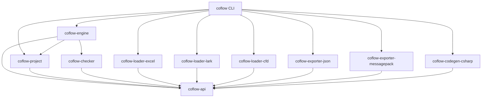
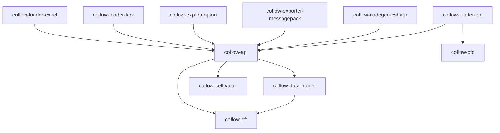
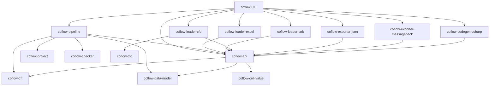

# Provider Registry Migration Implementation Plan

> **For agentic workers:** REQUIRED SUB-SKILL: Use superpowers:subagent-driven-development (recommended) or superpowers:executing-plans to implement this plan task-by-task. Steps use checkbox (`- [ ]`) syntax for tracking.

**Goal:** 将 Coflow 的 loader、exporter、codegen 从 pipeline 硬编码分支迁移为基于 trait 和 registry 的可扩展 provider 架构。

**Architecture:** 新增 `coflow-api` 作为统一公共边界，承载 schema/data model re-export、provider traits、diagnostic/origin/artifact、registry、共享 table loader 逻辑，以及原 `coflow-exporter-core` 的格式无关导出遍历。`coflow-engine` 只做项目编排、数据模型构建、check、artifact 安全写入，不直接依赖任何具体 provider；CLI 作为组合根注册内置 provider，外部 Rust 调用方可以自行组装 registry。

**Tech Stack:** Rust workspace、Cargo crates、trait object registry、`Arc<dyn Trait>`、serde 配置解码、现有 `coflow-cft` / `coflow-data-model` / `coflow-checker` / loader/exporter/codegen 实现。

---

## 迁移边界

这次迁移不保持旧 public API 兼容。允许重命名 crate、移动公开类型、调整 project YAML 配置结构、批量更新 examples/docs/tests。

迁移完成后，核心规则如下：

- `coflow-engine` 不依赖 `coflow-loader-excel`、`coflow-loader-lark`、`coflow-loader-cfd`、`coflow-exporter-json`、`coflow-exporter-messagepack`、`coflow-codegen-csharp`。
- provider crate 不依赖 `coflow-engine` 或 `coflow-project`。
- CLI 是组合根，负责在 `src/builtins.rs` 创建 builtin registry 并调用 engine。
- 外部 Rust 用户可以绕过 CLI，自己创建 registry 并注入自定义 provider。
- loader 只返回 source-neutral records 和 origins，不构建最终 model，不运行 check。
- exporter/codegen 只返回 artifact，不直接写磁盘。
- artifact staging、输出目录安全检查、原子提交只在 engine 中执行。

## 目标 crate 结构

### 保留或新增

- `coflow-api`
  - 统一公共 API crate。
  - re-export `CftContainer`、schema public types、`CfdDataModel`、`CfdInputRecord` 等外部 provider 必须使用的核心类型。
  - 定义 `DataLoader`、`DataExporter`、`CodeGenerator`。
  - 定义 `ProviderRegistry`、descriptor、probe、context。
  - 定义统一 `DiagnosticSet`、`Diagnostic`、`SourceLocation`、`OriginMap`。
  - 定义 `ArtifactSet`、`ArtifactFile`、`ArtifactContent`。
  - 合入原 `coflow-loader-table` 的 source-neutral table 数据结构和 `collect_table_input_records` 共享逻辑。
  - `coflow-api::table` 不依赖 `coflow-checker`，只负责表格 source 到 input records 的转换。
  - 合入原 `coflow-exporter-core` 的 `ExportEncoder`、`export_model_with_encoder`、`ExportError`。
- `coflow-engine`
  - 可以由现有 `coflow-pipeline` 重命名，也可以先保留 crate 名再内部重构。
  - 编排 schema compile、source discovery、loader dispatch、model build、check、export/codegen dispatch、artifact commit。
- `coflow-project`
  - 负责读取项目配置，输出 provider-neutral 的 project model。
  - 不依赖具体 provider。
- `coflow-loader-excel`
  - 实现 `DataLoader`。
  - 使用 `coflow-api::table` 的共享表格加载逻辑。
- `coflow-loader-lark`
  - 实现 `DataLoader`。
  - 使用 `coflow-api::table` 的共享表格加载逻辑。
- `coflow-loader-cfd`
  - 保持独立 loader crate，实现 `DataLoader`。
  - 继续消费 `coflow-cfd` 的 CFD 语法/AST/parser 能力。
- `coflow-cfd`
  - 保持原有低层 CFD 语法/AST/parser 职责。
  - 不实现 `DataLoader`，不承担 project source loader 语义。
- `coflow-exporter-json`
  - 实现 `DataExporter`。
- `coflow-exporter-messagepack`
  - 实现 `DataExporter`。
- `coflow-codegen-csharp`
  - 实现 `CodeGenerator`。
  - 内部包含 JSON loader 模板和 MessagePack loader 模板。

### 删除或合并

- `coflow-exporter-core` 合入 `coflow-api`。
- `coflow-loader-table` 合入 `coflow-api::table`。
- 不新增 `coflow-builtin-providers` crate；内置 provider 注册收进 CLI 的 `src/builtins.rs`。
- `coflow-codegen-csharp-json` 合入 `coflow-codegen-csharp` 内部模块。
- `coflow-codegen-csharp-messagepack` 合入 `coflow-codegen-csharp` 内部模块。

## 目标依赖图

主依赖图只展示架构边界：



实现辅助依赖单独看：



## 统一 API 设计

### Provider descriptors

每个 provider 都声明能力，engine 通过 descriptor 选择实现。

```rust
pub struct LoaderDescriptor {
    pub id: &'static str,
    pub display_name: &'static str,
    pub extensions: &'static [&'static str],
    pub uri_schemes: &'static [&'static str],
    pub config_keys: &'static [&'static str],
}

pub struct ExporterDescriptor {
    pub id: &'static str,
    pub display_name: &'static str,
    pub table_file_extension: &'static str,
    pub content_kind: ArtifactContentKind,
}

pub struct CodegenDescriptor {
    pub id: &'static str,
    pub display_name: &'static str,
    pub language: &'static str,
    pub file_extensions: &'static [&'static str],
    pub supported_data_formats: &'static [&'static str],
    pub needs_model_for_build: bool,
}
```

### Provider traits

Traits 必须 object-safe，服务 engine 内部动态 dispatch。Typed helper 可以作为 provider crate 的额外便利 API，但 engine 只使用 object-safe trait。

```rust
pub trait DataLoader: Send + Sync {
    fn descriptor(&self) -> &'static LoaderDescriptor;

    fn probe(&self, source: &SourceRef) -> ProbeResult;

    fn preflight(&self, ctx: LoadContext<'_>, source: &SourceSpec) -> DiagnosticSet;

    fn load(
        &self,
        ctx: LoadContext<'_>,
        source: &SourceSpec,
    ) -> Result<LoadedRecords, DiagnosticSet>;
}

pub trait DataExporter: Send + Sync {
    fn descriptor(&self) -> &'static ExporterDescriptor;

    fn preflight(&self, ctx: ExportContext<'_>, output: &OutputSpec) -> DiagnosticSet;

    fn export(
        &self,
        ctx: ExportContext<'_>,
        output: &OutputSpec,
    ) -> Result<ArtifactSet, DiagnosticSet>;
}

pub trait CodeGenerator: Send + Sync {
    fn descriptor(&self) -> &'static CodegenDescriptor;

    fn preflight(&self, ctx: CodegenContext<'_>, output: &OutputSpec) -> DiagnosticSet;

    fn generate(
        &self,
        ctx: CodegenContext<'_>,
        output: &OutputSpec,
    ) -> Result<ArtifactSet, DiagnosticSet>;
}
```

### Source matching

Engine 选择 loader 的规则：

1. `source.type` 显式存在时，按 provider id 查找。
2. 没有 `source.type` 时，按文件扩展名匹配 `LoaderDescriptor::extensions`。
3. 多个 loader 匹配时，调用 `probe()` 并选择最高置信度。
4. 仍然冲突时返回 diagnostic，要求用户显式配置 `type`。
5. 远端源优先靠 `type`、URI scheme 或 config key 匹配，不依赖文件扩展名。

## 统一数据结构

### Source and output specs

```rust
pub struct SourceSpec {
    pub source_type: Option<String>,
    pub file: Option<PathBuf>,
    pub dir: Option<PathBuf>,
    pub uri: Option<String>,
    pub options: serde_json::Value,
}

pub struct OutputSpec {
    pub output_type: String,
    pub dir: PathBuf,
    pub options: serde_json::Value,
}
```

### Diagnostics and origins

```rust
pub struct DiagnosticSet {
    pub diagnostics: Vec<Diagnostic>,
}

pub struct Diagnostic {
    pub code: String,
    pub stage: String,
    pub severity: Severity,
    pub message: String,
    pub primary: Option<Label>,
    pub related: Vec<Label>,
}

pub struct Label {
    pub location: SourceLocation,
    pub message: Option<String>,
}

pub enum SourceLocation {
    FileSpan {
        path: PathBuf,
        start_line: usize,
        start_character: usize,
        end_line: usize,
        end_character: usize,
    },
    TableCell {
        path: PathBuf,
        sheet: Option<String>,
        row: usize,
        column: usize,
    },
    RemoteCell {
        document: String,
        sheet: Option<String>,
        row: usize,
        column: usize,
    },
    ProjectConfig {
        path: PathBuf,
        key_path: Vec<String>,
    },
    Artifact {
        path: PathBuf,
    },
}
```

Loader 返回 `OriginMap`，engine 用它把 data model 和 check 诊断映射回源位置。

### Artifacts

```rust
pub struct ArtifactSet {
    pub files: Vec<ArtifactFile>,
    pub metadata: BTreeMap<String, String>,
}

pub struct ArtifactFile {
    pub relative_path: PathBuf,
    pub content: ArtifactContent,
}

pub enum ArtifactContent {
    Text(String),
    Bytes(Vec<u8>),
    Json(serde_json::Value),
}
```

## 迁移任务

### Task 1: 建立 `coflow-api`

**Files:**
- Create: `crates/coflow-api/Cargo.toml`
- Create: `crates/coflow-api/src/lib.rs`
- Modify: `Cargo.toml`

- [ ] **Step 1: 新增 crate 并加入 workspace**

在 workspace members 中加入 `crates/coflow-api`。`coflow-api` 依赖：

```toml
[dependencies]
coflow-cell-value = { path = "../coflow-cell-value" }
coflow-cft = { path = "../coflow-cft" }
coflow-data-model = { path = "../coflow-data-model" }
serde = { version = "1", features = ["derive"] }
serde_json = { version = "1", features = ["preserve_order"] }
```

- [ ] **Step 2: 添加核心 re-export**

在 `crates/coflow-api/src/lib.rs` 暴露 provider 需要的核心类型：

```rust
pub use coflow_cft::{
    CftAnnotation, CftAnnotationValue, CftContainer, CftSchemaEnum, CftSchemaField,
    CftSchemaType, CftSchemaTypeRef, ModuleId,
};
pub use coflow_data_model::{
    CfdDataModel, CfdDiagnostic, CfdDiagnostics, CfdInputRecord, CfdInputValue, CfdLabel,
    CfdPath, CfdValue,
};
```

- [ ] **Step 3: 定义 provider traits 和 registry**

在 `coflow-api` 中加入 `DataLoader`、`DataExporter`、`CodeGenerator`、descriptor、context、`ProviderRegistry`。

- [ ] **Step 4: 迁入 shared table loader 类型**

从 `coflow-loader-table` 迁入 source-neutral 表格加载能力：

- `TableSheetConfig`
- `TableSource`
- `TableSheet`
- `TableInputRecords`
- `TableOrigins`
- `collect_table_input_records`

不要迁入 `load_table` 和 `load_table_model` 这类构建 model 或运行 check 的便利函数；最终 model 构建和 check 属于 engine 职责。

- [ ] **Step 5: 编译检查**

Run: `cargo check -p coflow-api`

Expected: `coflow-api` 编译通过。

### Task 2: 合入 `coflow-exporter-core`

**Files:**
- Modify: `crates/coflow-api/src/lib.rs`
- Move logic from: `crates/coflow-exporter-core/src/lib.rs`
- Modify: `crates/coflow-exporter-json/Cargo.toml`
- Modify: `crates/coflow-exporter-json/src/lib.rs`
- Modify: `crates/coflow-exporter-messagepack/Cargo.toml`
- Modify: `crates/coflow-exporter-messagepack/src/lib.rs`
- Modify: `Cargo.toml`

- [ ] **Step 1: 将 `ExportEncoder` 和 `export_model_with_encoder` 移入 `coflow-api`**

保留函数签名语义，模块名建议为 `coflow_api::export`，并在 crate root re-export：

```rust
pub use export::{export_model_with_encoder, ExportEncoder, ExportError};
```

- [ ] **Step 2: 修改 JSON exporter 依赖**

`coflow-exporter-json` 移除 `coflow-exporter-core`，改依赖 `coflow-api`。

代码从：

```rust
use coflow_exporter_core::{export_model_with_encoder, ExportEncoder, ExportError};
```

改为：

```rust
use coflow_api::{export_model_with_encoder, CfdDataModel, CftContainer, ExportEncoder, ExportError};
```

- [ ] **Step 3: 修改 MessagePack exporter 依赖**

按 JSON exporter 同样方式迁移。

- [ ] **Step 4: 从 workspace 移除 `coflow-exporter-core`**

删除 workspace member，并删除所有 `coflow-exporter-core` 依赖。

- [ ] **Step 5: 运行 exporter 测试**

Run:

```powershell
cargo test -p coflow-exporter-json -p coflow-exporter-messagepack
```

Expected: JSON 和 MessagePack exporter 测试通过。

### Task 3: 统一 `ArtifactSet`

**Files:**
- Modify: `crates/coflow-api/src/lib.rs`
- Modify: `crates/coflow-codegen-csharp/src/lib.rs`
- Modify: `crates/coflow-exporter-json/src/lib.rs`
- Modify: `crates/coflow-exporter-messagepack/src/lib.rs`
- Modify: `crates/coflow-pipeline/src/artifacts.rs`

- [ ] **Step 1: 在 `coflow-api` 定义 artifact 类型**

定义 `ArtifactSet`、`ArtifactFile`、`ArtifactContent`、`ArtifactContentKind`。

- [ ] **Step 2: exporter 返回 `ArtifactSet`**

JSON exporter provider 产生 `<TableName>.json`，content 使用 `ArtifactContent::Json`。

MessagePack exporter provider 产生 `<TableName>.msgpack`，content 使用 `ArtifactContent::Bytes`。

- [ ] **Step 3: codegen 返回 `ArtifactSet`**

将现有 `GeneratedFile { relative_path, contents }` 映射为 `ArtifactFile { relative_path, content: ArtifactContent::Text(contents) }`。

- [ ] **Step 4: artifact writer 消费统一 artifact**

`coflow-pipeline/src/artifacts.rs` 中新增 `stage_artifact_set`，统一写入 Text/Bytes/Json。

- [ ] **Step 5: 运行现有 build/export/codegen 测试**

Run:

```powershell
cargo test -p coflow-pipeline --test export --test build --test codegen
cargo test --test cli_export --test cli_codegen
```

Expected: 现有导出和 codegen 行为保持一致。

### Task 4: 统一 diagnostics 和 origins

**Files:**
- Modify: `crates/coflow-api/src/lib.rs`
- Modify: `crates/coflow-loader-excel/src/lib.rs`
- Modify: `crates/coflow-loader-lark/src/lib.rs`
- Modify: `crates/coflow-loader-cfd/src/lib.rs`
- Modify: `crates/coflow-pipeline/src/data.rs`
- Modify: `crates/coflow-project/src/lib.rs`

- [ ] **Step 1: 在 `coflow-api` 定义统一 diagnostic 类型**

加入 `DiagnosticSet`、`Diagnostic`、`Severity`、`Label`、`SourceLocation`。

- [ ] **Step 2: 在 `coflow-api` 定义 `OriginMap`**

`OriginMap` 至少支持：

- record index 到 `SourceLocation` 的映射。
- `CfdLabel` 到 `Label` 的转换。
- 合并多个 loader 输出时按 record offset 追加。

- [ ] **Step 3: table/excel/lark/cfd loader 输出统一 diagnostics**

先保留内部 typed diagnostic，公开 provider 层统一转换为 `DiagnosticSet`。

- [ ] **Step 4: engine 删除按 loader 分类的诊断转换**

`coflow-pipeline/src/data.rs` 中移除 `diagnostics_from_excel_checks`、`diagnostics_from_table_checks`、`diagnostics_from_lark` 等分散转换，改为直接聚合 `DiagnosticSet`。

- [ ] **Step 5: 运行 loader 和 pipeline 数据测试**

Run:

```powershell
cargo test -p coflow-api -p coflow-loader-excel -p coflow-loader-lark -p coflow-loader-cfd -p coflow-cfd
cargo test -p coflow-pipeline
```

Expected: loader 诊断位置和 check 诊断回源仍正确。

### Task 5: 实现 loader provider

**Files:**
- Modify: `crates/coflow-loader-excel/src/lib.rs`
- Modify: `crates/coflow-loader-lark/src/lib.rs`
- Modify: `crates/coflow-loader-cfd/src/lib.rs`
- Modify: `crates/coflow-api/src/lib.rs`

- [ ] **Step 1: Excel 实现 `DataLoader`**

Descriptor:

```rust
LoaderDescriptor {
    id: "excel",
    display_name: "Excel workbook",
    extensions: &["xlsx", "xlsm", "xls"],
    uri_schemes: &[],
    config_keys: &["sheets"],
}
```

- [ ] **Step 2: Lark 实现 `DataLoader`**

Descriptor:

```rust
LoaderDescriptor {
    id: "lark-sheet",
    display_name: "Lark Sheet",
    extensions: &[],
    uri_schemes: &["https"],
    config_keys: &["lark_sheet", "spreadsheet_token", "url"],
}
```

- [ ] **Step 3: CFD loader 实现 `DataLoader`**

`DataLoader` 实现在 `coflow-loader-cfd`，不是 `coflow-cfd`。`coflow-cfd` 继续只提供 CFD 语法/AST/parser，不承担 project source loader 语义。

Descriptor:

```rust
LoaderDescriptor {
    id: "cfd",
    display_name: "Coflow data text",
    extensions: &["cfd"],
    uri_schemes: &[],
    config_keys: &[],
}
```

- [ ] **Step 4: Excel/Lark 切到 `coflow-api::table`**

Excel 和 Lark loader 删除对 `coflow-loader-table` crate 的依赖，改用 `coflow_api::table::{collect_table_input_records, TableSheetConfig, TableSource}`。

- [ ] **Step 5: `probe()` 实现**

Excel probe 优先扩展名，必要时检查 workbook 能否打开。

CFD probe 优先扩展名，必要时读取少量文本并尝试 parser 快速判断。

Lark probe 只对显式 type、Lark URL、Lark config key 返回高置信度。

- [ ] **Step 6: loader contract tests**

新增测试覆盖：

- descriptor id 唯一。
- extension 匹配。
- `source.type` 显式选择。
- 冲突时返回要求显式 type 的 diagnostic。
- provider 不直接构建 final model。

### Task 6: 实现 exporter provider

**Files:**
- Modify: `crates/coflow-exporter-json/src/lib.rs`
- Modify: `crates/coflow-exporter-messagepack/src/lib.rs`

- [ ] **Step 1: JSON 实现 `DataExporter`**

Descriptor:

```rust
ExporterDescriptor {
    id: "json",
    display_name: "JSON",
    table_file_extension: "json",
    content_kind: ArtifactContentKind::Json,
}
```

- [ ] **Step 2: MessagePack 实现 `DataExporter`**

Descriptor:

```rust
ExporterDescriptor {
    id: "messagepack",
    display_name: "MessagePack",
    table_file_extension: "msgpack",
    content_kind: ArtifactContentKind::Bytes,
}
```

- [x] **Step 3: 删除 pipeline 中的 data format hardcode**

`DataFormat` 已从 `coflow-pipeline` 公共执行 API 移除。pipeline 使用 provider id 字符串调度 exporter，并从 provider descriptor 生成报告。

- [ ] **Step 4: exporter contract tests**

测试 provider descriptor、artifact relative path、content kind、table file extension。

### Task 7: 合并 C# codegen provider

**Files:**
- Modify: `crates/coflow-codegen-csharp/Cargo.toml`
- Modify: `crates/coflow-codegen-csharp/src/lib.rs`
- Move templates from: `crates/coflow-codegen-csharp-json/templates`
- Move templates from: `crates/coflow-codegen-csharp-messagepack/templates`
- Modify: `Cargo.toml`

- [ ] **Step 1: 将 JSON/MessagePack 模板模块移入 `coflow-codegen-csharp`**

内部模块建议：

```text
src/formats/json.rs
src/formats/messagepack.rs
templates/json/*.tera
templates/messagepack/*.tera
```

- [ ] **Step 2: C# 实现 `CodeGenerator`**

Descriptor:

```rust
CodegenDescriptor {
    id: "csharp",
    display_name: "C#",
    language: "csharp",
    file_extensions: &["cs"],
    supported_data_formats: &["json", "messagepack"],
    needs_model_for_build: true,
}
```

- [ ] **Step 3: `@keyAsEnum` lockfile 下沉为 provider state**

C# provider 读取当前 schema/model 后产出 state artifact。engine 负责把 state artifact 和 code artifacts 一起 staging/commit。

- [ ] **Step 4: 删除独立 C# JSON/MessagePack crates**

从 workspace 移除：

- `crates/coflow-codegen-csharp-json`
- `crates/coflow-codegen-csharp-messagepack`

- [ ] **Step 5: 运行 C# codegen 测试**

Run:

```powershell
cargo test -p coflow-codegen-csharp
cargo test --test cli_codegen
```

Expected: JSON loader 和 MessagePack loader 生成行为保持规格一致。

### Task 8: 重构 engine dispatch

**Files:**
- Create or rename: `crates/coflow-engine`
- Modify: `crates/coflow-pipeline/src/lib.rs`
- Modify: `crates/coflow-pipeline/src/data.rs`
- Modify: `crates/coflow-pipeline/src/artifacts.rs`
- Modify: `src/main.rs`

- [ ] **Step 1: engine API 接收 registry**

核心入口改为：

```rust
pub fn check_project(
    project: &Project,
    registry: &ProviderRegistry,
) -> Result<PipelineOutcome<CheckReport>, String>;
```

`build_project`、`export_project_data`、`generate_project_code` 同样接收 registry。

- [ ] **Step 2: source discovery 使用 loader descriptors**

目录递归时不再用硬编码 `SourceKind`，改用 registry loader descriptors 匹配扩展名和 probe。

- [ ] **Step 3: data export 使用 exporter provider**

按 `outputs.data.type` 查找 exporter provider，执行 preflight/export，写入 `ArtifactSet`。

- [ ] **Step 4: codegen 使用 codegen provider**

按 `outputs.code.type` 查找 codegen provider，执行 preflight/generate，写入 `ArtifactSet`。

- [ ] **Step 5: CLI 注入 builtin registry**

`src/main.rs` 调用 CLI 内部 builtins 模块创建 registry：

```rust
let mut registry = ProviderRegistry::default();
crate::builtins::register_builtin_providers(&mut registry);
```

然后传给 engine。

- [ ] **Step 6: 运行 CLI 端到端测试**

Run:

```powershell
cargo test --test cli_check --test cli_build --test cli_export --test cli_codegen
```

Expected: CLI 行为符合更新后的 project config 和 provider dispatch。

### Task 9: 将 builtin provider 注册收进 CLI

**Files:**
- Create: `src/builtins.rs`
- Modify: `src/main.rs`
- Modify: `Cargo.toml`

- [ ] **Step 1: CLI 依赖内置 provider crates**

root CLI crate 直接依赖内置 provider crates 和 `coflow-api`：

```toml
[dependencies]
coflow-api = { path = "crates/coflow-api" }
coflow-loader-excel = { path = "crates/coflow-loader-excel" }
coflow-loader-lark = { path = "crates/coflow-loader-lark" }
coflow-loader-cfd = { path = "crates/coflow-loader-cfd" }
coflow-exporter-json = { path = "crates/coflow-exporter-json" }
coflow-exporter-messagepack = { path = "crates/coflow-exporter-messagepack" }
coflow-codegen-csharp = { path = "crates/coflow-codegen-csharp" }
```

- [ ] **Step 2: 注册内置 provider**

在 `src/builtins.rs` 实现：

```rust
pub fn register_builtin_providers(registry: &mut ProviderRegistry) {
    registry.register_loader(coflow_loader_excel::ExcelLoader::default());
    registry.register_loader(coflow_loader_lark::LarkSheetLoader::default());
    registry.register_loader(coflow_loader_cfd::CfdLoader::default());
    registry.register_exporter(coflow_exporter_json::JsonExporter::default());
    registry.register_exporter(coflow_exporter_messagepack::MessagePackExporter::default());
    registry.register_codegen(coflow_codegen_csharp::CsharpCodeGenerator::default());
}
```

- [ ] **Step 3: 测试内置 registry**

新增测试确保 builtin registry 包含：

- loaders: `excel`, `lark-sheet`, `cfd`
- exporters: `json`, `messagepack`
- codegens: `csharp`

### Task 10: 更新 project config 和文档

**Files:**
- Modify: `docs/spec/07-project-pipeline.md`
- Modify: `docs/spec/09-cli.md`
- Modify: `docs/spec/04-excel-loader.md`
- Modify: `docs/spec/05-json-export.md`
- Modify: `docs/spec/06-csharp-codegen.md`
- Modify: `docs/spec/08-messagepack-export.md`
- Modify: `README.md`
- Modify: `examples/*/coflow.yaml`

- [ ] **Step 1: 明确新配置模型**

示例：

```yaml
schema:
  - schema

sources:
  - file: data/rpg.xlsx
  - type: cfd
    dir: data/cfd
  - type: lark-sheet
    url: https://example.feishu.cn/sheets/...

outputs:
  data:
    type: messagepack
    dir: generated/data
  code:
    type: csharp
    dir: generated/csharp
    namespace: Game.Config
```

- [ ] **Step 2: 文档说明 provider matching**

写清楚显式 type、扩展名匹配、probe、冲突诊断、远端源选择规则。

- [ ] **Step 3: 更新 examples**

所有 `examples/*/coflow.yaml` 使用新 source/output 结构。

- [ ] **Step 4: 更新 CLI docs**

说明 CLI 内置 providers，以及外部 Rust API 可自定义 registry。

### Task 11: 删除旧 crate 和旧分支

**Files:**
- Modify: `Cargo.toml`
- Delete: `crates/coflow-exporter-core`
- Delete: `crates/coflow-loader-table`
- Delete: `crates/coflow-codegen-csharp-json`
- Delete: `crates/coflow-codegen-csharp-messagepack`
- Modify: affected tests

- [ ] **Step 1: 删除 workspace member**

从 root `Cargo.toml` 删除已合并 crates。

- [x] **Step 2: 删除硬编码 enums**

删除或局部降级：

- `DataFormat`
- `CodegenTarget`
- `SourceKind`

Engine 内部使用 provider id。`DataFormat` 与 `CodegenTarget` 不再作为 pipeline 公共执行模型存在；C# codegen crate 内部仍保留自己的 `CsharpDataFormat` 实现枚举。

- [ ] **Step 3: 删除旧 adapter 函数**

删除 pipeline 中只服务旧分支的诊断转换和 artifact staging 分支。

- [ ] **Step 4: 全工作区编译**

Run:

```powershell
cargo check --workspace
```

Expected: workspace 编译通过。

### Task 12: 完整验证

**Files:**
- No source edits unless validation exposes failures.

- [ ] **Step 1: 格式检查**

Run:

```powershell
cargo fmt --all -- --check
```

Expected: no formatting diff。

- [ ] **Step 2: Clippy**

Run:

```powershell
cargo clippy --workspace --all-targets -- -D warnings
```

Expected: no warnings。

- [ ] **Step 3: 全量测试**

Run:

```powershell
cargo test --workspace
```

Expected: all tests pass。

- [ ] **Step 4: AGENTS push gate**

Before pushing any branch, run all four required commands from repository root:

```powershell
cargo check --workspace
cargo fmt --all -- --check
cargo clippy --workspace --all-targets -- -D warnings
cargo test --workspace
```

Expected: all four commands pass。

## 可行性审查

### 高可行性点

- 当前 exporter 已经把格式无关遍历放进 `coflow-exporter-core`，合入 `coflow-api` 后 JSON/MessagePack 只需实现 encoder/provider。
- 现有 codegen 已经返回 `GeneratedFile`，迁移到 `ArtifactSet` 风险低。
- Excel 和 Lark 已经共用 table loader 语义，把这部分 source-neutral 逻辑合入 `coflow-api::table` 后，loader 统一为 records-first 模型符合当前实现。
- pipeline 已经集中管理输出目录安全检查和 staging，改为消费 `ArtifactSet` 是自然演进。

### 主要风险

- Diagnostic 和 Origin 统一会触碰大量测试，尤其是 CLI JSON diagnostic 输出。
- YAML 配置模型会破坏现有 examples/docs/tests，需要一次性更新。
- Object-safe trait 会限制接口设计，provider typed options 需要在 provider 内部从 `serde_json::Value` 解码。
- `@keyAsEnum` lockfile 下沉到 C# provider 后，必须保持 engine 负责原子写入，不能让 provider 直接写磁盘。
- Lark provider 依赖 secrets/http client，`LoadContext` 必须支持注入 test client 和 secret resolver。

### 不做事项

- 第一版不做动态库插件 ABI。
- 不把 Excel/Lark 两个 provider 合并成一个大 crate；只把共享 table 语义合入 `coflow-api::table`。
- 不让 provider 直接写输出目录。
- 不把所有 provider 内部错误都压成 `String`；内部可以保留 typed error，但 public provider 入口统一输出 `DiagnosticSet`。

## 分支策略

建议按任务分多次提交，避免一次性大爆炸：

1. `feat: add coflow api provider boundary`
2. `refactor: move exporter traversal into api`
3. `feat: add artifact set provider output`
4. `feat: unify diagnostics and origins`
5. `feat: implement loader providers`
6. `feat: implement exporter providers`
7. `refactor: merge csharp format codegen providers`
8. `refactor: dispatch pipeline through provider registry`
9. `feat: register builtin providers in cli`
10. `docs: update provider registry architecture`
11. `refactor: remove merged provider crates`

每个提交至少运行对应 crate 的 focused tests。最终提交前运行 AGENTS 要求的四个全量检查。

## Self-Review

- Spec coverage: 文档覆盖了 trait/registry、文件类型注册、统一 diagnostic/origin/artifact、`exporter-core` 合并、crate 合并、engine dispatch、builtin providers、配置和测试迁移。
- Placeholder scan: 文档没有保留 TBD/TODO/implement later 等占位内容。
- Type consistency: 文档中统一使用 `coflow-api`、`ProviderRegistry`、`DataLoader`、`DataExporter`、`CodeGenerator`、`ArtifactSet`、`DiagnosticSet`、`OriginMap` 命名。

## 迁移落地状态

本分支按“激进重构、不保留旧 crate 边界兼容”的方向落地，同时确保现有 CLI 功能不受影响。`coflow.yaml` 保持现有内置配置可用，并新增 provider-neutral 扩展面：source 支持 `type` 和 `options`，outputs 支持任意 provider id 和 `options`。配置进入 pipeline 后会被转换成 provider-neutral 的 `SourceSpec` / `OutputSpec`，再通过 registry dispatch。

已完成的结构性变化：

- 新增 `coflow-api`，承载 provider traits、registry、artifact、diagnostic/origin、`coflow-api::table` 和 `coflow-api::export`。
- 删除独立 `coflow-loader-table` crate，Excel/Lark 共享表格语义改走 `coflow-api::table`。
- 删除独立 `coflow-exporter-core` crate，JSON/MessagePack 共享导出遍历改走 `coflow-api::export`。
- 删除 `coflow-codegen-csharp-json` 与 `coflow-codegen-csharp-messagepack` crate，模板收进 `coflow-codegen-csharp/templates/json` 和 `templates/messagepack`。
- 不新增 `coflow-builtin-providers` crate；内置 provider 注册位于 CLI 根包 `src/builtins.rs`。
- `coflow-cfd` 保持低层语法/AST/parser 职责；`coflow-loader-cfd` 保持单独 loader provider 职责。
- `coflow-pipeline` 的正式依赖不再包含具体 loader/exporter/codegen provider crate；只依赖 `coflow-api`、project/schema/check/data-model 等核心 crate。
- `coflow-pipeline` 只在测试 dev-dependencies 中注册内置 providers，生产路径由 CLI 组合根注入 registry。
- `coflow-pipeline` 的 export/codegen 公共执行 API 使用 provider id 字符串，不再使用封闭的 `DataFormat` / `CodegenTarget` enum。
- `ProviderRegistry::register_loader` / `register_exporter` / `register_codegen` 对重复 provider id 返回错误，避免静默覆盖。

当前主要依赖图：



`coflow-pipeline` 依赖图经 `cargo tree -p coflow-pipeline --depth 1` 确认，正式依赖只剩：

- `coflow-api`
- `coflow-cft`
- `coflow-checker`
- `coflow-data-model`
- `coflow-project`
- `serde`
- `serde_json`

保留的权衡：

- `coflow-project` 只校验 source/output 的配置形状，不再校验内置 provider id 白名单。provider 是否存在、codegen 是否支持当前 data exporter 由 `coflow-pipeline` 结合 `ProviderRegistry` 和 descriptor 诊断。
- `OriginMap` 已支持 table cell 和 file span 的统一映射；远端 cell 目前在 Lark provider 错误中以 remote location 表达，飞书 API 返回的单元格级 origin 后续可继续扩展。
- C# `@keyAsEnum` lockfile 的稳定值合并仍由 pipeline 持有，provider 通过 `OutputSpec.options.key_as_enum_variants` 接收最终 variants。这保留了 artifact 原子写入和 lockfile 事务语义。
