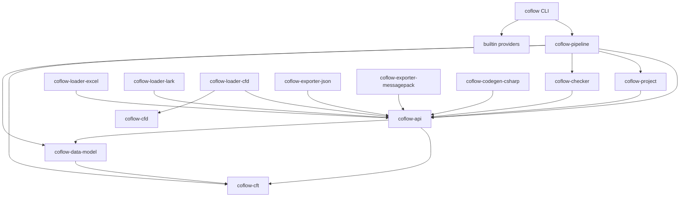

# Coflow 激进统一架构重构设计

## 目标

本设计用于下一轮激进重构。该重构不要求兼容旧 YAML、旧 public API 或旧内部类型，优先保证架构稳定、一致、可扩展。

目标是把 Coflow 内部收敛成一套统一协议：

```text
项目配置
  -> 标准化项目模型
  -> provider 自主解析 source
  -> 统一诊断模型
  -> source-neutral records + origins
  -> data model + check
  -> artifact set
  -> pipeline staging + commit
  -> CLI/LSP 渲染
```

重构完成后：

- `coflow-pipeline` 不知道 Excel、Lark、CFD 的私有配置和加载细节。
- `coflow-project` 不理解 provider 私有字段，只负责通用配置结构和路径标准化。
- loader/exporter/codegen provider 自己解析、校验、resolve 自己的 options。
- 内部错误全部使用 `coflow_api::DiagnosticSet`。
- CLI、JSON 输出和 LSP diagnostic 只是 `DiagnosticSet` 的渲染结果。
- provider 不直接写磁盘，只返回 records 或 artifacts。
- artifact 安全检查、staging 和 commit 只在 pipeline 内完成。

## 非目标

- 不保留旧 YAML 格式兼容层。
- 不保留旧 `DiagnosticJson` 作为内部传递类型。
- 不把 Lark、Excel、CFD 逻辑放回 pipeline。
- 不继续通过增加 crate 数量来表达边界；优先通过 `coflow-api` 中的协议类型表达边界。
- 不在本轮设计里引入复杂的 credential store。凭据先按 provider options 处理。

## 外部配置格式

外部 YAML 要保持轻量，不使用冗长的 `location.kind` 结构。用户直接写 `path` 或 `url`。

示例：

```yaml
schema: schema/

sources:
  - type: excel
    path: data/rpg.xlsx
    sheets:
      - sheet: Item
        type: Item
        key: id
        columns:
          名称: name

  - path: data/cfd

  - type: lark-sheet
    url: https://example.feishu.cn/wiki/wiki_token
    app_id: ${LARK_APP_ID}
    app_secret: ${LARK_APP_SECRET}
    sheets:
      - sheet: 物品表
        type: Item

outputs:
  data:
    type: json
    dir: generated/data

  code:
    type: csharp
    dir: generated/csharp
    namespace: Game.Config
```

配置规则：

- `type` 表示 provider id，可选；没有 `type` 时由 registry probe 推断。
- `path` 表示本地文件或目录。
- `url` 表示远程 source。
- `sources[*]` 必须且只能设置 `path` 或 `url` 之一。
- 除 `type`、`path`、`url` 之外的 source 字段全部进入 provider `options`。
- `outputs.*.type` 是 exporter/codegen provider id。
- `outputs.*.dir` 是输出目录。
- 除 `type`、`dir` 之外的 output 字段全部进入 provider `options`。
- `sheets`、`app_id`、`app_secret`、`namespace` 都不再是 `coflow-project` 语义，只是 provider options。

这样用户配置保持简单，但内部仍可以拥有统一结构。

## 标准化项目模型

`coflow-project` 负责把 YAML 标准化成 provider-neutral 模型。

建议类型：

```rust
pub struct ProjectSourceSpec {
    pub source_type: Option<String>,
    pub location: SourceLocationSpec,
    pub options: serde_json::Value,
}

pub enum SourceLocationSpec {
    Path(PathBuf),
    Uri(String),
}

pub struct ProjectOutputSpec {
    pub output_type: String,
    pub dir: PathBuf,
    pub options: serde_json::Value,
}
```

`coflow-project` 的职责：

- 读取 YAML。
- 校验通用 shape。
- 校验 `schema` 路径。
- 校验 `sources[*].type`、`sources[*].path`、`sources[*].url` 的通用格式。
- 校验 `outputs.*.type`、`outputs.*.dir` 的通用格式。
- 展开 `${ENV_NAME}` 这类环境变量引用，或在缺失时返回配置诊断。
- 把 provider 私有字段原样放入 `options`。

`coflow-project` 不做：

- 不校验 Excel sheets 结构。
- 不校验 Lark URL 是否能解析。
- 不校验 Lark app_id/app_secret 是否存在，除非它们以环境变量形式引用但环境变量缺失。
- 不校验 C# namespace 是否合法。
- 不根据扩展名决定 source 应由谁处理。

## Provider Source Resolve

`DataLoader` 增加 `resolve` 阶段。source resolve 下沉到 provider，pipeline 不再特判 Lark、Excel 或 CFD。

建议接口：

```rust
pub trait DataLoader: Send + Sync {
    fn descriptor(&self) -> &'static LoaderDescriptor;

    fn probe(&self, source: &ProjectSourceRef<'_>) -> ProbeResult;

    fn resolve(
        &self,
        ctx: SourceResolveContext<'_>,
        source: &ProjectSourceSpec,
    ) -> Result<Vec<ResolvedSource>, DiagnosticSet>;

    fn preflight(
        &self,
        ctx: LoadContext<'_>,
        source: &ResolvedSource,
    ) -> DiagnosticSet;

    fn load(
        &self,
        ctx: LoadContext<'_>,
        source: &ResolvedSource,
    ) -> Result<LoadedRecords, DiagnosticSet>;
}
```

新增类型：

```rust
pub struct SourceResolveContext<'a> {
    pub project_root: &'a Path,
    pub schema: &'a CftContainer,
}

pub struct ProjectSourceRef<'a> {
    pub source_type: Option<&'a str>,
    pub location: &'a SourceLocationSpec,
    pub option_keys: &'a [&'a str],
}

pub struct ResolvedSource {
    pub provider_id: String,
    pub location: SourceLocationSpec,
    pub options: serde_json::Value,
    pub display_name: String,
}
```

职责划分：

- `probe` 判断 provider 是否可以处理该 source。
- `resolve` 把用户配置展开成 provider 可加载的具体 source。
- `preflight` 做无副作用校验。
- `load` 读取数据并返回 source-neutral records。

Excel provider：

- 识别 `.xlsx`、`.xlsm`、`.xls`。
- 对目录 source 递归发现支持的 workbook。
- decode `sheets`。
- 使用 `coflow-api::table` 生成 input records。
- 生成 table origin。

CFD provider：

- 识别 `.cfd`。
- 对目录 source 递归发现 `.cfd` 文件。
- 解析文本 records。
- 生成 file origin。
- 不理解 `sheets`。

Lark provider：

- 识别 `type: lark-sheet`，也可以 probe 支持的 Lark/Feishu URL。
- decode `url`、`app_id`、`app_secret`、`sheets`。
- resolve wiki URL 到 spreadsheet token。
- 读取远程 sheet。
- 使用 `coflow-api::table` 生成 input records。
- 生成 remote table origin。

pipeline 不再出现 `if source.lark_sheet.is_some()` 或类似分支。

## 统一诊断模型

内部诊断统一使用 `coflow_api::DiagnosticSet`。

核心类型：

```rust
pub struct DiagnosticSet {
    pub diagnostics: Vec<Diagnostic>,
}

pub struct Diagnostic {
    pub code: String,
    pub stage: String,
    pub severity: Severity,
    pub message: String,
    pub primary: Option<Label>,
    pub related: Vec<Label>,
}

pub struct Label {
    pub location: SourceLocation,
    pub message: Option<String>,
}

pub enum SourceLocation {
    FileSpan {
        path: PathBuf,
        start_line: usize,
        start_character: usize,
        end_line: usize,
        end_character: usize,
    },
    TableCell {
        path: PathBuf,
        sheet: Option<String>,
        row: usize,
        column: usize,
    },
    RemoteCell {
        document: String,
        sheet: Option<String>,
        row: usize,
        column: usize,
    },
    ProjectConfig { path: PathBuf, key_path: Vec<String> },
    Artifact { path: PathBuf },
}
```

调整要求：

- `coflow-project` 返回 `DiagnosticSet`。
- `coflow-pipeline` 内部返回和聚合 `DiagnosticSet`。
- `coflow-pipeline` 不再依赖 `coflow_project::DiagnosticJson`。
- `DiagnosticJson` 只作为 CLI JSON 输出 DTO。
- LSP diagnostic 也由 `DiagnosticSet` 渲染得到。
- artifact 错误、配置错误、provider 错误、data model 错误、check 错误都走同一套诊断结构。

pipeline 公共结果建议改为：

```rust
pub enum PipelineOutcome<T> {
    Success(T),
    Diagnostics(DiagnosticSet),
}
```

对于不可恢复的内部错误，可以保留：

```rust
pub enum PipelineError {
    Io(DiagnosticSet),
    Internal(String),
}
```

原则是：用户可理解、可定位的问题都应进入 `DiagnosticSet`。

## 来源与 OriginMap

`OriginMap` 升级为统一的 record origin 映射，不区分 Excel/Lark 的内部路径。

建议类型：

```rust
pub struct OriginMap {
    records: Vec<RecordOrigin>,
}

pub enum RecordOrigin {
    File {
        path: PathBuf,
        span: Option<TextSpan>,
    },
    Table {
        document: SourceDocument,
        sheet: String,
        row: usize,
        id_column: usize,
        field_columns: BTreeMap<Vec<String>, usize>,
    },
}

pub enum SourceDocument {
    Local(PathBuf),
    Remote(String),
}

pub struct TextSpan {
    pub start_line: usize,
    pub start_character: usize,
    pub end_line: usize,
    pub end_character: usize,
}
```

映射规则：

- Excel records 使用 `RecordOrigin::Table`，其中 `document` 为 `SourceDocument::Local(path)`。
- Lark records 使用 `RecordOrigin::Table`，其中 `document` 为 `SourceDocument::Remote(url_or_token)`。
- CFD records 使用 `RecordOrigin::File { path, span }`。
- data model/check diagnostic 通过 `OriginMap` 映射回 `SourceLocation`。
- 输出层可以把 `SourceDocument::Local` 渲染成本地路径，把 `Remote` 渲染成远程文档。

这样 Excel 和 Lark 的 table 来源处理统一，CFD 文本来源也能保留 span。

## Pipeline 生命周期

pipeline 固定为一条清晰生命周期：

```text
1. 读取并标准化项目配置
2. 编译 schema
3. 根据 registry 选择 loader
4. loader.resolve
5. loader.preflight
6. loader.load
7. 构建 data model
8. 运行 checker
9. exporter/codegen.preflight
10. exporter/codegen export/generate
11. artifact 安全检查
12. artifact staging
13. artifact commit
14. CLI/LSP 渲染结果
```

pipeline 只负责：

- 编排顺序。
- 聚合诊断。
- 调用 registry。
- 调用 data model 和 checker。
- artifact 安全检查。
- staging 和 commit。

pipeline 不负责：

- 不解析 provider options。
- 不扫描某个 provider 的扩展名细节，目录发现由 loader resolve 完成。
- 不特判 Lark。
- 不特判 Excel sheets。
- 不特判 C# namespace。

## 输出与 Artifact

Exporter/codegen 继续只返回 `ArtifactSet`：

```rust
pub struct ArtifactSet {
    pub files: Vec<ArtifactFile>,
    pub metadata: BTreeMap<String, String>,
}
```

统一规则：

- provider 不直接写磁盘。
- provider 不创建目录。
- provider 不删除旧输出。
- pipeline 统一检查输出目录安全。
- pipeline 统一写 staging。
- pipeline 统一 commit。
- artifact 错误使用 `SourceLocation::Artifact`。

输出配置标准化后：

```rust
pub struct ProjectOutputSpec {
    pub output_type: String,
    pub dir: PathBuf,
    pub options: serde_json::Value,
}
```

`namespace` 等 codegen 私有字段进入 `options`，由 C# codegen provider decode。

## CLI 与 LSP 渲染

CLI 和 LSP 不再参与内部诊断语义，只负责渲染。

CLI：

- human output 从 `DiagnosticSet` 渲染。
- JSON output 从 `DiagnosticSet` 渲染成 `DiagnosticJson`。
- exit code 根据是否有 error severity 决定。

LSP：

- 从 `DiagnosticSet` 渲染成 LSP diagnostics。
- `FileSpan` 映射到文件 range。
- `ProjectConfig` 映射到 YAML 字段 range；如果字段 range 暂时不可用，则退化到配置文件开头。
- `TableCell` 和 `RemoteCell` 可在 LSP 中作为 related/context 信息保留。

## 迁移步骤

### 第一步：统一诊断模型

- 把 `coflow-project` 的诊断改为 `DiagnosticSet`。
- 把 `coflow-pipeline` 的 `PipelineOutcome::Diagnostics(Vec<DiagnosticJson>)` 改为 `DiagnosticSet`。
- CLI 增加 `DiagnosticSet -> human/json` 渲染。
- LSP 增加 `DiagnosticSet -> LSP diagnostics` 渲染。
- 移除 pipeline 内部对 `DiagnosticJson` 的依赖。

验收标准：

- project/provider/data model/check/artifact 诊断都可以进入同一 `DiagnosticSet`。
- CLI JSON 输出保持可用，但 `DiagnosticJson` 不再是内部模型。

### 第二步：标准化配置模型

- 修改 YAML schema 为 `type/path/url + provider fields`。
- 移除旧 `file`、`dir`、`lark_sheet`、`sheets`、`namespace` 的 project 语义。
- 新增 `ProjectSourceSpec` 和 `ProjectOutputSpec`。
- provider 私有字段进入 `options`。
- 更新 examples 和测试。

验收标准：

- `coflow-project` 不再知道 Excel sheets、Lark app_id/app_secret、C# namespace 的语义。
- 示例配置使用新格式。

### 第三步：loader resolve 下沉

- 给 `DataLoader` 增加 `resolve`。
- 增加 `ResolvedSource`。
- Excel/CFD/Lark loader 各自实现 source resolve。
- 删除 pipeline 中的目录扫描、Lark 特判和 sheets 特判。

验收标准：

- pipeline 不再出现 Lark 相关分支。
- `path: data` 目录可以由 provider resolve 发现各自支持的 source。
- `url` source 由 Lark provider 处理。

### 第四步：preflight 生命周期统一

- loader/exporter/codegen 都先 preflight，再执行。
- build/export/codegen 命令共享同一套 preflight 顺序。
- preflight 必须无副作用。

验收标准：

- preflight 诊断不会写 artifact。
- 多个 provider 的 preflight 诊断可以聚合返回。

### 第五步：OriginMap 泛化

- 引入 `SourceDocument`。
- Excel/Lark 共用 table origin。
- CFD 使用 file origin 和 text span。
- data model/check 诊断统一通过 origin 映射。

验收标准：

- Excel 和 Lark table 诊断路径走同一套 origin 逻辑。
- CFD 文本诊断能保留文件 span。

### 第六步：artifact 错误统一

- artifact 安全检查、staging、commit 错误返回 `DiagnosticSet`。
- `SourceLocation::Artifact` 被实际使用。
- CLI 只渲染 artifact diagnostic。

验收标准：

- 输出目录冲突、写入失败、commit 失败都以统一诊断输出。

## 测试策略

必须覆盖：

- 新 YAML 正向配置。
- 旧 YAML 字段被拒绝。
- `path` 文件 source。
- `path` 目录 source。
- `url` remote source。
- `type` 显式 provider 选择。
- 无 `type` 时 probe 自动选择。
- unknown provider。
- 多 provider probe 冲突。
- provider options 错误由 provider 报告。
- Lark source 不经过 pipeline 特判。
- loader/exporter/codegen preflight 无副作用。
- project/provider/data model/check/artifact 诊断都能统一渲染到 CLI JSON。
- Excel/Lark table origin 映射。
- CFD file origin 映射。

保留现有行为测试，迁移断言到新配置和新诊断模型。

## 风险与处理

### 配置格式破坏性变化

风险：所有 examples、README、CLI tests 都需要更新。

处理：不做兼容层，但集中更新示例和规格文档，并用测试固定新格式。

### `DiagnosticJson` 移除范围较大

风险：CLI、LSP、pipeline 测试都会受影响。

处理：先引入渲染层，再替换内部类型，避免同时改诊断语义和输出格式。

### provider resolve 可能让 loader 变厚

风险：loader 同时承担发现、校验、加载，文件会变大。

处理：provider 内部拆模块，例如 `resolve.rs`、`options.rs`、`load.rs`、`diagnostics.rs`。

### 目录 source 多 provider 协作复杂

风险：`path: data` 目录里可能同时有 Excel 和 CFD，不同 loader 都能 resolve。

处理：registry 对目录 source 调用所有可匹配 loader 的 `resolve`，合并 resolved sources；对单文件或 URL 如果多个 provider 同等置信度则要求显式 `type`。

### 远程 source preflight 成本

风险：Lark preflight 可能需要网络请求，影响 `check` 速度。

处理：Lark provider 自己定义 preflight 的最小必要请求。后续可增加缓存，但本轮不引入缓存。

## 最终依赖方向



## 决策

采用激进重构方案：

- 外部配置保持简洁：`type/path/url + provider fields`。
- 内部模型彻底统一：`location/options/DiagnosticSet/ArtifactSet/OriginMap`。
- provider 自己 resolve source。
- pipeline 不特判任何 provider。
- 不兼容旧 YAML。
- 不新增兼容层。

该方案会带来较大迁移成本，但能消除当前最主要的架构债：pipeline 和 project 对 provider 细节的认知，以及诊断模型在内部和输出层之间的混用。
