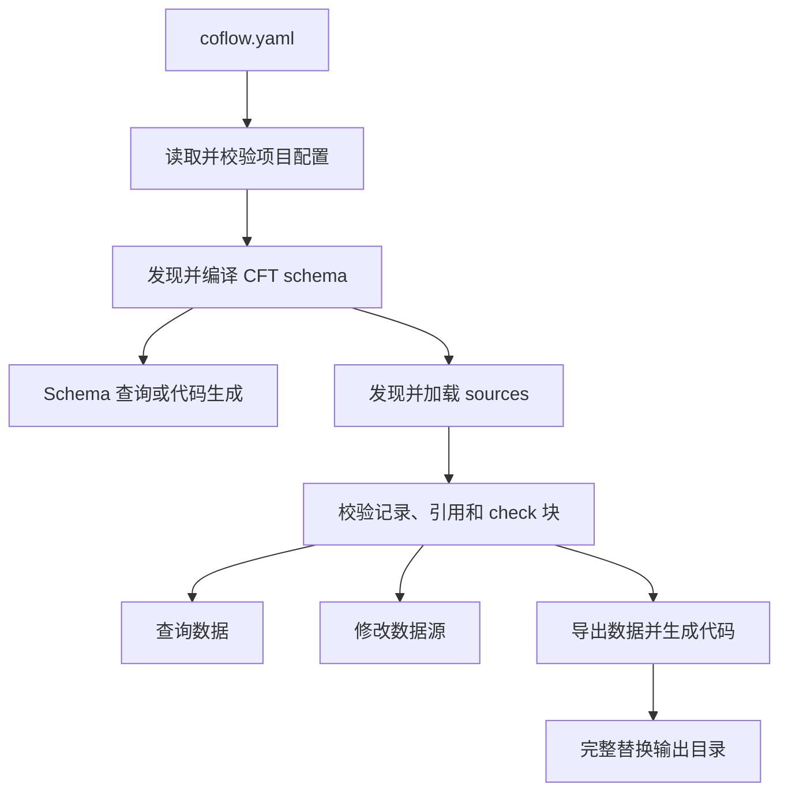

# 项目流水线

项目流水线说明 Coflow 从 `coflow.yaml` 到校验、查询、数据修改和产物生成的对外行为。

项目字段和路径规则见 [`coflow.yaml` 参考](./01-project-config.md)。CLI 参数以及各命令使用的
流水线阶段见 [CLI 命令参考](./08-cli.md#命令矩阵)。

## Schema 编译

读取项目配置后，Coflow 会发现并编译 schema：

- 指向同一实际文件的重复 schema 路径只编译一次。
- 多个 schema 文件按稳定顺序合并编译。
- 编译覆盖语法、全局命名、继承、字段类型、默认值、注解和 `check {}` 的静态类型检查。

只使用 schema 的流程在此阶段结束，不要求数据源文件存在。

## Source 发现与选择

source 的选择规则如下：

- 显式设置 `type` 时，使用对应 provider。
- 单文件未设置 `type` 时，按文件格式选择 provider。
- 目录未设置 `type` 时，递归发现支持的文件，再分别选择 provider。
- 多个 provider 都能处理同一 source 时，应显式设置 `type`。
- 目录遍历不会通过符号链接或 junction 逃出声明根目录，并会去除指向同一实际文件的重复项。
- 配置的维度托管目录不会作为普通目录 source 重复加载。

可识别的文件类型由当前应用提供的 source provider 声明，不是 Coflow 项目的固定白名单。
默认 CLI 和编辑器提供 Excel、CSV 和 CFD provider；使用 Coflow 库的应用可以注册自定义
provider，增加新的文件扩展名和识别规则。`coflow.yaml` 只能引用已经提供的 provider。

provider 选项会在读取数据前校验。未知字段、错误类型和歧义映射会定位到
`coflow.yaml` 中对应的 source 配置项。

## 数据加载与校验

不同输入格式使用相同的记录和值校验规则：

- 默认值与必填字段校验。
- 字段类型、继承和多态校验。
- record key、字典 key 和 `@singleton` 约束。
- `&Type` 记录引用解析。
- CFT `check {}` 业务校验。

Excel、CSV 和 CFD 中的错误会尽可能保留文件、sheet、记录、字段或单元格位置。数据查询返回
请求的数据，同时在 `diagnostics` 中包含本次项目校验发现的问题。

## 数据写入

数据写入包括按 schema 创建文件或 Excel sheet、同步表头或 CFD 顶层字段、替换 CFD 文本，
以及批量修改记录。具体操作和参数见 [CLI 数据命令](./08-cli.md#data)。

批量修改把一组操作作为一个写入请求处理：

- 操作会按请求顺序解析，记录重命名等批内依赖可以被后续操作引用。
- 写入失败时，本批已经产生的文件修改会被撤销，`applied` 为空。
- 只有 CFT `check {}` 业务诊断时，修改可以保留；调用方通过 `check_ok` 和 `diagnostics` 继续修正。
- `affected_files` 是本次实际写入并去重后的 source 文件集合。

只读和检查流程不会生成或重写维度托管文件。完整产物构建可以生成缺失的维度文件，并在
生成后对最终数据再次执行校验。

## 维度文件

配置 `dimensions.<name>` 后：

1. `@dimension(name)` 字段绑定到对应维度；`@localized` 使用 `language` 维度。
2. Coflow 在 `dimensions.<name>.out_dir` 中维护维度文件。
3. 源数据中的字段值作为 `default`，配置的 variants 保存各自覆盖值。
4. 查询、检查和导出时，维度值仍属于原 owner record，不会表现为额外的业务记录类型。
5. 相关 `check {}` 会分别针对默认值和各变体执行。

托管目录中的文件不应显式加入 `sources`。重命名或删除 owner record 时，对应维度数据会与
记录修改保持一致。

## 产物写入

数据导出、代码生成和完整构建在写入前会完成各自所需的配置、schema、数据和 provider
选项校验。

每个 `outputs.*.dir` 都由 Coflow 完整接管，不应包含手写文件。Coflow 会先生成并验证全部
产物，再替换这些输出目录。多个 target 作为一次操作发布；任一步失败都会保留或恢复旧输出，
不会留下 data、code 或 `@idAsEnum` 状态彼此不一致的结果。

输出目录不能与项目根、配置文件、schema、source 或同一次构建中的其他输出目录重叠。

## 诊断

配置、schema、数据、provider 和产物错误都使用统一的 diagnostics 结构。能够定位的问题会
尽量包含配置字段、文件、record、field、sheet 或 cell 位置。CLI 可以输出人类可读文本或
JSON；各命令的报告字段和退出码见 CLI 参考。
