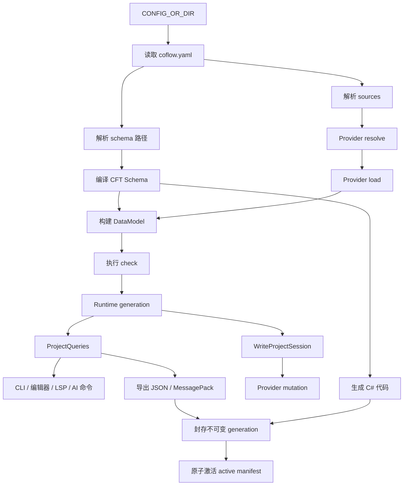

# 项目流水线

项目流水线说明 Coflow 从 `coflow.yaml` 到校验、导出和代码生成的执行顺序。它是 CLI、编辑器、LSP、Provider 和自动化工具共享行为的总入口。



## 入口

大多数命令接受可选 `CONFIG_OR_DIR`：

| 输入 | 解析方式 |
| --- | --- |
| 未提供 | 在当前目录查找 `coflow.yaml`，再查找 `coflow.yml` |
| 目录 | 在该目录查找 `coflow.yaml`，再查找 `coflow.yml` |
| 文件 | 直接作为项目配置文件读取 |

项目相对路径均以配置文件所在目录为根。

## 配置读取

`coflow-project` 负责读取和校验 `coflow.yaml`：

- 顶层字段只允许 `schema`、`sources`、`outputs`、`dimensions`。
- `schema` 是单个路径或路径列表。
- `sources` 是数据源列表。
- `outputs` 声明一个或多个由 data、可选 code 和可选 loader 组成的输出目标；旧对象形式映射为单目标。
- `dimensions` 声明维度配置，例如 `dimensions.language`。

source 必须且只能设置 `path` 或 `url` 之一。source 的通用字段是 `type`、`path`、`url`，其他字段会作为 Provider options 传入 loader。

data/code output 必须设置 `type` 和 `dir`，其他字段会作为 Provider options 传入 exporter 或 codegen。loader 必须设置 `type`，其他字段作为 loader options。

## Schema 发现与编译

schema 路径可以指向文件或目录：

- 文件必须是精确小写 `.cft`。
- 目录会递归发现精确小写 `.cft` 文件。
- 文件按 module id 排序后收集为 `CftFile`。
- 多个 schema 文件合并为一个编译后的 schema。

Schema 编译阶段会处理：

- 词法和语法。
- const、enum、type 全局命名。
- 继承关系。
- 字段类型。
- 默认值。
- 注解。
- `check {}` 静态类型检查。

`coflow-cft` 将 `CftFile` 解析为不可变的 `CftModuleSet`，再连同维度配置构建一个 `CftSchema`。runtime 将模块集、schema 和输入 fingerprint 作为同一个 generation 缓存；只有完整构建成功才替换已发布 generation。失败的候选仅用于诊断，语义查询继续读取上一份可用 schema。维度 storage type 属于同一次 CFT build，不会逐个发布半完成索引。

只需要 schema 的命令不会要求数据源存在。

## 命令阶段矩阵

| 命令 | 项目配置 | Schema | Source | DataModel | Check | 写产物 |
| --- | --- | --- | --- | --- | --- | --- |
| `coflow cft check` | 是 | 是 | 否 | 否 | 否 | 否 |
| `coflow lsp` | 是 | 是 | 否 | 否 | 否 | 否 |
| `coflow schema inspect` | 是 | 是 | 否 | 否 | 否 | 否 |
| `coflow schema files` | 是 | 是 | 否 | 否 | 否 | 否 |
| `coflow schema write-file --check` | 是 | 是 | 否 | 否 | 否 | 可写 schema 文件 |
| `coflow data sources` | 是 | 是 | 是 | 是 | 是 | 否 |
| `coflow data list/get` | 是 | 是 | 是 | 是 | 是 | 否 |
| `coflow data create-file` | 是 | 是 | 否 | 否 | 否 | 写数据文件 |
| `coflow data sync-header` | 是 | 是 | 否 | 否 | 否 | 写数据文件 |
| `coflow data write-file --check` | 是 | 是 | 是 | 是 | 是 | 写 CFD 文件 |
| `coflow data patch` | 是 | 是 | 是 | 是 | 是 | 写数据源 |
| `coflow check` | 是 | 是 | 是 | 是 | 是 | 否 |
| `coflow export json/messagepack` | 是 | 是 | 是 | 是 | 是 | 是 |
| `coflow codegen csharp` | 是 | 是 | 否 | 否 | 否 | 是 |
| `coflow build` | 是 | 是 | 是 | 是 | 是 | 是 |

`codegen csharp` 会为唯一匹配的 target 生成公共声明和对应 loader。该命令是 schema-only，两者都不按当前数据过滤 table；它读取现有 `@idAsEnum` lock state，但只有完整 `build` 会根据当前数据更新 lock state。完整 `build` 中的公共代码和 loader 使用同一次不可变 DataModel generation，以保证导出的非空 table 与加载 API 一致。

`data sources`、`data list` 和 `data get` 使用绑定到同一 generation 的只读 query capability。它们的主要输出
分别是 source、record 索引和 record 内容，但返回的 `diagnostics` 会包含数据加载、
DataModel 和 CFT `check {}` 诊断。

`data patch` 通过 write capability 执行整批 mutation transaction。runtime 先解析批内依赖并完成
provider preflight，再为本地来源保存字节快照、为远程来源取得补偿句柄；全部 writer I/O 完成后只重建一次
候选 generation。writer、加载、DataModel 或 transaction commit 失败会恢复来源并保留旧 generation，
此时 `applied` 为空且 revision 不变。候选 generation 只有业务 `CHECK` 诊断时仍可发布，调用方根据
`check_ok` 和 `diagnostics` 继续修正；一次成功批次只推进一次 revision。成功报告会保留每个
operation 的 provider diagnostics，并在顶层 `diagnostics` 中与新 generation 诊断合并一次；
`affected_files` 是 runtime 记录的实际写入来源集合。

`schema write-file --check` 的 Check 列为“否”，因为它只在写入后重新编译
schema。它不会加载 source、同步表头、构建 DataModel，也不会执行 CFT
`check {}`。

`coflow check` 覆盖项目配置、schema、source、DataModel 和 CFT `check {}`，
但不解码 output provider options，也不生成产物。启用产物输出的项目应在发布或提交产物前
运行 `coflow build`。

## Source Resolve

Source resolve 由 `coflow-runtime` 通过 `ProviderRegistry` 执行。

选择 Provider 的规则：

- source 显式写 `type` 时，使用对应 Provider。
- 本地单文件未写 `type` 时，通过扩展名和 Provider probe 选择。
- 本地目录未写 `type` 时，runtime 统一安全遍历目录，再对每个文件执行 Provider probe。
- 远端 URL 未写 `type` 时，通过 URI scheme 或 Provider probe 选择。
- 多个 Provider 同等匹配时，应显式设置 `type`。

Resolve 之后得到具体 `ResolvedSource`。例如一个目录 source 可能展开为多个 Excel、CSV 或 CFD 文件。

项目配置中的 provider options 只在 provider 选择边界保留为 raw JSON。选中
provider 后，runtime 调用一次 provider decoder，将其转换为带 provider identity
的 typed options；后续 resolve、load、write、table 和 dimension operation 都复用
同一份 decoded options。未知 key、错误类型和歧义映射会在读取数据前报告，并
定位到 `coflow.yaml` 对应的 `sources.<index>.<key>`。

目录 source 由 runtime 统一按 canonical 路径顺序遍历，并按文件 probe provider；
每个文件只由选中的 provider 解码和处理，不会让所有 provider 重复扫描目录。

## Load 与 input records

Loader 负责把具体来源读成 input records：

```text
ResolvedSource
  -> provider.preflight
  -> provider.load
  -> LoadedRecordDraft[]
```

Input record 保留来源定位，但不执行最终业务规则。不同 Provider 输出相同的来源无关结构，后续统一交给 DataModel。

CFD 使用唯一的两阶段前端：`coflow-cfd` 先把文本解析成带 source span 的
canonical AST，`coflow-loader-cfd` 再根据已编译 schema 将 AST lowering 为
`LoadedRecordDraft`。LSP、writer 和 loader 共享同一套 CFD syntax parser；loader
不维护第二套 lexer/parser，也不在 syntax 阶段执行 schema 语义。

表格 create/sync operation 使用同一条本地文件 runtime 路径。项目 path 按扩展名
选择 provider，由 source provider 提供 decoded options，再调用同 id 的
`TableManager`。

`sync-header` 在 provider 写入前构建统一表头协调计划。该计划按列身份投影所有
已有行，同时给出新增和删除列；CSV 与 Excel 使用同一语义。字段重排不会只替换
首行，也不会让原数据继续停留在旧列位置。

## DataModel 与 Check

完整项目检查的数据主线是：

```text
Project
  -> compile schema
  -> inject dimension types
  -> resolve sources
  -> load input records
  -> build CfdDataModel
  -> resolve refs
  -> run coflow-checker
  -> runtime generation
```

DataModel 阶段统一处理：

- 默认值。
- 必填字段。
- 字段类型。
- 继承和多态。
- 字典 key。
- record key。
- `@singleton`。
- `&Type` 记录引用。

Checker 阶段执行 CFT `check {}`，并生成 `CFD-CHECK-*` 诊断。

## 运行时能力会话

runtime 内部把 project、schema、model、diagnostics 和 source/record/file 索引保存为一个完整 generation。拥有该状态的 session 是 crate-private；宿主只能使用表达用途的窄接口：

| Capability | 用途 |
| --- | --- |
| `ProjectQueries<'generation>` | 对一个确定 generation 执行只读查询 |
| `ReadOnlyProjectSession` | 编辑、检查等不允许生成维度文件的生命周期 |
| `BuildProjectSession` | build 流程；允许生成维度来源后再发布最终 generation |
| `WriteProjectSession` | 持有 Provider registry、revision 和 mutation 命令 |

CLI、编辑器和自动化命令复用这些 capability，而不是导入 owning session、重新实现加载/检查流程，或自行协调 Provider 写入和重建。每个成功应用的 mutation 才推进 write revision；没有应用任何操作的失败保持当前 generation。

## 维度文件

配置 `dimensions.<name>` 后，schema build 和 runtime 会：

1. 把 `@dimension(name)` 字段绑定到 canonical dimension；`@localized` 等价绑定到 `language`。
2. 在各自的 `dimensions.<name>.out_dir` 独占目录下维护维度数据文件。
3. 把维度文件注册为隐式 source，并按原字段类型解析 variant 值。
4. 把 variant overlay 附着到 owner record，不生成合成 type、record 或独立 store。
5. 按默认值轮和各维度的配置 variant 轮执行相关 check。

维度数据复用普通 source / DataModel / check 流程，overlay 是 owner record 的一部分。

## 产物写入

写产物的命令包括：

- `coflow export json`
- `coflow export messagepack`
- `coflow codegen csharp`
- `coflow build`

写入前会执行：

1. 项目/schema 诊断。
2. 需要数据时的数据加载、DataModel 和 check。
3. 宿主先解析全部 target 的 exporter、codegen 和兼容 loader，再调用各 provider 的 option decoder，把 project-facing JSON 转换为 provider-owned typed options。
4. root artifact release module 对全部输出执行 artifact safety 检查。
5. 全部 provider 使用 decoded options 完成纯内存 generation。
6. 全部 generation 和目标目录 staging 成功后，事务性替换目标目录，最后只 publication 一次 active manifest。

存在诊断时不写产物。

通过检查后，CLI 使用 staging 目录写入、同步并回读验证完整产物，再把目录封存为不可变 generation，并用同一份产物替换 `outputs.*.dir`。旧 generation 不会被改写；目标目录替换失败时，已经替换的目标会恢复到旧版本。

全部 target 的 data、code generation 与 C# `@idAsEnum` lock state 组成一个 manifest snapshot。第一个 target 继续使用兼容 slot `data` / `code`，后续 target 使用 `output-N-data` / `output-N-code`。CLI 先原子更新可提交到版本库的 `coflow.enum.lock.json` 镜像，再以一次原子替换项目目录下 `.coflow/artifacts/active.json` 激活整个 snapshot。任何被报告的失败都发生在最终激活之前，因此旧 active snapshot 保持完整；已有 active manifest 始终优先于镜像。没有本地 manifest 的干净 clone 才从镜像恢复编号。

## 诊断流

跨模块边界统一使用 `DiagnosticSet`：

```text
CFT diagnostics
  -> DiagnosticSet

DataModel / check diagnostics + RecordOrigin
  -> DiagnosticSet

Provider / project / artifact diagnostics
  -> DiagnosticSet

DiagnosticSet
  -> CLI human / JSON
  -> editor diagnostics
  -> LSP diagnostics
```

能定位到项目配置、source、record、cell 或 artifact 的错误应进入结构化诊断。`Err(String)` 只用于更早期的不可恢复错误，例如配置文件无法读取或命令参数无法解析。

## 边界

| 模块 | 职责 |
| --- | --- |
| `coflow-project` | 项目配置、项目根目录、路径解析、schema 文件发现、项目初始化 |
| `coflow-runtime` | schema 编译、source resolve/load、DataModel、check、索引、诊断聚合 |
| 根 `coflow` crate | CLI 参数、命令编排、human/JSON 输出、output option planning、artifact safety、generation staging 和 manifest publication |
| `coflow-builtins` | 默认 Provider registry |
| Provider crates | loader、writer、exporter、codegen 具体实现 |

Provider 不发现项目配置，不持有宿主状态，不直接决定业务合法性。Runtime 不渲染 CLI 输出，不发布 artifact manifest。CLI 不重新实现 source resolve/load/model/check。
