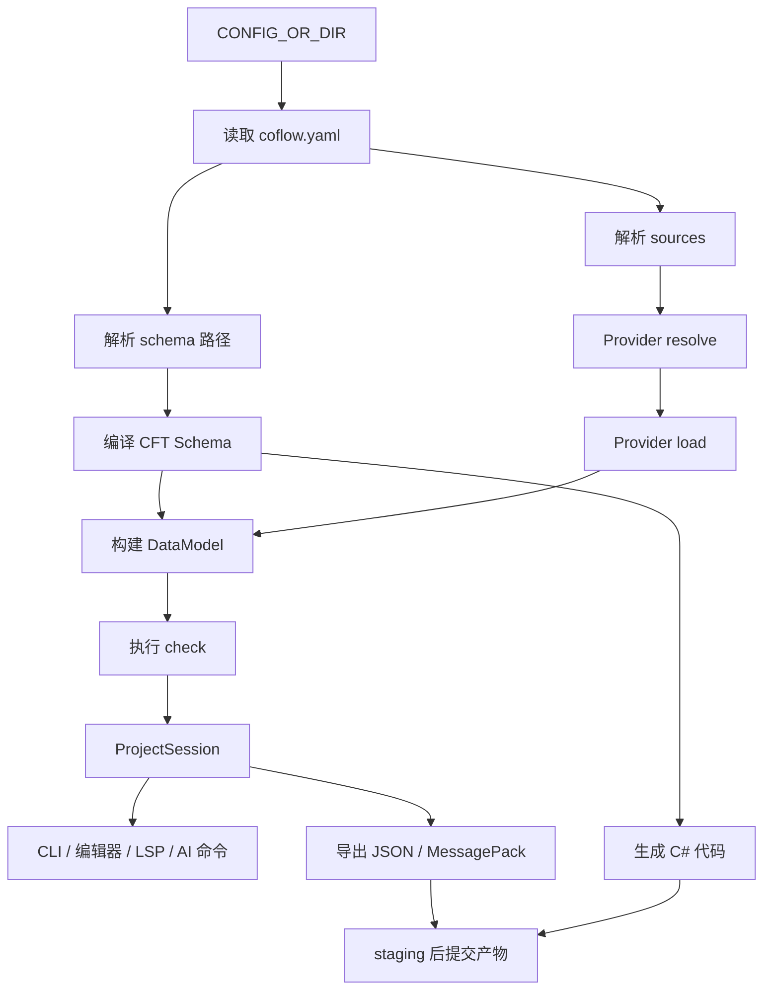

# 项目流水线

项目流水线说明 Coflow 从 `coflow.yaml` 到校验、导出和代码生成的执行顺序。它是 CLI、编辑器、LSP、Provider 和自动化工具共享行为的总入口。



## 入口

大多数命令接受可选 `CONFIG_OR_DIR`：

| 输入 | 解析方式 |
| --- | --- |
| 未提供 | 在当前目录查找 `coflow.yaml`，再查找 `coflow.yml` |
| 目录 | 在该目录查找 `coflow.yaml`，再查找 `coflow.yml` |
| 文件 | 直接作为项目配置文件读取 |

项目相对路径均以配置文件所在目录为根。

## 配置读取

`coflow-project` 负责读取和校验 `coflow.yaml`：

- 顶层字段只允许 `schema`、`sources`、`outputs`、`dimensions`。
- `schema` 是单个路径或路径列表。
- `sources` 是数据源列表。
- `outputs` 声明导出和代码生成目标。
- `dimensions` 声明维度配置，例如 `dimensions.language`。

source 必须且只能设置 `path` 或 `url` 之一。source 的通用字段是 `type`、`path`、`url`，其他字段会作为 Provider options 传入 loader。

output 必须设置 `type` 和 `dir`，其他字段会作为 Provider options 传入 exporter 或 codegen。

## Schema 发现与编译

schema 路径可以指向文件或目录：

- 文件必须是精确小写 `.cft`。
- 目录会递归发现精确小写 `.cft` 文件。
- 文件按 module id 排序后注册到 `CftContainer`。
- 多个 schema 文件合并为一个编译后的 schema。

Schema 编译阶段会处理：

- 词法和语法。
- const、enum、type 全局命名。
- 继承关系。
- 字段类型。
- 默认值。
- 注解。
- `check {}` 静态类型检查。

`CftContainer` 将 module source、schema reflection、类型/enum 索引、typed check schedule 和 value dependency plan 作为同一个 `CompiledSchema` generation 发布。新增 module 只进入 staged 输入；只有完整编译成功才原子替换 generation，失败时查询仍读取上一份 schema 与对应 source。运行时生成的 dimension storage type 也按批次构建候选 generation，不会逐个类型发布半完成索引。

只需要 schema 的命令不会要求数据源存在。

## 命令阶段矩阵

| 命令 | 项目配置 | Schema | Source | DataModel | Check | 写产物 |
| --- | --- | --- | --- | --- | --- | --- |
| `coflow cft check` | 是 | 是 | 否 | 否 | 否 | 否 |
| `coflow lsp` | 是 | 是 | 否 | 否 | 否 | 否 |
| `coflow schema inspect` | 是 | 是 | 否 | 否 | 否 | 否 |
| `coflow schema files` | 是 | 是 | 否 | 否 | 否 | 否 |
| `coflow schema write-file --check` | 是 | 是 | 否 | 否 | 否 | 可写 schema 文件 |
| `coflow data sources` | 是 | 是 | 是 | 是 | 是 | 否 |
| `coflow data list/get` | 是 | 是 | 是 | 是 | 是 | 否 |
| `coflow data create-file` | 是 | 是 | 否 | 否 | 否 | 写数据文件 |
| `coflow data sync-header` | 是 | 是 | 否 | 否 | 否 | 写数据文件 |
| `coflow data write-file --check` | 是 | 是 | 是 | 是 | 是 | 写 CFD 文件 |
| `coflow data patch` | 是 | 是 | 是 | 是 | 是 | 写数据源 |
| `coflow check` | 是 | 是 | 是 | 是 | 是 | 否 |
| `coflow export json/messagepack` | 是 | 是 | 是 | 是 | 是 | 是 |
| `coflow codegen csharp` | 是 | 是 | 否 | 否 | 否 | 是 |
| `coflow build` | 是 | 是 | 是 | 是 | 是 | 是 |

`codegen csharp` 是 schema-only 命令。它不要求 source 存在，也不构建 DataModel。

`data sources`、`data list` 和 `data get` 使用完整项目 session。它们的主要输出
分别是 source、record 索引和 record 内容，但返回的 `diagnostics` 会包含数据加载、
DataModel 和 CFT `check {}` 诊断。

`data patch` 写入后会刷新项目 session 并返回写入后的诊断；业务校验诊断不会回滚
已经成功写入的数据，调用方应根据 `write_ok`、`check_ok` 和 `diagnostics` 继续修正。

`schema write-file --check` 的 Check 列为“否”，因为它只在写入后重新编译
schema。它不会加载 source、同步表头、构建 DataModel，也不会执行 CFT
`check {}`。

`coflow check` 覆盖项目配置、schema、source、DataModel 和 CFT `check {}`，
但不执行 exporter / codegen preflight。启用产物输出的项目应在发布或提交产物前
运行 `coflow build`。

## Source Resolve

Source resolve 由 `coflow-runtime` 通过 `ProviderRegistry` 执行。

选择 Provider 的规则：

- source 显式写 `type` 时，使用对应 Provider。
- 本地单文件未写 `type` 时，通过扩展名和 Provider probe 选择。
- 本地目录未写 `type` 时，目录交给各 loader 的 resolve 阶段发现可处理文件。
- 远端 URL 未写 `type` 时，通过 URI scheme 或 Provider probe 选择。
- 多个 Provider 同等匹配时，应显式设置 `type`。

Resolve 之后得到具体 `ResolvedSource`。例如一个目录 source 可能展开为多个 Excel、CSV 或 CFD 文件。

项目配置中的 provider options 只在 provider 选择边界保留为 raw JSON。选中
provider 后，runtime 调用一次 provider decoder，将其转换为带 provider identity
的 typed options；后续 resolve、load、write、table 和 dimension operation 都复用
同一份 decoded options。未知 key、错误类型和歧义映射会在读取数据前报告，并
定位到 `coflow.yaml` 对应的 `sources.<index>.<key>`。

目录 source 由 runtime 统一按 canonical 路径顺序遍历，并按文件 probe provider；
每个文件只由选中的 provider 解码和处理，不会让所有 provider 重复扫描目录。

## Load 与 input records

Loader 负责把具体来源读成 input records：

```text
ResolvedSource
  -> provider.preflight
  -> provider.load
  -> CfdInputRecord[]
```

Input record 保留来源定位，但不执行最终业务规则。不同 Provider 输出相同的来源无关结构，后续统一交给 DataModel。

CFD 使用唯一的两阶段前端：`coflow-cfd` 先把文本解析成带 source span 的
canonical AST，`coflow-loader-cfd` 再根据已编译 schema 将 AST lowering 为
`CfdInputRecord`。LSP、writer 和 loader 共享同一套 CFD syntax parser；loader
不维护第二套 lexer/parser，也不在 syntax 阶段执行 schema 语义。

表格 create/sync operation 使用同一条 location-neutral runtime 路径。本地 path
可以按扩展名选择 provider；远程 URI 必须匹配已配置 source，由 source provider
提供 decoded options，再调用同 id 的 `TableManager`。CLI 不解析 Lark URL、凭证
或 sheet options，也没有远程 provider 特判。

`sync-header` 在 provider 写入前构建统一表头协调计划。该计划按列身份投影所有
已有行，同时给出新增和删除列；CSV、Excel 与 Lark 使用同一语义。字段重排不会
只替换首行，也不会让原数据继续停留在旧列位置；远程表格还会显式清空已删除的
尾列范围。

Lark source load 与后续 write/table operation 共享同一个远程 document state，因而
复用同一份凭证、wiki 解析和 sheet metadata。缓存不会只按 app id 或 spreadsheet
token 跨凭证复用；token 失效时由统一远程请求层刷新并重试一次。

## DataModel 与 Check

完整项目检查的数据主线是：

```text
Project
  -> compile schema
  -> inject dimension types
  -> resolve sources
  -> load input records
  -> build CfdDataModel
  -> resolve refs
  -> run coflow-checker
  -> ProjectSession
```

DataModel 阶段统一处理：

- 默认值。
- 必填字段。
- 字段类型。
- 继承和多态。
- 字典 key。
- record key。
- `@singleton`。
- `&Type` 记录引用。

Checker 阶段执行 CFT `check {}`，并生成 `CFD-CHECK-*` 诊断。

## ProjectSession

`ProjectSession` 是 runtime 构建出的共享运行时状态：

```text
ProjectSession
  project
  schema
  model
  diagnostics
  sources
  records
  files
```

CLI、编辑器和自动化命令应该复用 `ProjectSession` 中的 schema、model、source index、record index 和 diagnostics，而不是重新实现一套加载和检查流程。

## 维度文件

`dimensions.language` 启用语言维度时，runtime 会：

1. 扫描 schema 中的 `@localized` 字段。
2. 注入合成 type。
3. 在 `dimensions.language.out_dir` 下维护维度数据文件。
4. 把维度文件注册为隐式 source。
5. 按默认值轮和语言变体轮执行相关 check。

维度数据进入普通 source / DataModel / check 流程，不是独立的外部覆盖层。

## 产物写入

写产物的命令包括：

- `coflow export json`
- `coflow export messagepack`
- `coflow codegen csharp`
- `coflow build`

写入前会执行：

1. 项目/schema 诊断。
2. 需要数据时的数据加载、DataModel 和 check。
3. exporter / codegen preflight。
4. artifact safety preflight。

存在诊断时不写产物。

通过检查后，CLI 使用 staging 目录写入完整产物，再替换目标目录。导出目录和代码生成目录由 Coflow 完整接管，目标目录内已有内容不会保留。

C# codegen 的 `coflow.enum.lock.json` 位于 `coflow.yaml` 同级。codegen 会在 staging 成功后再提交 lockfile。

## 诊断流

跨模块边界统一使用 `DiagnosticSet`：

```text
CFT diagnostics
  -> DiagnosticSet

DataModel / check diagnostics + RecordOrigin
  -> DiagnosticSet

Provider / project / artifact diagnostics
  -> DiagnosticSet

DiagnosticSet
  -> CLI human / JSON
  -> editor diagnostics
  -> LSP diagnostics
```

能定位到项目配置、source、record、cell 或 artifact 的错误应进入结构化诊断。`Err(String)` 只用于更早期的不可恢复错误，例如配置文件无法读取或命令参数无法解析。

## 边界

| 模块 | 职责 |
| --- | --- |
| `coflow-project` | 项目配置、项目根目录、路径解析、schema 文件发现、项目初始化 |
| `coflow-runtime` | schema 编译、source resolve/load、DataModel、check、索引、诊断聚合 |
| 根 `coflow` crate | CLI 参数、命令编排、human/JSON 输出、产物 preflight、staging 和 commit |
| `coflow-builtins` | 默认 Provider registry |
| Provider crates | loader、writer、exporter、codegen 具体实现 |

Provider 不发现项目配置，不持有宿主状态，不直接决定业务合法性。Runtime 不渲染 CLI 输出，不替换导出目录。CLI 不重新实现 source resolve/load/model/check。
