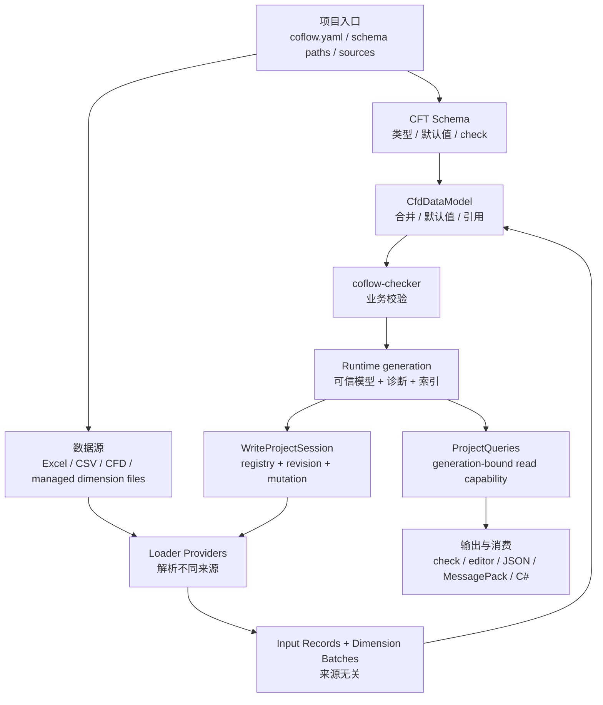

# 项目架构

本页说明 Coflow 仓库的核心模块、运行时数据流和职责边界。它不是入门教程，而是给需要理解内部结构、扩展 Provider、维护 CLI/编辑器/LSP 的开发者使用。

## 数据处理流程

Coflow 的主线是数据处理：CFT 定义数据形状，数据源提供记录，Provider 把不同来源转成统一输入，DataModel 负责合并、补默认值和解析引用，check 通过后再导出数据和生成运行时代码。



`coflow.yaml`、路径解析、Provider registry 和宿主命令都服务于这条数据主线。runtime 内部拥有处理完成后的完整 generation；CLI、编辑器和自动化命令只通过 capability session 复用它，而不是各自重新实现 schema/data/check 管线。

内部 generation 保存共享运行时状态：

```text
Runtime generation
  project        # 项目配置、根目录和路径信息
  schema         # 编译后的 CFT schema
  model          # 构建后的 CfdDataModel
  diagnostics    # 结构化诊断
  sources        # source 索引
  records        # record 索引
  files          # 文件索引
```

拥有该 generation 的 session 不属于 public interface。`ProjectQueries` 提供 generation-bound 的窄只读 interface，不向宿主暴露 source/file/record 索引容器；`ReadOnlyProjectSession`、`BuildProjectSession` 和 `WriteProjectSession` 分别表达无副作用读取、允许维度生成的构建、以及持有 registry/revision 的 mutation 能力。`check` 到这里结束；`build`、`export` 和 `codegen` 会在 generation 有效后进入 root artifact release module，写入不可变 artifact generation，并原子激活一个 manifest snapshot。

## 分层职责


这张图按自上而下的调用关系阅读：宿主调用项目运行时，运行时使用核心模型和 Provider registry；具体 Provider 通过 `coflow-api` 的接口接入。

## Crate 边界

| Crate | 职责 |
| --- | --- |
| `coflow-api` | Provider traits、diagnostics、source locations、artifacts、writer contracts |
| `coflow-project` | 读取和校验 `coflow.yaml`、路径解析、schema 文件发现、项目初始化 |
| `coflow-runtime` | schema 编译、source resolve/load、DataModel、check、索引、维度文件维护与 overlay 装配 |
| `coflow-builtins` | 注册默认 Provider registry |
| 根 `coflow` crate | CLI 参数解析、命令编排、human/JSON 输出、artifact generation staging 和 manifest publication |
| `coflow-cft` | CFT parser、schema compiler、check 表达式静态类型检查 |
| `coflow-cfd` | 唯一 CFD syntax parser、canonical AST 和 source spans |
| `coflow-structure` | parser/compiler/evaluator 共用的递归深度、节点数和工作量预算 |
| `coflow-data-model` | record/object/value 模型、默认值、引用、索引和 DataModel 诊断 |
| `coflow-loader-table-core` | Excel/CSV 共享表格加载、表头协调和单元格值解析 |
| `coflow-loader-*` | 具体数据源 loader/writer |
| `coflow-exporter-core` | JSON/MessagePack 共享导出遍历规则 |
| `coflow-exporter-*` | 具体数据导出格式 |
| `coflow-codegen-csharp` | C# 运行时代码生成 |
| `coflow-checker` | CFT `check {}` 运行期执行 |
| `coflow-lsp` | CFT/CFD language server |
| `editors/cfd-editor/src-tauri` | 编辑器后端宿主，复用 runtime 和 writer |

## 关键模块

### `coflow-project`

`coflow-project` 只负责项目入口和路径：

- 发现 `coflow.yaml` / `coflow.yml`。
- 解析项目根目录。
- 校验 `schema`、`sources`、`outputs`、`dimensions` 配置形状。
- 展开 schema 文件列表。
- 初始化最小项目骨架。

它不加载数据、不构建 DataModel、不调用 exporter 或 codegen。

### `coflow-runtime`

`coflow-runtime` 是共享项目运行时。它把 project、schema、source、DataModel、diagnostics 和索引组织成不可被宿主拆开的 generation，并通过 capability session 暴露用途明确的 interface。

source resolution module 是配置 source 到 resolved source 的唯一 seam：它集中完成
provider 选择、typed option 解码、provider identity contract、目录展开、目标位置覆盖和
project-config diagnostics。load、table operation 和 mutation 不再各自重做 provider/path
解析，因而同一配置在所有入口具有同一语义。

主要职责：

- 编译 CFT schema。
- 解析并加载 record-owned dimension overlays。
- resolve / preflight / load sources。
- 构建统一的 `CfdDataModel`。
- 建立 source、record、file 索引。
- 以 `SourceId` 保持配置 source 到 record mutation 的唯一身份。
- 执行引用解析和 `coflow-checker`。
- 聚合结构化诊断。
- 规划并原子发布 source mutation transaction。

runtime 返回诊断，不负责最终的 CLI 输出格式，也不负责替换导出目录。

### `coflow-api`

`coflow-api` 是 Provider 和宿主之间的公共边界。它定义：

- loader / writer / exporter / codegen traits。
- Provider descriptor。
- 诊断结构和 source location。
- artifact 输出契约。
- write patch / write outcome 和 source transaction compensation contract。
- opaque `DecodedSourceOptions` / `DecodedOutputOptions` 及 provider-owned option decoding contract。

共享表格算法、导出遍历算法和项目生命周期不放在 `coflow-api`，避免 API crate 变成实现集合。

`SourceConfig.options` 是 project adapter 的 raw 输入，不属于运行时 source contract。
`ResolvedSource` 只保存 provider 解码后的 opaque typed options；loader、writer 和
table manager 必须读取本 provider 的具体 option 类型，provider identity 或类型
不匹配会产生 contract diagnostic。provider option value 不通过 source index 或
Debug 输出暴露给 host。

output provider 使用对称的 typed option seam。宿主只在 release planning 时把
project-facing JSON 解码一次；exporter/codegen generation 收到 provider-owned
`DecodedOutputOptions`，看不到 output provider id 和宿主 artifact directory。
`@idAsEnum` variants 等宿主生成输入通过 context 传递，不混入用户 options。

每个 resolved source 在 generation 内获得稳定 `SourceId`。record index 保存该 ID，
已有 record 的 mutation 直接按 ID 找回原 source，不把可能重复的 display path 当作
身份。file index 会保留同一路径对应的全部 source；只有映射唯一时，insert 这类纯文件
入口才允许派发，否则返回 `WRITE-AMBIGUOUS-SOURCE`。

### Mutation transaction

`WriteProjectSession` 是唯一 mutation interface。一次请求按以下顺序执行：

1. planner 解析所有操作，并用 pending-record overlay 折叠 `insert -> set/rename/delete` 等批内依赖；随后生成一次 provider execution plan，固定 source、writer、target、sheet、delete origin 和 reference rewrite actions。
2. 所有可执行的 provider preflight 在任何写入前完成。
3. 每个本地 path source 由 runtime 保存原始字节；每个远程 source 必须返回 provider-owned compensation handle，否则整批在写入前拒绝。
4. `writes::stage` 只执行 provider I/O，不 rebuild session。
5. 全部来源写入后构建一个候选 generation。加载、schema 或 DataModel 错误会触发 compensation；业务 `CHECK` 诊断属于可发布结果。
6. 所有远端 transaction 先完成可失败的 `prepare_commit`。全部准备成功后，runtime 才调用不可失败的最终 `commit` publication，替换旧 generation，并且整批只推进一次 revision。

preflight、transaction enlistment 和 stage 只消费同一 execution plan，不重复按路径查找
source 或 writer。stage、rebuild 或 prepare-commit 失败时，runtime 按逆序补偿远程来源并恢复本地字节，旧 generation 继续为查询提供一致视图，报告中的 `applied` 为空。最终 publication 不允许失败，因此不会出现“部分 source 已 commit 后再尝试回滚”的无效契约。远程 writer 若没有可靠补偿和两阶段 publication 能力，必须显式声明 `Unsupported`；不能用“尽力回滚”伪装成原子写入。

成功报告中的 operation outcome 只保存该 operation 的 provider diagnostics，不复制整个
generation diagnostic set。顶层 `diagnostics` 按 operation 顺序汇总 provider diagnostics，
再追加候选 generation diagnostics；`affected_files` 对所有 operation 实际写入的来源路径去重。

## Provider Registry

Provider registry 持有 loader、writer、exporter 和 codegen。默认 registry 由 `coflow-builtins` 组装。

| 类别 | Provider id |
| --- | --- |
| loader/writer | `excel` |
| loader/writer | `csv` |
| loader/writer | `cfd` |
| exporter | `json` |
| exporter | `messagepack` |
| codegen | `csharp` |

runtime 只依赖 registry 和 trait，不依赖具体 Provider crate 的实现细节。扩展新数据源、导出格式或代码生成目标时，应优先通过 Provider 接口接入。

本地文件的 table operation 使用统一 runtime preparation interface：匹配项目 source、
选择 provider、复用 decoded options、校验 provider role，然后调用 `TableManager`。

表头同步的列身份、增删集合和旧列到新列的行投影由
`coflow-loader-table-core::writer::HeaderReconciliationPlan` 一次计算。CSV、Excel
adapter 只执行该计划，不各自实现列匹配。重复的空表头槽位按出现次序匹配，因此
`@expand` 字段在新增、删除或重排其他字段后仍保持原数据绑定。

Excel source provider 的 read descriptor 接受 `.xlsx`、`.xlsm` 和 `.xls`，但
writer capability 与 table-operation descriptor 只对 `.xlsx` 开放。Runtime 查询
每个 `ResolvedSource` 的动态 capability，不再把 provider 级静态 capability 套用
到所有格式；writer 和 table manager 入口仍执行相同的格式预检。

## 数据模型边界

Loader 输出 source-neutral input records。它们只表达“某个来源读到了哪些记录和值”，不直接变成导出产物。

`coflow-exporter-core` 借用 `CftSchema` 的 field metadata，并把每个 table 转成 path-aware `begin/end/key/scalar` 事件流。JSON 和 MessagePack sink 直接顺序写入最终 table buffer，不构造跨 table value tree，也不为 scalar/child aggregate 分配临时编码 buffer；sink 错误由 core 补充 table、record key 与完整字段路径。

CFD loader 是 schema-guided lowering adapter，而不是另一套文本 parser。CFD
文本只由 `coflow-cfd` 解析一次，得到 canonical AST；`coflow-loader-cfd` 消费
该 AST，完成类型、字段、多态、引用和 dict key 转换。语言工具和数据加载因此
共享相同的 token、恢复规则和 source span。

DataModel 统一处理：

- 顶层 record key。
- 默认值。
- 必填字段。
- 字段类型匹配。
- 多态对象可赋值性。
- dict key 唯一性。
- `&Type` 记录引用。
- 继承索引。
- `@singleton` 约束。

因此 Excel、CSV 和 CFD 的数据最终使用同一套规则。Provider 不应该各自实现业务校验。

## 宿主边界

### CLI

根 `coflow` crate 是 CLI 宿主，负责：

- 解析命令行参数。
- 调用 project / runtime。
- 将 diagnostics 渲染为 human 或 JSON。
- 编排 `check`、`build`、`export`、`codegen`。
- 构建统一 artifact release plan，并执行全部 output 的 safety validation。
- 在任何 staging 前完成全部纯内存 generation。
- 验证并封存全部不可变 artifact generation，再以一次 publication 原子发布 active manifest。

active manifest 同时选择 data、code generation 和 `@idAsEnum` lock state。它的发布属于 CLI 宿主职责，不放进 runtime；所有可报告的文件系统操作都在最后一次 manifest 原子替换前完成，旧 generation 不参与回滚写入，失败时只需保持旧 manifest 未变。根目录 `coflow.enum.lock.json` 是激活前写好的版本化镜像，不参与 active snapshot 选择；若最终激活失败，它可以暂时领先于 active manifest，但不会成为运行时状态。

artifact release plan 保存 generation-bound session、provider 和 project-facing options。prepare 阶段
先对全部 output 解码和验证 provider-owned typed options，再执行 safety validation，随后才开始
纯内存 provider generation；任一预检诊断都会阻止所有 generation。publish 阶段才接触 staging 和
manifest；`build`、`export`、`codegen` 只是这个 lifecycle 的命令 adapter。

### 编辑器

每个 `EditorSession` 持有一个 `WriteProjectSession`、wire diagnostics 索引和
`RevisionCoordinator`。编辑器后端复用 `coflow-runtime`：

- 通过 generation-bound `ProjectQueries` 读取项目。
- 展示 source/file/record 索引。
- 展示表格视图、记录视图和关系视图。
- 只通过 `WriteProjectSession` mutation interface 写回数据。
- 使用同一套 diagnostics。

reload 会先取得当前 revision ticket，在 session 锁外构建完整候选 generation，
再在短写锁内比较 ticket。只有基准 revision 仍然匹配的候选才能替换 session；过期
候选被丢弃并重新构建，因此较慢的文件 reload 不能覆盖较新的内部写入。

每个 mutation 命令在一次 session 写锁内完成 read-modify-write、runtime mutation、wire
projection 和 revision capture；collection 编辑和 delete undo snapshot 不会跨 generation
拼接。内部写入推进 revision，并直接使用 runtime mutation report 的 `affected_files` 记录每个实际
写入路径的 SHA-256 内容指纹。文件 watcher
只有在路径和当前内容都匹配该指纹时才把事件归因于内部写入；之后发生的外部修改会
立即触发 reload，不依赖固定时间窗口。所有 snapshot、mutation outcome 和 diagnostics
都携带 revision；`FileRecords` 和 `GraphData` 也返回生成它们的 revision。前端只接收当前
session 的最新 revision，并通过统一 affected-file loader 校验整批查询结果，防止旧缓存覆盖
新状态。insert、delete 和跨文件 rename 都按同一 `affected_files` 集合批量刷新 target source
与所有 reference source，不再由 editor 从 record coordinate 反推写入范围。

前端的 project generation controller 统一验收 session/revision，mutation history controller
串行执行写入并只在 `committed` 后移动 undo/redo history；`superseded` 和 `failed` 不污染
history。关系图使用独立的纯 graph layout module，根据启用字段计算可达节点、环边和 ELK
输入，Worker 只负责执行布局。生产视图和测试消费同一 interface，不通过源码抽取复制算法。

编辑器 diagnostics 以 `(file, RecordCoordinate)` 建立索引。表格和关系视图按 record
直接读取相关诊断，不复制或扫描完整诊断列表。编辑器不应绕过 runtime mutation
interface 直接调用 writer 或修改 Provider 数据文件。

### LSP

LSP 是 schema-only/text language server，不要求数据源文件存在，重点提供 CFT/CFD 的
诊断、补全、hover、跳转、符号和语义高亮。`ValidationCore` 持有 open document、
单调 revision 和最近一次不可变 `ValidationSnapshot`；snapshot 将 schema build、
typed CFD definitions、diagnostics、document version 和 active URI 绑定在同一 revision。

文档变化只把不可变 `ValidationInput` 交给后台 worker。worker mailbox 会用较新的输入
替换尚未开始的旧输入；已在运行的旧 build 可以完成，但 `commit_snapshot` 只有在候选
revision 等于当前 revision 时才发布。需要 schema snapshot 的 feature request 会排队到
当前 revision 提交后再执行；排队请求保存接收时的 revision，后续文档变化会取消旧请求，
不会拿新 snapshot 解释旧 position。VS Code adapter 同时监视 config、CFT 和 CFD，closed
document 的外部修改也会推进 validation revision；已处置的子进程 session 会丢弃任何迟到的
stdout、diagnostic 或 failure 回调，活跃 session 也只能发布其当前拥有 document 的诊断，因此不能覆盖
替代 session 的诊断。CFD source、canonical AST、syntax
diagnostics 和 definition facts 保存在同一个不可变 document snapshot 中供语言功能复用，
因此旧 diagnostics、definition index 或 semantic state 不能与新文档混用，feature request
也不再重复解析同一 CFD。LSP 不维护第二套 CFD parser。

## 维度与本地化

`@localized` 字段属于 `language` 维度。runtime 会：

1. 把 project dimension 配置作为编译输入，生成一等 `CftDimension` 和字段 binding。
2. 根据每个 `dimensions.<name>.out_dir` 发现 managed dimension source。
3. Provider 按原 `CftField` 类型直接加载 variant value 和 physical origin。
4. DataModel 把 variant overlay 附着到 owner record，不生成 synthetic type/record 或独立 store。
5. checker 从 owner record 构造 default/variant rounds，并复用预编译 typed check plan。
6. mutation 在同一 transaction 中写普通 source、维度值、引用重写和 owner key 生命周期变化。

普通字段是 default 的唯一语义所有者。维度文件中的 `default` 只是 Provider 管理的物理镜像；variant 值进入 owner overlay，并参与同一套引用、诊断、增量检查和 publication 流程。

## 产物安全

所有写产物的命令都遵循同一原则：

- 有诊断时不写产物。
- release plan 先对全部目标做 artifact safety validation。
- 全部 provider generation 成功后才开始文件系统 staging。
- 在同级 staging 目录写入、同步并回读验证。
- 把完成目录封存为不可变 generation。
- 只通过一个 active manifest 原子激活完整 snapshot。

这样可以避免半生成目录被运行时误读；任一文件系统操作失败时，active state 仍是旧或新完整 generation。artifact preflight 还会解析已存在祖先的真实路径，避免输出经 symlink/junction 落进项目根、schema 或 source 目录。

## 非职责

| 模块 | 不负责 |
| --- | --- |
| `coflow-project` | 不加载 source，不构建 DataModel |
| `coflow-runtime` | 不渲染 CLI 输出，不发布 artifact manifest |
| CLI | 不重新实现 source resolve/load/model/check |
| Provider | 不发现项目配置，不持有宿主状态 |
| `coflow-api` | 不承载表格加载算法或导出遍历算法 |
