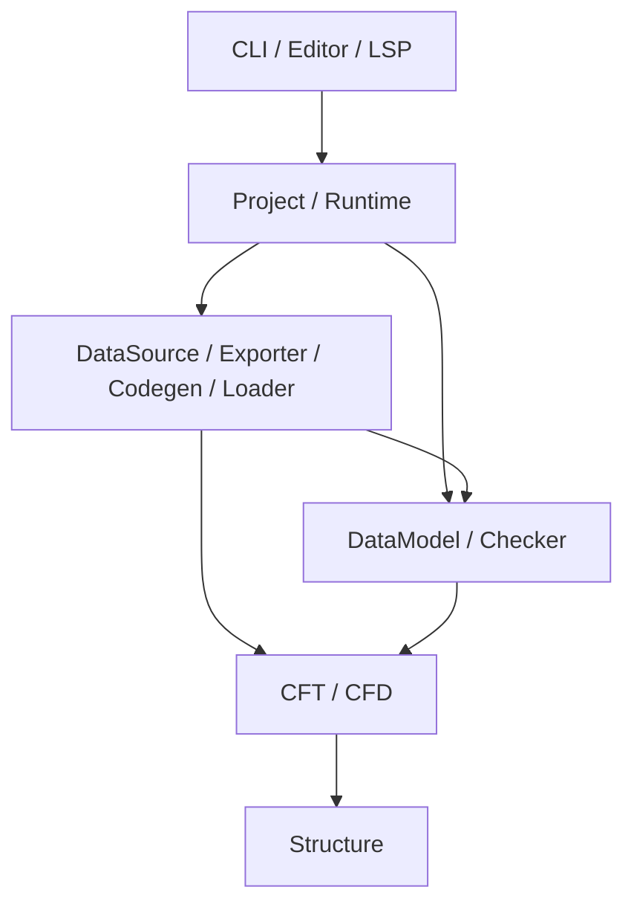
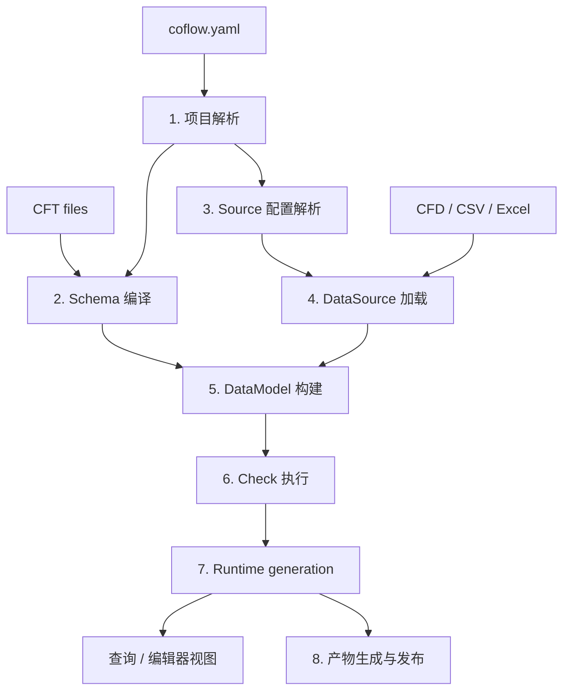

# 项目架构

## 主要 Crate

| Crate | 职责 |
| --- | --- |
| `coflow-structure` | 为语言、数据模型和校验提供共享的结构能力 |
| `coflow-cft` | 类型定义语言 CFT 的语法实现，输出 schema |
| `coflow-cfd` | 配置数据语言 CFD 的语法实现，输出 AST |
| `coflow-data-model` | 按 schema 组织各类 DataSource 提供的记录，形成统一 DataModel |
| `coflow-checker` | 执行 schema 中定义的 `check {}`，输出诊断 |
| `coflow-api` | 定义 runtime 与 Provider 之间共享的数据结构和扩展接口 |
| `coflow-project` | 读取项目配置并解析项目路径 |
| `coflow-runtime` | 组织 schema、DataSource、DataModel 和 checker，生成可查询的项目状态 |
| `coflow-loader-*` | 实现 CFD、CSV 和 Excel DataSource，提供数据读取与写回 |
| `coflow-exporter-*` | 实现 JSON 和 MessagePack Exporter |
| `coflow-codegen-csharp` | 实现 C# Codegen，以及 JSON/MessagePack 对应的 Loader |
| 根 `coflow` crate | 提供 CLI 命令并发布构建产物 |

## 核心数据流

### 1. 项目解析

`coflow-project` 读取 `coflow.yaml`，确定项目根目录，并解析 schema、source 和 output 配置。

### 2. Schema 编译

`coflow-cft` 将 CFT 文件编译为 schema。Schema 描述类型、字段、默认值、继承、注解和 `check {}`，供后续阶段统一使用。

### 3. Source 配置解析

runtime 解析 source 配置及其路径和选项，并选择对应的 DataSource。

### 4. DataSource 加载

DataSource 将 CFD、CSV、Excel 等外部数据转换为统一的 input records，并保留记录的来源信息。

### 5. DataModel 构建

`coflow-data-model` 按 schema 合并 input records，处理默认值、类型、继承和记录引用，形成统一 DataModel。

### 6. Check 执行

`coflow-checker` 在 DataModel 上执行 type-local 与命名顶层 check。两种作用域共用 evaluator、预算、`CheckExecutionId`、动态 path dependency、dimension round 和 snapshot engine；`records(Type)` 使用 DataModel 的稳定 assignable-record index，并以只读 record handle 求值，不复制 record object。

增量写入由 runtime 产生 canonical mutation impact：每个 `RecordCoordinate` 对应精确 `Paths` 或显式 `All`，结构操作另带 record-set membership delta。snapshot 使用同一 typed path 的祖先/后代 overlap 规则选择受影响根。schema-only 顶层诊断使用 module source catalog 映射到 CFT 文件；具体成员失败以数据位置为 primary，并关联规则声明位置。

### 7. Runtime Generation

`coflow-runtime` 将 project、schema、DataModel 和 diagnostics 组成一个 generation。CLI、编辑器和自动化命令读取同一份项目状态。

### 8. 产物生成与发布

Exporter 生成数据文件，Codegen 生成运行时代码，Loader 生成代码与数据格式之间的加载实现。根 `coflow` crate 将这些结果发布到输出目录。
