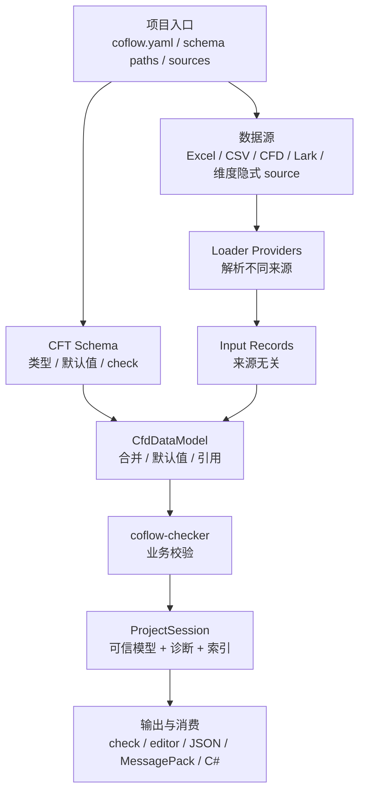
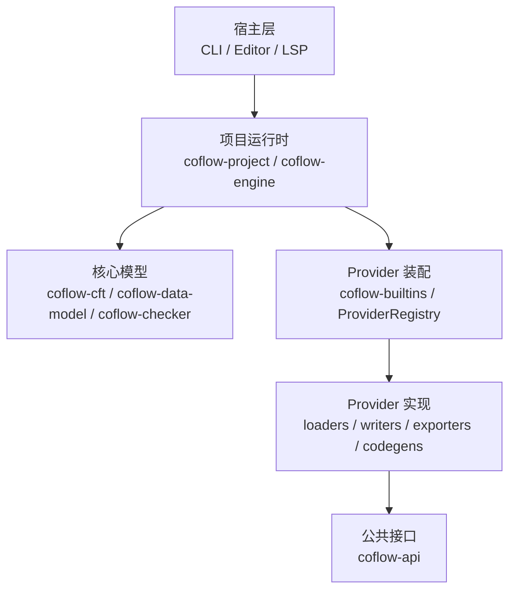

# 项目架构

本页说明 Coflow 仓库的核心模块、运行时数据流和职责边界。它不是入门教程，而是给需要理解内部结构、扩展 Provider、维护 CLI/编辑器/LSP 的开发者使用。

## 数据处理流程

Coflow 的主线是数据处理：CFT 定义数据形状，数据源提供记录，Provider 把不同来源转成统一输入，DataModel 负责合并、补默认值和解析引用，check 通过后再导出数据和生成运行时代码。



`coflow.yaml`、路径解析、Provider registry 和宿主命令都服务于这条数据主线。`ProjectSession` 是处理完成后的共享状态：CLI、编辑器和自动化命令应复用它，而不是各自重新实现一套 schema/data/check 管线。

`ProjectSession` 保存共享运行时状态：

```text
ProjectSession
  project        # 项目配置、根目录和路径信息
  schema         # 编译后的 CFT schema
  model          # 构建后的 CfdDataModel
  diagnostics    # 结构化诊断
  sources        # source 索引
  records        # record 索引
  files          # 文件索引
  dependencies   # 依赖视图
```

`check` 到这里结束。`build`、`export` 和 `codegen` 会在 session 有效后继续执行产物 preflight、staging 和 commit。

## 分层职责



这张图按自上而下的调用关系阅读：宿主调用项目运行时，运行时使用核心模型和 Provider registry；具体 Provider 通过 `coflow-api` 的接口接入。

## Crate 边界

| Crate | 职责 |
| --- | --- |
| `coflow-api` | Provider traits、diagnostics、source locations、artifacts、writer contracts |
| `coflow-project` | 读取和校验 `coflow.yaml`、路径解析、schema 文件发现、项目初始化 |
| `coflow-engine` | schema 编译、source resolve/load、DataModel、check、索引、维度文件注入 |
| `coflow-builtins` | 注册默认 Provider registry |
| 根 `coflow` crate | CLI 参数解析、命令编排、human/JSON 输出、export/codegen staging 和 commit |
| `coflow-cft` | CFT parser、schema compiler、check 表达式静态类型检查 |
| `coflow-data-model` | record/object/value 模型、默认值、引用、索引和 DataModel 诊断 |
| `coflow-loader-table-core` | Excel/CSV/Lark 共享表格加载和单元格值解析 |
| `coflow-loader-*` | 具体数据源 loader/writer |
| `coflow-exporter-core` | JSON/MessagePack 共享导出遍历规则 |
| `coflow-exporter-*` | 具体数据导出格式 |
| `coflow-codegen-csharp` | C# 运行时代码生成 |
| `coflow-checker` | CFT `check {}` 运行期执行 |
| `coflow-lsp` | CFT/CFD language server |
| `editors/cfd-editor/src-tauri` | 编辑器后端宿主，复用 engine 和 writer |

## 关键模块

### `coflow-project`

`coflow-project` 只负责项目入口和路径：

- 发现 `coflow.yaml` / `coflow.yml`。
- 解析项目根目录。
- 校验 `schema`、`sources`、`outputs`、`dimensions` 配置形状。
- 展开 schema 文件列表。
- 初始化最小项目骨架。

它不加载数据、不构建 DataModel、不调用 exporter 或 codegen。

### `coflow-engine`

`coflow-engine` 是共享项目运行时。它把 project、schema、source、DataModel、diagnostics 和索引组织成 `ProjectSession`。

主要职责：

- 编译 CFT schema。
- 注入维度合成 type。
- resolve / preflight / load sources。
- 构建统一的 `CfdDataModel`。
- 建立 source、record、file、dependency 索引。
- 执行引用解析和 `coflow-checker`。
- 聚合结构化诊断。

engine 返回诊断，不负责最终的 CLI 输出格式，也不负责替换导出目录。

### `coflow-api`

`coflow-api` 是 Provider 和宿主之间的公共边界。它定义：

- loader / writer / exporter / codegen traits。
- Provider descriptor。
- 诊断结构和 source location。
- artifact 输出契约。
- write patch / write outcome 类型。

共享表格算法、导出遍历算法和项目生命周期不放在 `coflow-api`，避免 API crate 变成实现集合。

## Provider Registry

Provider registry 持有 loader、writer、exporter 和 codegen。默认 registry 由 `coflow-builtins` 组装。

| 类别 | Provider id |
| --- | --- |
| loader/writer | `excel` |
| loader/writer | `csv` |
| loader/writer | `cfd` |
| loader/writer | `lark-sheet` |
| exporter | `json` |
| exporter | `messagepack` |
| codegen | `csharp` |

engine 只依赖 registry 和 trait，不依赖具体 Provider crate 的实现细节。扩展新数据源、导出格式或代码生成目标时，应优先通过 Provider 接口接入。

## 数据模型边界

Loader 输出 source-neutral input records。它们只表达“某个来源读到了哪些记录和值”，不直接变成导出产物。

DataModel 统一处理：

- 顶层 record key。
- 默认值。
- 必填字段。
- 字段类型匹配。
- 多态对象可赋值性。
- dict key 唯一性。
- `&Type` 记录引用。
- 继承索引。
- `@singleton` 约束。

因此 Excel、CSV、CFD 和飞书/Lark 的数据最终使用同一套规则。Provider 不应该各自实现业务校验。

## 宿主边界

### CLI

根 `coflow` crate 是 CLI 宿主，负责：

- 解析命令行参数。
- 调用 project / engine。
- 将 diagnostics 渲染为 human 或 JSON。
- 编排 `check`、`build`、`export`、`codegen`。
- 执行 artifact preflight。
- 使用 staging 目录提交导出和代码生成产物。

产物目录替换和 `coflow.enum.lock.json` 提交属于 CLI 宿主职责，不放进 engine。

### 编辑器

编辑器后端复用 `coflow-engine`：

- 读取 project session。
- 展示 source/file/record 索引。
- 展示表格视图、记录视图和关系视图。
- 通过 Provider writer 写回数据。
- 使用同一套 diagnostics。

编辑器不应绕过 writer 直接修改 Provider 数据文件。

### LSP

LSP 是 schema-only/text language server，不要求数据源文件存在，重点提供 CFT/CFD 的诊断、补全、hover、跳转、符号和语义高亮。

## 维度与本地化

`@localized` 字段属于 `language` 维度。engine 会：

1. 扫描 schema 中的维度字段。
2. 为每个字段注入合成 type。
3. 根据 `dimensions.language.out_dir` 注册隐式 source。
4. 维护维度数据文件。
5. 在 check 阶段按变体运行校验。

维度文件进入普通 source/model/check 流程，而不是单独的外部覆盖表。

## 产物安全

所有写产物的命令都遵循同一原则：

- 有诊断时不写产物。
- 写入前做 artifact preflight。
- 先写同级 staging 目录。
- 全部写入成功后再替换目标目录。
- 输出目录由 Coflow 完整接管。

这样可以避免半生成目录被运行时误读，也避免输出目录误指向项目根、schema 或 source 目录。

## 非职责

| 模块 | 不负责 |
| --- | --- |
| `coflow-project` | 不加载 source，不构建 DataModel |
| `coflow-engine` | 不渲染 CLI 输出，不替换导出目录 |
| CLI | 不重新实现 source resolve/load/model/check |
| Provider | 不发现项目配置，不持有宿主状态 |
| `coflow-api` | 不承载表格加载算法或导出遍历算法 |
