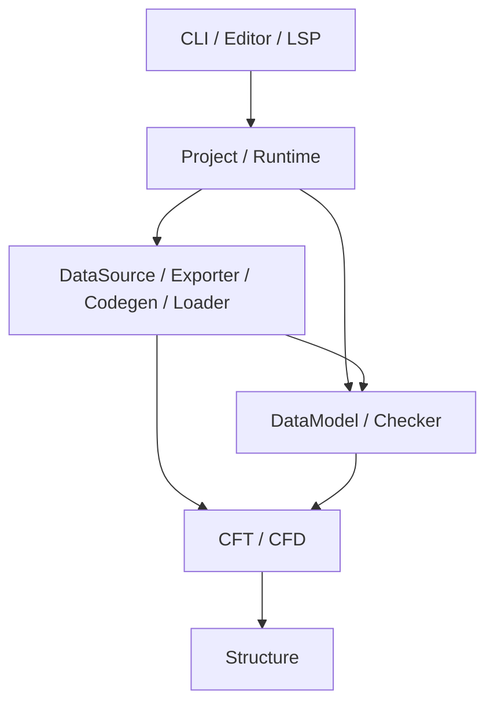
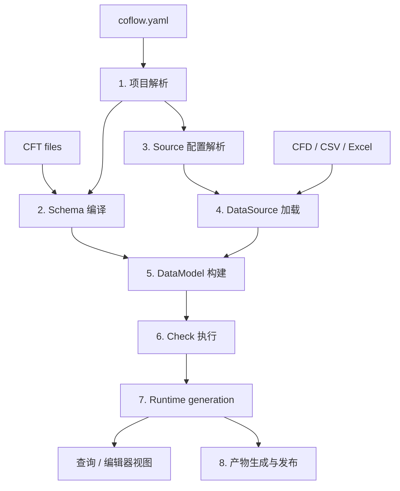

# 项目架构

## 主要 Crate

```mermaid
flowchart TD
  Hosts["CLI / Editor / LSP"] --> Runtime["Project / Runtime"]
  Runtime --> Providers["DataSource / Exporter / Codegen / Loader"]
  Runtime --> Data["DataModel / Checker"]
  Providers --> Data
  Providers --> Language["CFT / CFD"]
  Data --> Language
  Language --> Structure["Structure"]
```

| Crate | 职责 |
| --- | --- |
| `coflow-structure` | 为语言、数据模型和校验提供共享的结构能力 |
| `coflow-cft` | 类型定义语言 CFT 的语法实现，输出 schema，并建立 check statement 静态依赖索引 |
| `coflow-cfd` | 配置数据语言 CFD 的语法实现，输出 AST |
| `coflow-data-model` | 按 schema 组织各类 DataSource 提供的记录，形成统一 DataModel |
| `coflow-checker` | 无状态执行 runtime 指定的 check task，输出本次 task 的诊断与统计 |
| `coflow-api` | 定义 runtime 与 Provider 之间共享的数据结构和扩展接口 |
| `coflow-project` | 读取项目配置并解析项目路径 |
| `coflow-runtime` | 组织 schema、DataSource、DataModel 和 checker，生成可查询的项目状态 |
| `coflow-loader-*` | 实现 CFD、CSV 和 Excel DataSource，提供数据读取与写回 |
| `coflow-exporter-*` | 实现 JSON 和 MessagePack Exporter |
| `coflow-codegen-csharp` | 实现 C# Codegen，以及 JSON/MessagePack 对应的 Loader |
| 根 `coflow` crate | 提供 CLI 命令并发布构建产物 |

## 核心数据流

```mermaid
flowchart TD
  Config["coflow.yaml"] --> Project["1. 项目解析"]
  CftFiles["CFT files"] --> Schema["2. Schema 编译"]
  Project --> Schema

  Project --> Resolve["3. Source 配置解析"]
  Resolve --> Load["4. DataSource 加载"]
  SourceFiles["CFD / CSV / Excel"] --> Load

  Schema --> Model["5. DataModel 构建"]
  Load --> Model
  Model --> Check["6. Check 执行"]
  Check --> Generation["7. Runtime generation"]

  Generation --> Queries["查询 / 编辑器视图"]
  Generation --> Publish["8. 产物生成与发布"]
```

### 1. 项目解析

`coflow-project` 读取 `coflow.yaml`，确定项目根目录，并解析 schema、source 和 output 配置。

### 2. Schema 编译

`coflow-cft` 将 CFT 文件编译为 schema。Schema 描述类型、字段、默认值、继承、注解和 `check {}`，供后续阶段统一使用。

### 3. Source 配置解析

runtime 解析 source 配置及其路径和选项，并选择对应的 DataSource。

### 4. DataSource 加载

DataSource 将 CFD、CSV、Excel 等外部数据转换为统一的 input records，并保留记录的来源信息。

### 5. DataModel 构建

`coflow-data-model` 按 schema 合并 input records，处理默认值、类型、继承和记录引用，形成统一 DataModel。

### 6. Check 执行

`coflow-cft` 在编译每个 check 根 statement 时，静态收集所有可能分支涉及的顶层字段、record set 和 dimension，并建立依赖到 statement 的反向索引。索引同时包含继承关系和内联 object 的顶层宿主关系；短路、`when`、量词和格式化消息不会改变静态依赖集合。

`coflow-runtime` 将写入影响归一化为顶层字段变化、dimension variant 投影和 record-set 成员变化，再从 schema 索引生成明确的 `CheckTask`。同宿主字段变化只调度变化记录；跨类型依赖保守调度 statement owner 的全部宿主记录。完整检查和增量检查使用同一种 task。

`coflow-checker` 只执行传入的 statement、record/project target 和 base/dimension projection，不保存上一代结果，也不选择增量目标。runtime 按 task scope 保存和替换诊断，并在 DataModel 重建后按稳定记录坐标重映射诊断位置。schema-only 顶层诊断使用 module source catalog 映射到 CFT 文件；具体成员失败以数据位置为 primary，并关联规则声明位置。

### 7. Runtime Generation

`coflow-runtime` 将 project、schema、DataModel 和 diagnostics 组成一个 generation。CLI、编辑器和自动化命令读取同一份项目状态。

### 8. 产物生成与发布

Exporter 生成数据文件，Codegen 生成运行时代码，Loader 生成代码与数据格式之间的加载实现。根 `coflow` crate 将这些结果发布到输出目录。
